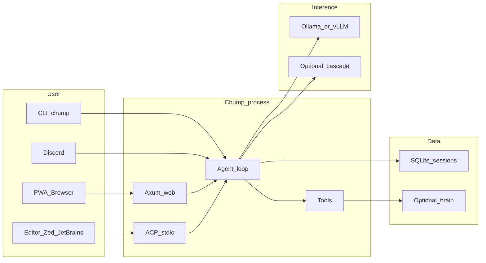

# Chump

Self-hosted AI coding agent with persistent memory and autonomous task execution.
Runs entirely on your hardware. Your keys, your data, your machine.

**What it does:** Chump connects to local LLMs (Ollama, vLLM, mistral.rs) and gives them durable state (SQLite tasks, episodes, memory), a governed tool surface (30+ tools: repo, git, GitHub, web search, scheduling), and multiple interfaces (web PWA, CLI, Discord, and any [ACP-compatible editor](https://agentclientprotocol.com)).

**What makes it different:**
- **Persistent memory** — SQLite FTS5 + embedding-based semantic recall + HippoRAG-inspired associative knowledge graph with enriched schema (confidence, expiry, provenance)
- **Cognitive architecture** — nine subsystems (surprise tracking, belief state, blackboard/global workspace, neuromodulation, precision controller, memory graph, counterfactual reasoning, phi proxy, holographic workspace) inspired by cognitive science, wired into the agent loop and actively studied via A/B eval with multi-axis scoring and A/A controls; see [research findings](docs/research/consciousness-framework-paper.md) for current empirical status (Scaffolding U-curve, neuromodulation ablation, and the lessons-block hallucination channel)
- **Structured perception** — rule-based task classification, entity extraction, constraint detection, and risk assessment before the model sees the input
- **Bounded autonomy** — layered governance with tool approval gates, task contracts with verification, precision-controlled regimes, and human escalation paths
- **Action verification** — post-execution verification for write tools with output parsing and surprisal checks
- **Eval framework** — property-based evaluation with multi-axis scoring (correctness + hallucination detection), A/A controls, Wilson CIs, and regression detection stored in SQLite
- **Editor-native integration** — full [Agent Client Protocol](docs/ACP.md) implementation: launchable as an agent from Zed, JetBrains IDEs, or any ACP client. Write tools prompt for user consent through the editor's UI; file and shell operations delegate to the editor's environment when running on a remote host.
- **Local-first** — runs on a MacBook with a 14B model. No cloud required. Provider cascade for optional cloud fallback.

**Surfaces:** web PWA (recommended), CLI, Discord bot, ACP stdio server (`chump --acp`), and optional Tauri desktop shell.

**Platform:** macOS and Linux. Windows via WSL2. Apple Silicon and x86_64 both supported.

**License:** [MIT](LICENSE).

**Vision:** [docs/NORTH_STAR.md](docs/NORTH_STAR.md) — the founding vision: why Chump exists, what the first-run experience must be, and what every decision is measured against.

**Documentation site:** [repairman29.github.io/chump](https://repairman29.github.io/chump/)




---

## Research findings

Chump runs nine cognitive modules in every agent turn and measures their effect empirically. This is live ongoing science, not marketing copy. Here is what the data shows so far:

| Study | Finding | Delta |
|-------|---------|-------|
| Scaffolding U-curve | 1B/14B local models benefit from scaffolding; 3B/7B are hurt; 8B is neutral | ±10pp |
| Neuromodulation ablation (qwen3:8b) | +12pp pass rate on tasks, but −0.60 tool-efficiency on dynamic tasks | trade-off confirmed |
| Lessons-block hallucination channel | Current lessons block increases fake tool-call emission by **+0.14 mean** — 10.7× the A/A noise floor | documented harm |
| COG-016 directive validation | Targeted directive injection eliminates hallucination signal entirely | −0.14 delta neutralized |
| Seeded-fact retrieval (Study 5) | Lessons block successfully surfaces injected directives (A=40%, B=5%, delta=35pp) | retrieval confirmed |

All results include A/A controls, Wilson CIs, and raw data in the repo:

- **[docs/CONSCIOUSNESS_AB_RESULTS.md](docs/CONSCIOUSNESS_AB_RESULTS.md)** — full A/B study log with methodology, raw scores, and interpretations
- **[Consciousness framework paper](docs/research/consciousness-framework-paper.md)** — preprint-quality write-up of the nine-module architecture and empirical status
- **[RESEARCH_COMMUNITY.md](docs/research/RESEARCH_COMMUNITY.md)** — how to run studies on your own hardware and contribute results
- **[docs/PROJECT_STORY.md](docs/PROJECT_STORY.md)** — how this project got here and where it is going

---

## Quick start

**Time estimate:** ~30 minutes (Rust compilation and model download take most of it).

1. **Prerequisites:** [Rust](https://rustup.rs/), [Ollama](https://ollama.com/), Git.

2. **Clone and setup**
   ```bash
   git clone https://github.com/repairman29/chump.git && cd chump
   cp .env.minimal .env        # 10-line starter config (or run ./scripts/setup-local.sh for guided setup)
   ```

3. **Pull a model**
   ```bash
   ollama serve                 # if not already running
   ollama pull qwen2.5:14b     # ~9 GB download, 5-15 min
   ```

4. **Build and run** (first build takes 15-25 min — this is normal for Rust)
   ```bash
   cargo build
   ./run-web.sh
   ```

5. **Verify**
   ```bash
   curl -s http://127.0.0.1:3000/api/health
   ```
   Open **http://127.0.0.1:3000** in your browser.

**CLI one-shot:** `./run-local.sh -- --chump "What is 2+2?"`

**Smoke check (no model needed):** `./scripts/verify-external-golden-path.sh` — verifies the build and required files.

**Full setup guide:** [docs/EXTERNAL_GOLDEN_PATH.md](docs/EXTERNAL_GOLDEN_PATH.md)

### Troubleshooting

- **Model / connection** (timeouts, refused, 5xx, flap, OOM): [docs/INFERENCE_STABILITY.md](docs/INFERENCE_STABILITY.md), [docs/STEADY_RUN.md](docs/STEADY_RUN.md), canonical ports [docs/INFERENCE_PROFILES.md](docs/INFERENCE_PROFILES.md).
- **Empty PWA dashboard:** normal without `chump-brain/` and heartbeats — [docs/WEB_API_REFERENCE.md](docs/WEB_API_REFERENCE.md) (Dashboard).
- **Disk:** [docs/STORAGE_AND_ARCHIVE.md](docs/STORAGE_AND_ARCHIVE.md), `./scripts/cleanup-repo.sh`.

---

## Key scripts

| Script | What it does |
|--------|-------------|
| `./run-web.sh` | Start the web PWA (default: port 3000) |
| `./run-local.sh -- --chump “prompt”` | CLI one-shot |
| `./scripts/setup-local.sh` | Guided first-time setup |
| `./scripts/verify-external-golden-path.sh` | Smoke test (build + required files) |
| `./scripts/chump-preflight.sh` | Full health check (inference + API + tools) |

---

## Documentation

**Browse online:** [repairman29.github.io/chump](https://repairman29.github.io/chump/)

| Start here | Purpose |
|------------|---------|
| [Dissertation](https://repairman29.github.io/chump/dissertation.html) ([source](book/src/dissertation.md)) | Technical thesis — architecture, cognitive modules, ACP, lessons learned |
| [docs/PROJECT_STORY.md](docs/PROJECT_STORY.md) | What this project is, how it got here, and where it’s going |
| [docs/EXTERNAL_GOLDEN_PATH.md](docs/EXTERNAL_GOLDEN_PATH.md) | Full setup walkthrough |
| [docs/ARCHITECTURE.md](docs/ARCHITECTURE.md) | System architecture reference |
| [docs/ACP.md](docs/ACP.md) | Agent Client Protocol adapter — editor integration, methods, capabilities, persistence |
| [docs/CHUMP_TO_COMPLEX.md](docs/CHUMP_TO_COMPLEX.md) | Cognitive architecture vision, empirical status, and roadmap |
| [docs/CONSCIOUSNESS_AB_RESULTS.md](docs/CONSCIOUSNESS_AB_RESULTS.md) | A/B study results — what the cognitive modules actually do |
| [docs/research/consciousness-framework-paper.md](docs/research/consciousness-framework-paper.md) | Preprint — nine-module framework, methodology, and empirical findings |
| [docs/research/RESEARCH_COMMUNITY.md](docs/research/RESEARCH_COMMUNITY.md) | Participate in research — run studies on your hardware, submit results |
| [CONTRIBUTING.md](CONTRIBUTING.md) | PR checklist and quality bar |
| [docs/OPERATIONS.md](docs/OPERATIONS.md) | Run modes, env vars, heartbeats |
| [docs/ROADMAP.md](docs/ROADMAP.md) | What’s next |
| [SECURITY.md](SECURITY.md) | Vulnerability reporting |

**Bug reports:** use the [GitHub issue template](.github/ISSUE_TEMPLATE/bug_report.md) or see [CONTRIBUTING.md](CONTRIBUTING.md#bug-reports).

**Beta testers:** see [BETA_TESTERS.md](BETA_TESTERS.md) for expectations, known limitations, and how to give feedback.
