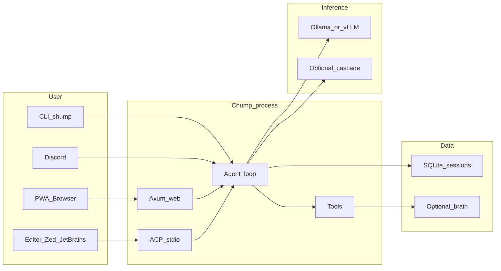

# Chump

**A Rust-native local-first AI agent — and a library ecosystem for building your own.**

Self-hosted AI coding agent with persistent memory and autonomous task execution. Runs entirely on your hardware. Your keys, your data, your machine.

**Two things in one repo:**

1. **The product** — a full agent you can run today (web PWA, CLI, Discord, Tauri desktop, any [ACP-compatible editor](https://agentclientprotocol.com)).
2. **The ecosystem** — reusable Rust crates for the hard parts of agent engineering. Depend on just the pieces you need.

| Crate | What it solves | Status |
|---|---|---|
| [`chump-agent-lease`](crates/chump-agent-lease/) | Path-level optimistic leases — prevents silent stomps when multiple agents edit the same repo in parallel | ✅ extracted |
| `chump-mcp-lifecycle` | Per-session MCP server spawn / scope / reap (full ACP lifecycle) | extraction pending |
| `chump-cognition` | Active inference + neuromod + precision controller + belief state | extraction pending |
| `chump-agent-matrix` | Runtime regression defense suite as a library | extraction pending |
| `chump-telemetry` | Working energy telemetry (joules/watts) on Apple Silicon + NVIDIA | implementation landed; extraction pending |
| `chump-core` | Foundation types — message, tool, session, provider | extraction pending |

See [`docs/RUST_AGENT_STANDARD_PLAN.md`](docs/RUST_AGENT_STANDARD_PLAN.md) for the full library-ecosystem roadmap, [`docs/LIBRARY_ADOPTION_GUIDE.md`](docs/LIBRARY_ADOPTION_GUIDE.md) for per-crate consumer examples, and [`docs/WHY_CHUMP_NOT_OPENJARVIS.md`](docs/WHY_CHUMP_NOT_OPENJARVIS.md) for an honest comparison vs the Stanford framework.

**What the product does:** Chump connects to local LLMs (Ollama, vLLM-MLX, mistral.rs) and gives them durable state (SQLite tasks, episodes, memory), a governed tool surface (30+ tools: repo, git, GitHub, web search, scheduling), and multiple interfaces (web PWA, CLI, Discord, Tauri desktop, ACP stdio).

**What makes it different:**
- **Persistent memory** — SQLite FTS5 + embedding-based semantic recall + HippoRAG-inspired associative knowledge graph with enriched schema (confidence, expiry, provenance)
- **Synthetic consciousness framework** — nine subsystems (surprise tracking, belief state, blackboard/global workspace, neuromodulation, precision controller, memory graph, counterfactual reasoning, phi proxy, holographic workspace) that measurably improve tool selection and calibration
- **Structured perception** — rule-based task classification, entity extraction, constraint detection, and risk assessment before the model sees the input
- **Bounded autonomy** — layered governance with tool approval gates, task contracts with verification, precision-controlled regimes, and human escalation paths
- **Action verification** — post-execution verification for write tools with output parsing and surprisal checks
- **Eval framework** — property-based evaluation cases with regression detection, stored in SQLite for tracking across versions
- **Editor-native integration** — full [Agent Client Protocol](docs/ACP.md) implementation: launchable as an agent from Zed, JetBrains IDEs, or any ACP client. Write tools prompt for user consent through the editor's UI; file and shell operations delegate to the editor's environment when running on a remote host.
- **Local-first** — runs on a MacBook with a 14B model. No cloud required. Provider cascade for optional cloud fallback.

**Surfaces:** web PWA (recommended), CLI, Discord bot, ACP stdio server (`chump --acp`), and optional Tauri desktop shell.

**Platform:** macOS and Linux. Windows via WSL2. Apple Silicon and x86_64 both supported.

**License:** [MIT](LICENSE).

**Documentation site:** [repairman29.github.io/chump](https://repairman29.github.io/chump/)




---

## Quick start

**Time estimate:** ~30 minutes (Rust compilation and model download take most of it).

1. **Prerequisites:** [Rust](https://rustup.rs/), [Ollama](https://ollama.com/), Git.

2. **Clone and setup**
   ```bash
   git clone https://github.com/repairman29/chump.git && cd chump
   cp .env.minimal .env        # 10-line starter config (or run ./scripts/setup-local.sh for guided setup)
   ```

3. **Pull a model**
   ```bash
   ollama serve                 # if not already running
   ollama pull qwen2.5:14b     # ~9 GB download, 5-15 min
   ```

4. **Build and run** (first build takes 15-25 min — this is normal for Rust)
   ```bash
   cargo build
   ./run-web.sh
   ```

5. **Verify**
   ```bash
   curl -s http://127.0.0.1:3000/api/health
   ```
   Open **http://127.0.0.1:3000** in your browser.

**CLI one-shot:** `./run-local.sh -- --chump "What is 2+2?"`

**Smoke check (no model needed):** `./scripts/verify-external-golden-path.sh` — verifies the build and required files.

**Full setup guide:** [docs/EXTERNAL_GOLDEN_PATH.md](docs/EXTERNAL_GOLDEN_PATH.md)

### Troubleshooting

- **Model / connection** (timeouts, refused, 5xx, flap, OOM): [docs/INFERENCE_STABILITY.md](docs/INFERENCE_STABILITY.md), [docs/STEADY_RUN.md](docs/STEADY_RUN.md), canonical ports [docs/INFERENCE_PROFILES.md](docs/INFERENCE_PROFILES.md).
- **Empty PWA dashboard:** normal without `chump-brain/` and heartbeats — [docs/WEB_API_REFERENCE.md](docs/WEB_API_REFERENCE.md) (Dashboard).
- **Disk:** [docs/STORAGE_AND_ARCHIVE.md](docs/STORAGE_AND_ARCHIVE.md), `./scripts/cleanup-repo.sh`.

---

## Key scripts

| Script | What it does |
|--------|-------------|
| `./run-web.sh` | Start the web PWA (default: port 3000) |
| `./run-local.sh -- --chump “prompt”` | CLI one-shot |
| `./scripts/setup-local.sh` | Guided first-time setup |
| `./scripts/verify-external-golden-path.sh` | Smoke test (build + required files) |
| `./scripts/chump-preflight.sh` | Full health check (inference + API + tools) |

---

## Documentation

**Browse online:** [repairman29.github.io/chump](https://repairman29.github.io/chump/)

| Start here | Purpose |
|------------|---------|
| [Dissertation](https://repairman29.github.io/chump/dissertation.html) ([source](book/src/dissertation.md)) | Technical thesis — architecture, all 9 consciousness modules, ACP, lessons learned |
| [docs/EXTERNAL_GOLDEN_PATH.md](docs/EXTERNAL_GOLDEN_PATH.md) | Full setup walkthrough |
| [docs/ARCHITECTURE.md](docs/ARCHITECTURE.md) | System architecture reference |
| [docs/ACP.md](docs/ACP.md) | Agent Client Protocol adapter — editor integration, methods, capabilities, persistence |
| [docs/CHUMP_TO_COMPLEX.md](docs/CHUMP_TO_COMPLEX.md) | Consciousness framework vision and implementation |
| [CONTRIBUTING.md](CONTRIBUTING.md) | PR checklist and quality bar |
| [docs/OPERATIONS.md](docs/OPERATIONS.md) | Run modes, env vars, heartbeats |
| [docs/ROADMAP.md](docs/ROADMAP.md) | What’s next |
| [docs/README.md](docs/README.md) | Full docs index (146+ files) |
| [SECURITY.md](SECURITY.md) | Vulnerability reporting |

**Bug reports:** use the [GitHub issue template](.github/ISSUE_TEMPLATE/bug_report.md) or see [CONTRIBUTING.md](CONTRIBUTING.md#bug-reports).

**Beta testers:** see [BETA_TESTERS.md](BETA_TESTERS.md) for expectations, known limitations, and how to give feedback.
