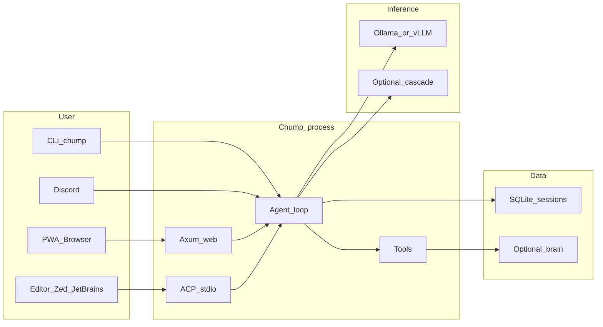

# Chump

A self-hosted AI coding agent **and** a multi-agent dispatcher, in one repo.
Runs on your hardware. Your keys, your data, your machine.

Chump has two co-equal lanes:

- **The agent** — connects to local LLMs (Ollama, vLLM, mistral.rs), keeps durable state in SQLite (tasks, episodes, memory), exposes 30+ governed tools (repo, git, GitHub, web search, scheduling), and talks through a web PWA, CLI, Discord bot, or any [ACP-compatible editor](https://agentclientprotocol.com) (Zed, JetBrains).
- **The dispatcher** — coordinates many concurrent agent sessions on the same repo without stomping each other. File-based leases, an `ambient.jsonl` peripheral-vision stream, a SQLite gap registry, linked worktrees, and a merge-queue ship pipeline. This is how Chump does its own development — it is its own operator harness.

**License:** [MIT](LICENSE) · **Platform:** macOS, Linux, Windows (WSL2) · **Docs:** [repairman29.github.io/chump](https://repairman29.github.io/chump/)

---

## Quick start

**Time estimate:** ~30 minutes (Rust compilation and model download take most of it).

1. **Prerequisites:** [Rust](https://rustup.rs/), [Ollama](https://ollama.com/), Git.

2. **Clone and setup**
   ```bash
   git clone https://github.com/repairman29/chump.git && cd chump
   cp .env.minimal .env        # 10-line starter config (or run ./scripts/setup/setup-local.sh for guided setup)
   ```

3. **Pull a model**
   ```bash
   ollama serve                 # if not already running
   ollama pull qwen2.5:7b      # ~4.7 GB download, 3-8 min — recommended for 16-24 GB RAM
   # Larger options (need more RAM): ollama pull qwen2.5:14b (~9 GB)
   ```

4. **Build and run** (first build takes 15-25 min — this is normal for Rust)
   ```bash
   cargo build
   ./run-web.sh
   ```

5. **Verify**
   ```bash
   curl -s http://127.0.0.1:3000/api/health
   ```
   Open **http://127.0.0.1:3000** in your browser.

**CLI one-shot:** `./run-local.sh -- --chump "What is 2+2?"`

**Smoke check (no model needed):** `./scripts/ci/verify-external-golden-path.sh` — verifies the build and required files.

**Full setup guide:** [docs/process/EXTERNAL_GOLDEN_PATH.md](docs/process/EXTERNAL_GOLDEN_PATH.md)

### Troubleshooting

- **Model / connection** (timeouts, refused, 5xx, flap, OOM): [docs/operations/INFERENCE_STABILITY.md](docs/operations/INFERENCE_STABILITY.md), [docs/operations/STEADY_RUN.md](docs/operations/STEADY_RUN.md), canonical ports [docs/operations/INFERENCE_PROFILES.md](docs/operations/INFERENCE_PROFILES.md).
- **Empty PWA dashboard:** normal without `chump-brain/` and heartbeats — [docs/api/WEB_API_REFERENCE.md](docs/api/WEB_API_REFERENCE.md) (Dashboard).
- **Disk:** [docs/operations/STORAGE_AND_ARCHIVE.md](docs/operations/STORAGE_AND_ARCHIVE.md), `./scripts/dev/cleanup-repo.sh`.

---

## The agent

What you get when you talk to Chump:

- **Local-first inference.** Default backend is Ollama; vLLM and mistral.rs work too. A provider cascade can fall back to a hosted model only when you ask it to.
- **Persistent memory.** SQLite FTS5 + embedding-based semantic recall + a HippoRAG-inspired associative graph (confidence, expiry, provenance).
- **Editor-native via ACP.** `chump --acp` runs Chump as a stdio agent for any [Agent Client Protocol](docs/architecture/ACP.md) client. Write tools prompt for consent through the editor; file/shell ops delegate to the editor's environment when running on a remote host.
- **30+ governed tools.** Repo edits, git, GitHub (PRs/issues/checks), web search, schedulers, sub-agent dispatch — each behind an approval gate with post-execution verification on writes.
- **Eval framework.** Property-based scoring (correctness + hallucination detection), A/A controls, Wilson CIs, regression detection. Results live in SQLite and are diff-reviewable.

**Surfaces:** web PWA (recommended), CLI, Discord bot, ACP stdio (`chump --acp`), optional Tauri desktop shell.




---

## The dispatcher

Running one agent is straightforward. Running ten — on the same repo, against the same `main`, without stomping each other's commits — is the part nobody else solves. Chump's dispatcher is the operator harness it uses on itself, and the same primitives are available to anyone running multi-agent workflows.

| Primitive | What it does |
|---|---|
| **`.chump-locks/<session>.json` leases** | Lightweight file-based ownership. Each agent claims a gap and (optionally) a path set; sibling agents see the claim instantly. Auto-expiring TTL — no stale locks. |
| **`ambient.jsonl` peripheral vision** | Append-only stream of session starts, file edits, commits, and `ALERT` events (lease overlaps, silent agents, edit bursts). Glance at the tail and you know what every other agent is doing. |
| **`chump gap` SQLite registry** | Authoritative gap store at `.chump/state.db` with `reserve` / `claim` / `preflight` / `ship` subcommands. Concurrent reservations don't race; `docs/gaps.yaml` is a regenerated mirror for diff review. |
| **Linked worktrees** | Every gap gets its own worktree under `.claude/worktrees/<codename>/` on a `claude/<codename>` branch. Clean isolation, no branch-switching cost, hourly reaper sweeps stale ones. |
| **`scripts/coord/bot-merge.sh` ship pipeline** | Rebases on `main`, runs fmt/clippy/tests, opens the PR, and arms `gh pr merge --auto --squash` against the GitHub merge queue. The queue rebases each PR on top of `main` and re-runs CI before the atomic squash — no lost commits, no stale-base merges. |
| **Pre-commit guards** | Every commit checks for lease collisions, stomp warnings, duplicate / hijacked / recycled gap IDs, gaps.yaml discipline, cargo-fmt, cargo-check, docs-delta, and credential patterns. Each guard fails loud with a documented bypass. |

**Read the full operating procedure:** [`AGENTS.md`](AGENTS.md) (canonical, tool-agnostic) and [`CLAUDE.md`](CLAUDE.md) (Chump-specific overlay).

---

## Vision

[`docs/strategy/NORTH_STAR.md`](docs/strategy/NORTH_STAR.md) — the founding vision: why Chump exists, what the first-run experience must be, and what every decision is measured against.

---

## Research

Chump runs nine cognitive-architecture modules in every agent turn and studies their effect via A/B eval. **The architecture as a whole is not validated.** The validated finding to date is narrower: **instruction injection has tier-dependent effects** — prescriptive lessons help small models on specific tasks and harm frontier models. Individual-module ablation (EVAL-043) has shipped infrastructure but results are pending.

Cite results at the specificity they are reported. See [`docs/process/RESEARCH_INTEGRITY.md`](docs/process/RESEARCH_INTEGRITY.md) for the accurate thesis and prohibited claims list.

- [`docs/research/CONSCIOUSNESS_AB_RESULTS.md`](docs/research/CONSCIOUSNESS_AB_RESULTS.md) — full A/B study log
- [`docs/research/consciousness-framework-paper.md`](docs/research/consciousness-framework-paper.md) — preprint
- [`docs/research/RESEARCH_COMMUNITY.md`](docs/research/RESEARCH_COMMUNITY.md) — run studies on your own hardware

---

## Key scripts

| Script | What it does |
|--------|-------------|
| `./run-web.sh` | Start the web PWA (default: port 3000) |
| `./run-local.sh -- --chump "prompt"` | CLI one-shot |
| `./scripts/setup/setup-local.sh` | Guided first-time setup |
| `./scripts/ci/verify-external-golden-path.sh` | Smoke test (build + required files) |
| `./scripts/ci/chump-preflight.sh` | Full health check (inference + API + tools) |
| `./scripts/coord/bot-merge.sh --gap <ID> --auto-merge` | Dispatcher: ship a gap through the merge queue |

---

## Documentation

**Browse online:** [repairman29.github.io/chump](https://repairman29.github.io/chump/)

| Start here | Purpose |
|------------|---------|
| [`AGENTS.md`](AGENTS.md) | Canonical entry point — build/test/lint, code style, gap-registry, PR conventions |
| [`CLAUDE.md`](CLAUDE.md) | Chump-specific session rules — leases, ambient stream, ship pipeline, commit guards |
| [Dissertation](https://repairman29.github.io/chump/dissertation.html) ([source](book/src/dissertation.md)) | Technical thesis — agent architecture, cognitive modules, ACP, lessons learned |
| [`docs/strategy/PROJECT_STORY.md`](docs/strategy/PROJECT_STORY.md) | What this project is, how it got here, and where it's going |
| [`docs/process/EXTERNAL_GOLDEN_PATH.md`](docs/process/EXTERNAL_GOLDEN_PATH.md) | Full setup walkthrough |
| [`docs/architecture/ARCHITECTURE.md`](docs/architecture/ARCHITECTURE.md) | System architecture reference |
| [`docs/architecture/ACP.md`](docs/architecture/ACP.md) | Agent Client Protocol adapter |
| [`docs/process/AGENT_COORDINATION.md`](docs/process/AGENT_COORDINATION.md) | Dispatcher internals — leases, branches, failure modes, pre-commit spec |
| [`docs/strategy/CHUMP_TO_CHAMP.md`](docs/strategy/CHUMP_TO_CHAMP.md) | Chump-to-Champ roadmap — cognitive architecture vision and frontier direction |
| [`CONTRIBUTING.md`](CONTRIBUTING.md) | PR checklist and quality bar |
| [`docs/operations/OPERATIONS.md`](docs/operations/OPERATIONS.md) | Run modes, env vars, heartbeats |
| [`docs/strategy/ROADMAP.md`](docs/strategy/ROADMAP.md) | What's next |
| [`SECURITY.md`](SECURITY.md) | Vulnerability reporting |

**Bug reports:** use the [GitHub issue template](.github/ISSUE_TEMPLATE/bug_report.md) or see [`CONTRIBUTING.md`](CONTRIBUTING.md#bug-reports).

**Beta testers:** see [`docs/briefs/BETA_TESTERS.md`](docs/briefs/BETA_TESTERS.md) for expectations, known limitations, and how to give feedback.
