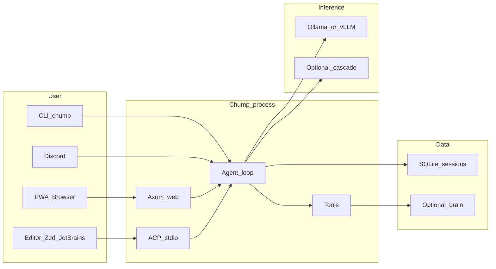

# Chump

**Chump is a multi-agent fleet coordinator + gap registry. Bring your own coding agent** (Claude Code, opencode, Codex CLI, Aider, goose, or manual commits).

Runs on your hardware. Your keys, your data, your machine.

Chump has two co-equal lanes:

- **The coordinator** — file-based leases, an `ambient.jsonl` peripheral-vision stream, a SQLite gap registry, linked worktrees, and a merge-queue ship pipeline. Coordinates many concurrent agent sessions on the same repo without stomping each other. No specific agent required; any tool that can commit code and push a branch works.
- **The built-in agent** — optionally, Chump also ships its own agent: connects to local LLMs (Ollama, vLLM, mistral.rs), keeps durable state in SQLite (tasks, episodes, memory), exposes 30+ governed tools (repo, git, GitHub, web search, scheduling), and talks through a web PWA, CLI, Discord bot, or any [ACP-compatible editor](https://agentclientprotocol.com) (Zed, JetBrains). **This lane is optional** — you can use Chump as a pure coordinator for agents you already have.

**License:** [MIT](LICENSE) · **Platform:** macOS, Linux, Windows (WSL2) · **Docs:** [repairman29.github.io/chump](https://repairman29.github.io/chump/)

> **No Anthropic key? No Claude Code?** Chump works with any agent that can commit code. See [docs/QUICKSTART_OFFLINE.md](docs/QUICKSTART_OFFLINE.md) for Ollama, or use the coordinator with your existing tool.
>
> **Using a local LLM?** → [docs/QUICKSTART_OFFLINE.md](docs/QUICKSTART_OFFLINE.md) — 5-step guide for solo devs on Ollama.

---

## Try Chump in 5 minutes

The end-to-end demo flow — what a new operator sees from a clean Mac to a self-driving fleet. **Install, `init`, `gen`, `orchestrate`, `fleet-status` in five steps.**

> **Prerequisites:** macOS or Linux. [Ollama](https://ollama.com) running with at least one model (`ollama pull qwen2.5:7b` — ~4.7 GB, ~5 min download). No paid API key required for the local-LLM path.

**1. Install**

```bash
brew tap repairman29/chump && brew install chump   # macOS — when the tap is published
# OR build from source (any platform): see "Build from source" below
```

**2. Initialize** — interactive wizard checks Ollama, scaffolds `~/.chump/`, picks a default model.

```bash
chump init
```

What it does: writes `~/.chump/config.toml`, creates `.chump/state.db`, prompts for an inference backend (Ollama / vLLM / hosted), confirms a working model. Non-interactive variant: `chump init --no-interactive` (used by CI).

**3. One-shot a coding task** — single prompt → working PR, no fleet, no orchestration.

```bash
chump gen "add a /health endpoint to my axum server"
```

Reads the current repo, generates a patch, runs `cargo check`, opens a PR. Good for "I have one task, ship it" — no need to spin up the fleet.

**4. Talk to the fleet** — conversational loop driving multiple agents in parallel.

```bash
chump orchestrate
```

Then type natural-language intents:

```
> spawn the fleet on infra p0/p1, size 4
> what's our mission grade?
> ship the offline quickstart by EOD
> stop the fleet
```

Each line is parsed into a structured `chump` command (`chump fleet start --size 4`, `chump mission-grade`, etc.) — see `src/intent_parser.rs` for the routing table. The stub path (no LLM) recognizes ~20 canonical phrases; the LLM-driven path handles freeform when `ANTHROPIC_API_KEY` is set.

**5. See what's running**

```bash
chump fleet status              # human-readable
chump fleet status --json       # machine-readable, for scripting
```

Real-time view of active agents, current claims, recent ships, and pillar grades. Same data the PWA cockpit at `http://localhost:3000/v2/` renders graphically.

> **First-run validation in CI:** `.github/workflows/ftue-clean-machine-2026.yml` runs the entire 5-step flow on a fresh macOS runner on every PR touching the relevant paths. If this README is accurate, that workflow stays green.

### Troubleshooting (5-minute path)

- **`chump init` says Ollama unreachable:** start it (`ollama serve`), confirm with `curl localhost:11434/api/tags`, re-run.
- **`chump gen` runs but no PR opens:** check `$GH_TOKEN`. The PR step needs GitHub credentials; `gh auth status` should be green.
- **`chump orchestrate` "unknown intent":** the stub parser only handles canonical phrases. Try `"what is our mission grade?"` or set `ANTHROPIC_API_KEY` for the LLM-driven path.
- **`chump fleet status` shows zero workers:** run `chump fleet start --size N` first, or your fleet was already stopped.

---

## Build from source

For operators on platforms without a brew tap, or who want to develop on Chump itself.

**Time estimate:** ~30 minutes (Rust compilation and model download take most of it).

1. **Prerequisites:** [Rust](https://rustup.rs/), [Ollama](https://ollama.com/), Git.

2. **Clone and setup**
   ```bash
   git clone https://github.com/repairman29/chump.git && cd chump
   cp .env.minimal .env        # 10-line starter config (or run ./scripts/setup/setup-local.sh for guided setup)
   ```

3. **Pull a model**
   ```bash
   ollama serve                 # if not already running
   ollama pull qwen2.5:7b      # ~4.7 GB download, 3-8 min — recommended for 16-24 GB RAM
   # Larger options (need more RAM): ollama pull qwen2.5:14b (~9 GB)
   ```

4. **Build and run** (first build takes 15-25 min — this is normal for Rust)
   ```bash
   cargo build
   ./run.sh web
   ```

5. **Verify**
   ```bash
   curl -s http://127.0.0.1:3000/api/health
   ```
   Open **http://127.0.0.1:3000** in your browser.

**CLI one-shot:** `./run.sh local -- --chump "What is 2+2?"`

**Smoke check (no model needed):** `./scripts/ci/verify-external-golden-path.sh` — verifies the build and required files.

**Full setup guide:** [docs/process/EXTERNAL_GOLDEN_PATH.md](docs/process/EXTERNAL_GOLDEN_PATH.md)

### Troubleshooting (build-from-source path)

- **Model / connection** (timeouts, refused, 5xx, flap, OOM): [docs/operations/INFERENCE_STABILITY.md](docs/operations/INFERENCE_STABILITY.md), [docs/operations/STEADY_RUN.md](docs/operations/STEADY_RUN.md), canonical ports [docs/operations/INFERENCE_PROFILES.md](docs/operations/INFERENCE_PROFILES.md).
- **Empty PWA dashboard:** normal without `chump-brain/` and heartbeats — [docs/api/WEB_API_REFERENCE.md](docs/api/WEB_API_REFERENCE.md) (Dashboard).
- **Disk:** [docs/operations/STORAGE_AND_ARCHIVE.md](docs/operations/STORAGE_AND_ARCHIVE.md), `./scripts/dev/cleanup-repo.sh`.

---

## The built-in agent (optional)

Chump ships its own agent too — but you don't have to use it. If you already have a coding agent you trust, skip this section and go straight to [The coordinator](#the-coordinator).

What you get when you use Chump's built-in agent:

- **Local-first inference.** Default backend is Ollama; vLLM and mistral.rs work too. A provider cascade can fall back to a hosted model only when you ask it to.
- **Persistent memory.** SQLite FTS5 + embedding-based semantic recall + a HippoRAG-inspired associative graph (confidence, expiry, provenance).
- **Editor-native via ACP.** `chump --acp` runs Chump as a stdio agent for any [Agent Client Protocol](docs/architecture/ACP.md) client. Write tools prompt for consent through the editor; file/shell ops delegate to the editor's environment when running on a remote host.
- **30+ governed tools.** Repo edits, git, GitHub (PRs/issues/checks), web search, schedulers, sub-agent dispatch — each behind an approval gate with post-execution verification on writes.
- **Eval framework.** Property-based scoring (correctness + hallucination detection), A/A controls, Wilson CIs, regression detection. Results live in SQLite and are diff-reviewable.

**Surfaces:** web PWA (recommended), CLI, Discord bot, ACP stdio (`chump --acp`), optional Tauri desktop shell.




---

## The coordinator

Running one agent is straightforward. Running ten — on the same repo, against the same `main`, without stomping each other's commits — is the part nobody else solves. Chump's coordinator is the harness it uses on itself, and the same primitives are available to any agent you bring.

**What Chump provides (the coordinator layer):**

| Primitive | What it does |
|---|---|
| **`.chump-locks/<session>.json` leases** | Lightweight file-based ownership. Each agent claims a gap and (optionally) a path set; sibling agents see the claim instantly. Auto-expiring TTL — no stale locks. Works with Claude Code, opencode, Aider, goose, or manual commits. |
| **`ambient.jsonl` peripheral vision** | Append-only stream of session starts, file edits, commits, and `ALERT` events (lease overlaps, silent agents, edit bursts). Glance at the tail and you know what every other agent is doing. |
| **`chump gap` SQLite registry** | Authoritative gap store at `.chump/state.db` with `reserve` / `claim` / `preflight` / `ship` subcommands. Concurrent reservations don't race; `docs/gaps.yaml` is a regenerated mirror for diff review. |
| **Linked worktrees** | Every gap gets its own isolated git worktree + branch. Clean isolation, no branch-switching cost, hourly reaper sweeps stale ones. |
| **`scripts/coord/bot-merge.sh` ship pipeline** | Rebases on `main`, runs fmt/clippy/tests, opens the PR, and arms `gh pr merge --auto --squash` against the GitHub merge queue. The queue rebases each PR on top of `main` and re-runs CI before the atomic squash — no lost commits, no stale-base merges. |
| **Pre-commit guards** | Every commit checks for lease collisions, stomp warnings, duplicate / hijacked / recycled gap IDs, gaps.yaml discipline, cargo-fmt, cargo-check, docs-delta, and credential patterns. Each guard fails loud with a documented bypass. |

**What your agent provides:**

- LLM calls and inference (any backend: Ollama, Claude API, OpenAI, local Llama)
- Tool use and code synthesis
- Reading and writing files, running tests, opening PRs

The coordinator is fully functional without any specific agent. `chump gap list`, `chump claim`, `bot-merge.sh`, and the ambient stream all work with manual commits or any coding tool.

**Read the full operating procedure:** [`AGENTS.md`](AGENTS.md) (canonical, tool-agnostic operating rules for any agent) and [`CLAUDE.md`](CLAUDE.md) (Chump fleet-specific overlay for Claude Code and fleet workers).

---

## Vision

[`docs/strategy/NORTH_STAR.md`](docs/strategy/NORTH_STAR.md) — the founding vision: why Chump exists, what the first-run experience must be, and what every decision is measured against.

---

## Research

Chump ships nine cognitive-architecture modules and studies their effect via A/B eval — but **only some of them are wired into the chat-turn flow**. The public-facing module map at [`docs/architecture/CHUMP_FACULTY_MAP.md`](docs/architecture/CHUMP_FACULTY_MAP.md) is a stub; per-module wired/not-wired/removed/telemetry-only status, faculty tables, and validated empirical results are tracked in the `chump-proprietary` private repo (research-privacy policy — see [`docs/process/RESEARCH_INTEGRITY.md`](docs/process/RESEARCH_INTEGRITY.md)). **The architecture as a whole is not validated.** The validated finding to date is narrower: **instruction injection has tier-dependent effects** — prescriptive lessons help small models on specific tasks and harm frontier models. Individual-module ablation (EVAL-043) has shipped infrastructure; results land per-module as ablation flags reach n≥50/cell.

Cite results at the specificity they are reported. See [`docs/process/RESEARCH_INTEGRITY.md`](docs/process/RESEARCH_INTEGRITY.md) for the accurate thesis and prohibited claims list, and [`docs/research/RESEARCH_COMMUNITY.md`](docs/research/RESEARCH_COMMUNITY.md) for running studies on your own hardware.

Per-cell forensics, validated empirical results, and paper preprints are tracked privately so they can be published through controlled channels rather than scraped from a public repo. Contact the project owner for access.

---

## Key scripts

| Script | What it does |
|--------|-------------|
| `./run.sh web` | Start the web PWA (default: port 3000) |
| `./run.sh local -- --chump "prompt"` | CLI one-shot |
| `./scripts/setup/setup-local.sh` | Guided first-time setup |
| `./scripts/ci/verify-external-golden-path.sh` | Smoke test (build + required files) |
| `./scripts/ci/chump-preflight.sh` | Full health check (inference + API + tools) |
| `./scripts/coord/bot-merge.sh --gap <ID> --auto-merge` | Dispatcher: ship a gap through the merge queue |

---

## Documentation

**Browse online:** [repairman29.github.io/chump](https://repairman29.github.io/chump/)

| Start here | Purpose |
|------------|---------|
| [`AGENTS.md`](AGENTS.md) | Canonical entry point — build/test/lint, code style, gap-registry, PR conventions |
| [`CLAUDE.md`](CLAUDE.md) | Chump-specific session rules — leases, ambient stream, ship pipeline, commit guards |
| [Dissertation](https://repairman29.github.io/chump/dissertation.html) ([source](book/src/dissertation.md)) | Technical thesis — agent architecture, cognitive modules, ACP, lessons learned |
| [`docs/strategy/PROJECT_STORY.md`](docs/strategy/PROJECT_STORY.md) | What this project is, how it got here, and where it's going |
| [`docs/process/EXTERNAL_GOLDEN_PATH.md`](docs/process/EXTERNAL_GOLDEN_PATH.md) | Full setup walkthrough |
| [`docs/architecture/ARCHITECTURE.md`](docs/architecture/ARCHITECTURE.md) | System architecture reference |
| [`docs/architecture/ACP.md`](docs/architecture/ACP.md) | Agent Client Protocol adapter |
| [`docs/architecture/ACP_CAPABILITY_COMPARISON.md`](docs/architecture/ACP_CAPABILITY_COMPARISON.md) | ACP capability comparison vs other agents in the registry |
| [`docs/process/AGENT_COORDINATION.md`](docs/process/AGENT_COORDINATION.md) | Dispatcher internals — leases, branches, failure modes, pre-commit spec |
| [`docs/strategy/CHUMP_TO_CHAMP.md`](docs/strategy/CHUMP_TO_CHAMP.md) | Chump-to-Champ roadmap — cognitive architecture vision and frontier direction |
| [`CONTRIBUTING.md`](CONTRIBUTING.md) | PR checklist and quality bar |
| [`docs/operations/OPERATIONS.md`](docs/operations/OPERATIONS.md) | Run modes, env vars, heartbeats |
| [`docs/ROADMAP.md`](docs/ROADMAP.md) | What's next |
| [`SECURITY.md`](SECURITY.md) | Vulnerability reporting |

**Bug reports:** use the [GitHub issue template](.github/ISSUE_TEMPLATE/bug_report.md) or see [`CONTRIBUTING.md`](CONTRIBUTING.md#bug-reports).

**Beta testers:** see [`docs/briefs/BETA_TESTERS.md`](docs/briefs/BETA_TESTERS.md) for expectations, known limitations, and how to give feedback.
