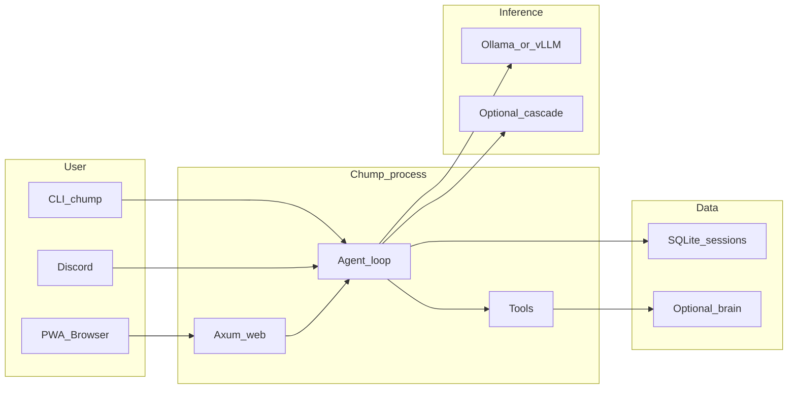

# Chump

Self-hosted AI coding agent with persistent memory and autonomous task execution.
Runs entirely on your hardware. Your keys, your data, your machine.

**What it does:** Chump is an AI agent that connects to local LLMs (Ollama, vLLM) and gives them durable state (SQLite tasks, episodes, memory), a governed tool surface (repo, git, GitHub, web search), and multiple interfaces (web PWA, CLI, Discord).

**What makes it different:** This isn't a chat wrapper. Chump has persistent SQLite state across sessions, a markdown brain for long-term memory, test-aware code editing, and a tool approval system. It runs entirely offline with local models.

**Surfaces:** web PWA (recommended), CLI, and optional Discord bot.

**Platform:** macOS and Linux. Windows via WSL2. Apple Silicon and x86_64 both supported.

**License:** [MIT](LICENSE).




---

## Quick start

**Time estimate:** ~30 minutes (Rust compilation and model download take most of it).

1. **Prerequisites:** [Rust](https://rustup.rs/), [Ollama](https://ollama.com/), Git.

2. **Clone and setup**
   ```bash
   git clone https://github.com/repairman29/chump.git && cd chump
   cp .env.minimal .env        # 10-line starter config (or run ./scripts/setup-local.sh for guided setup)
   ```

3. **Pull a model**
   ```bash
   ollama serve                 # if not already running
   ollama pull qwen2.5:14b     # ~9 GB download, 5-15 min
   ```

4. **Build and run** (first build takes 15-25 min — this is normal for Rust)
   ```bash
   cargo build
   ./run-web.sh
   ```

5. **Verify**
   ```bash
   curl -s http://127.0.0.1:3000/api/health
   ```
   Open **http://127.0.0.1:3000** in your browser.

**CLI one-shot:** `./run-local.sh -- --chump "What is 2+2?"`

**Smoke check (no model needed):** `./scripts/verify-external-golden-path.sh` — verifies the build and required files.

**Full setup guide:** [docs/EXTERNAL_GOLDEN_PATH.md](docs/EXTERNAL_GOLDEN_PATH.md)

### Troubleshooting

- **Model / connection** (timeouts, refused, 5xx, flap, OOM): [docs/INFERENCE_STABILITY.md](docs/INFERENCE_STABILITY.md), [docs/STEADY_RUN.md](docs/STEADY_RUN.md), canonical ports [docs/INFERENCE_PROFILES.md](docs/INFERENCE_PROFILES.md).
- **Empty PWA dashboard:** normal without `chump-brain/` and heartbeats — [docs/WEB_API_REFERENCE.md](docs/WEB_API_REFERENCE.md) (Dashboard).
- **Disk:** [docs/STORAGE_AND_ARCHIVE.md](docs/STORAGE_AND_ARCHIVE.md), `./scripts/cleanup-repo.sh`.

---

## Key scripts

| Script | What it does |
|--------|-------------|
| `./run-web.sh` | Start the web PWA (default: port 3000) |
| `./run-local.sh -- --chump “prompt”` | CLI one-shot |
| `./scripts/setup-local.sh` | Guided first-time setup |
| `./scripts/verify-external-golden-path.sh` | Smoke test (build + required files) |
| `./scripts/chump-preflight.sh` | Full health check (inference + API + tools) |

---

## Documentation

| Start here | Purpose |
|------------|---------|
| [docs/EXTERNAL_GOLDEN_PATH.md](docs/EXTERNAL_GOLDEN_PATH.md) | Full setup walkthrough |
| [CONTRIBUTING.md](CONTRIBUTING.md) | PR checklist and quality bar |
| [docs/OPERATIONS.md](docs/OPERATIONS.md) | Run modes, env vars, heartbeats |
| [docs/ROADMAP.md](docs/ROADMAP.md) | What’s next |
| [docs/README.md](docs/README.md) | Full docs index (146 files) |
| [SECURITY.md](SECURITY.md) | Vulnerability reporting |

**Bug reports:** use the [GitHub issue template](.github/ISSUE_TEMPLATE/bug_report.md) or see [CONTRIBUTING.md](CONTRIBUTING.md#bug-reports).

**Beta testers:** see [BETA_TESTERS.md](BETA_TESTERS.md) for expectations, known limitations, and how to give feedback.
