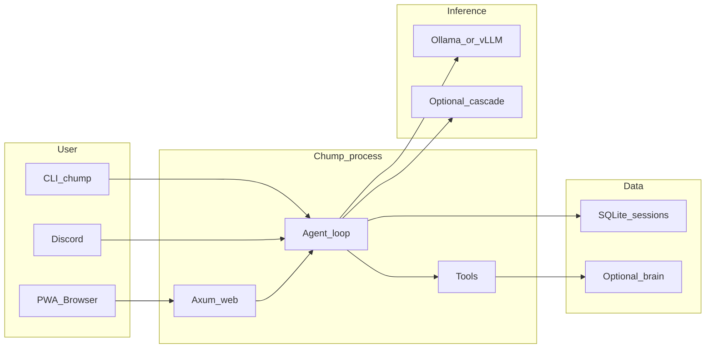

# Chump

**Chump** is a **self-hosted** Rust agent (Axum + AxonerAI) that talks to **OpenAI-compatible** APIs (Ollama, vLLM-MLX, or an optional multi-provider cascade). It is **single-tenant**: you run it on your machine with your keys—not a hosted SaaS.

**Differentiation (vs a thin chat wrapper):** durable **SQLite** state (tasks, episodes, memory, schedules), a large **tool surface** (repo, git, GitHub, web search, approvals), an optional **markdown brain** (`chump-brain/`), and a **PWA** with dashboard APIs—not only a single-model REPL.

**Surfaces:** CLI (`--chump`), **web PWA** (`--web`), and optional **Discord** bot. **Default for onboarding:** web PWA + [external golden path](docs/EXTERNAL_GOLDEN_PATH.md) (`/api/health`); Discord is optional. See [docs/DOSSIER.md](docs/DOSSIER.md) for the full architecture narrative.

**Market positioning and evaluation:** who Chump is for, competitive matrix, north-star metrics, and research templates — [docs/MARKET_EVALUATION.md](docs/MARKET_EVALUATION.md).

**Wedge H1 + pilot metrics:** [docs/WEDGE_H1_GOLDEN_EXTENSION.md](docs/WEDGE_H1_GOLDEN_EXTENSION.md), [docs/WEDGE_PILOT_METRICS.md](docs/WEDGE_PILOT_METRICS.md), [docs/TRUST_SPECULATIVE_ROLLBACK.md](docs/TRUST_SPECULATIVE_ROLLBACK.md).

**License:** [MIT](LICENSE).

**Platform expectations:** **macOS** and **Linux** are the primary environments. **Windows:** use **WSL2** (same flow as Linux); native Windows is not regularly tested. **Apple Silicon / x86_64:** both supported via Rust + Ollama builds for your arch.




---

## Quick start (external golden path)

**Goal:** HTTP health check + PWA on **port 3000** with **local Ollama** — no Discord required.

1. **Prerequisites:** [Rust](https://rustup.rs/), [Ollama](https://ollama.com/), Git.

2. **Clone and env**
   ```bash
   git clone <repo-url> chump && cd chump
   ./scripts/setup-local.sh
   ```
   Edit `.env`: for web-only testing, **comment out** `DISCORD_TOKEN` (see banner at top of `.env.example`).

3. **Model**
   ```bash
   ollama serve
   ollama pull qwen2.5:14b
   ```

4. **Build and run web**
   ```bash
   cargo build
   ./run-web.sh
   ```

5. **Verify**
   ```bash
   curl -s http://127.0.0.1:3000/api/health
   ```
   Open **http://127.0.0.1:3000** for the PWA.

**CLI one-shot (optional):** `./run-local.sh -- --chump "What is 2+2?"`

**Full detail:** [docs/EXTERNAL_GOLDEN_PATH.md](docs/EXTERNAL_GOLDEN_PATH.md) (troubleshooting, `CHUMP_HOME`, advanced topics).

**Smoke check (no Ollama required):** `./scripts/verify-external-golden-path.sh` — verifies `cargo build` and required files.

### Troubleshooting

- **Model / connection errors** (timeouts, refused, 5xx): see [docs/INFERENCE_STABILITY.md](docs/INFERENCE_STABILITY.md) and [docs/STEADY_RUN.md](docs/STEADY_RUN.md).
- **Empty PWA dashboard:** normal without `chump-brain/` and heartbeats — see [docs/WEB_API_REFERENCE.md](docs/WEB_API_REFERENCE.md) (Dashboard section).
- **Disk:** [docs/STORAGE_AND_ARCHIVE.md](docs/STORAGE_AND_ARCHIVE.md), `./scripts/cleanup-repo.sh`.

---

## Docs index

| Doc | Purpose |
|-----|---------|
| [docs/EXTERNAL_GOLDEN_PATH.md](docs/EXTERNAL_GOLDEN_PATH.md) | Minimal first success for new developers |
| [docs/PRODUCT_CRITIQUE.md](docs/PRODUCT_CRITIQUE.md) | Multi-angle review + **external launch gate** |
| [docs/SETUP_QUICK.md](docs/SETUP_QUICK.md) | Ollama, Discord, autonomy tests, ChumpMenu |
| [docs/OPERATIONS.md](docs/OPERATIONS.md) | Run modes, heartbeats, env tables |
| [docs/ROADMAP.md](docs/ROADMAP.md) | What we’re building next |
| [docs/README.md](docs/README.md) | Full documentation index |

**Contributing:** [CONTRIBUTING.md](CONTRIBUTING.md). **Bug reports:** include OS, `ollama --version` or model URL, and whether you followed the golden path.

## Troubleshooting (inference and stability)

If the model server flaps, OOMs, or the bot says the model is down, start with **[docs/INFERENCE_STABILITY.md](docs/INFERENCE_STABILITY.md)** (Farmer Brown, Ollama/vLLM ports, **model flap drill**). Canonical ports: [docs/INFERENCE_PROFILES.md](docs/INFERENCE_PROFILES.md).

---

## Project context

Chump is designed for **24/7 personal operations** (optional heartbeats, fleet roles, Android companion “Mabel”) — see [docs/ECOSYSTEM_VISION.md](docs/ECOSYSTEM_VISION.md). **External v1** intentionally scopes to **single-machine** Ollama + web/CLI; fleet docs are “phase 2.”
