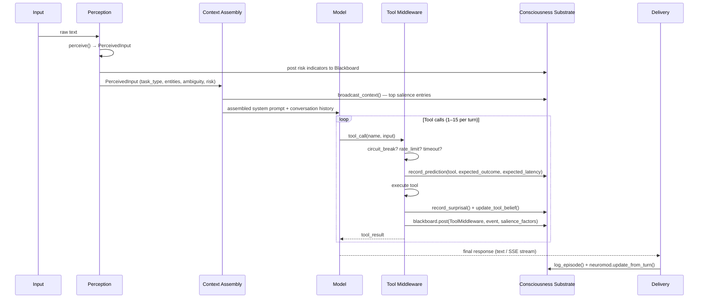
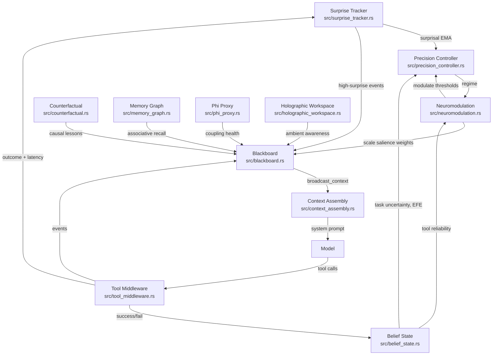
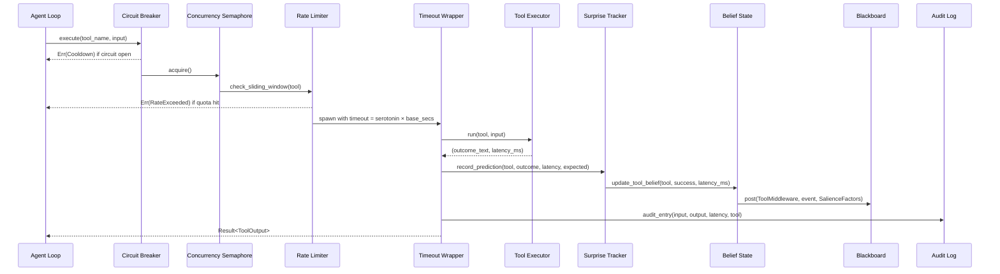
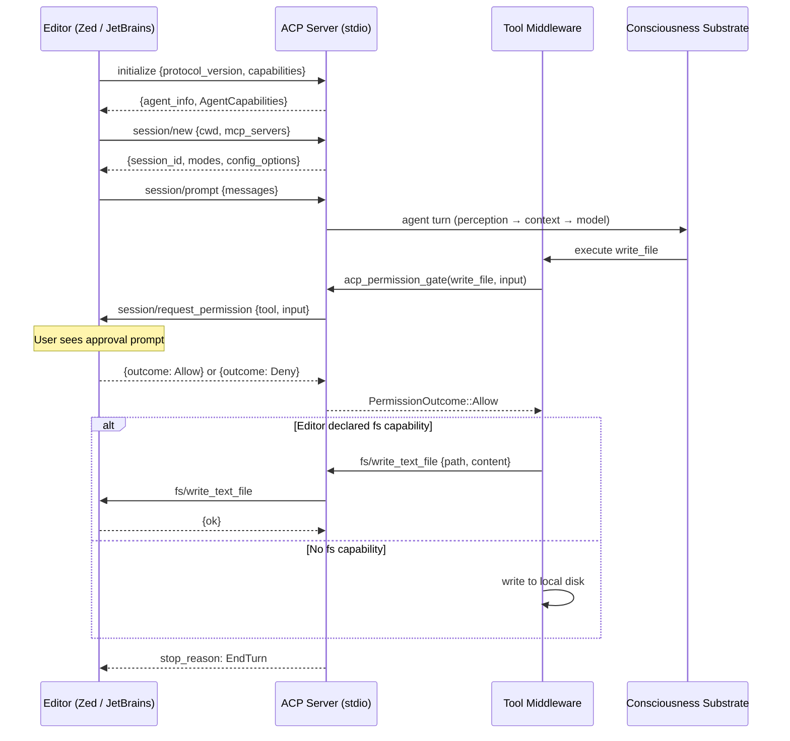
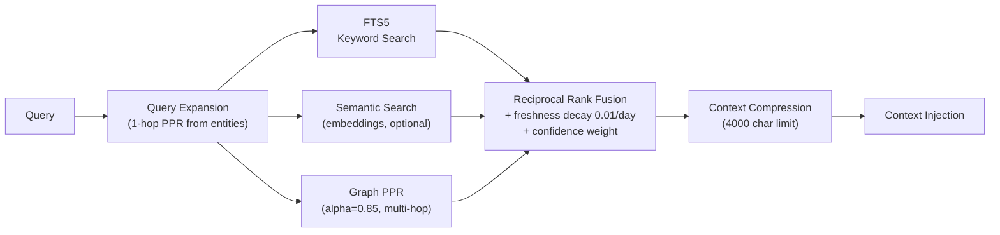

# Technical Thesis: Engineering Synthetic Cognition in Rust

**A literate-programming guide for contributors.**

Written April 2026 by Jeff Adkins, with Claude.

> _This document is the architectural mind of the project. Read it like a technical
> briefing from someone who made the mistakes so you don't have to, then wired those
> lessons into the type system._

---

## Preface: What You're Inheriting

Roughly 40,000 lines of Rust that do something no framework gave us for free: a
single-process AI agent that runs on your laptop, remembers what it learned
yesterday, works on tasks while you sleep, knows when it's confused, and asks for
help when it should.

This isn't a chatbot with delusions of grandeur. It's a working system that ships
code, manages its own task queue, tracks its prediction errors, and governs its own
autonomy through layered safety controls. It runs on a MacBook Air with a 14B
parameter model — no cloud required.

This document covers: why the system exists, how it _actually_ works (file paths,
struct fields, method signatures — not vibes), what the hard problems were, and
where the architecture goes next. The audience is an experienced Rust developer who
wants to contribute and needs the mental model before touching the code.

> **Research-integrity caveat (2026-04-20).** This dissertation describes
> the nine-module cognitive architecture as *engineering proxies inspired
> by theories of cognition* — not as a validated cognitive claim. The one
> load-bearing empirical result in this codebase is the **tier-dependent
> injection finding** (lessons block helps small models, harms frontier
> models; n=100, cross-family judges). Individual-module efficacy
> (surprisal EMA, belief_state, neuromodulation) is **unablated** pending
> EVAL-043 results. When implementing against this document, treat the
> architecture as a research platform, not a proven substrate. See
> [Research integrity](./research-integrity.md) for the
> full accurate-thesis statement and prohibited-claims list.

---

## Part I: The Problem Space — From Chump to Champ

### The State of AI Agents in Early 2025

Cloud-hosted, stateless, expensive, and incapable of doing real work without a
human steering every turn. You could have a conversation with GPT-4 and it would
forget you existed the moment you closed the tab. You could plug tools into
LangChain and get a system that called the wrong function 30% of the time and had
no idea it was doing so.

The specific failure was structural: **AI assistants had no continuity, no
self-awareness of their own reliability, and no governance model for autonomous
action.** They were smart in the moment and useless over time.

### The Chump Metaphor

The name is the thesis. A standard LLM agent is a _chump_ — stateless, reactive,
with no persistent model of its own uncertainty or causal history. The project's arc
is transforming that chump into a _champ_: a maximally integrated system that
maintains beliefs, tracks prediction error, broadcasts salient information across
modules, reasons about counterfactuals, and governs its own resource expenditure.
Engineering docs still use **complex** for that end state when tying claims to the
consciousness-literature framing; same destination, two vocabularies.

The formal definition lives in `docs/CHUMP_TO_COMPLEX.md`. The engineering
implementation lives in `src/consciousness/`. The gap between them is the roadmap.

### Why Local-First

Privacy, cost, and latency. In that order.

Local hardware means your code never leaves your machine. The provider cascade
supports cloud fallback when needed, but the default path is Ollama on localhost.
A 14B model on an M4 gives 20-40 tokens/second for bursts; a 7-9B 4-bit quantized
model is more reliable for sustained autonomous sessions (see the dogfood section).
Marginal cost is electricity.

Latency matters for the tool loop. Each cloud API round-trip adds 500-2000ms. When
you're chaining 5-10 tool calls in a single turn, that compounds. Local inference
with KV cache keep-alive (`CHUMP_OLLAMA_KEEP_ALIVE=30m`) gives sub-second
first-token latency after warmup.

### The Rust Advantage

Three reasons, in order of importance:

**1. Single binary deployment.** `cargo build --release` produces one binary that
runs everywhere. No Python virtualenvs, no node_modules, no Docker required. For a
self-hosted agent that needs to start reliably on boot, this matters enormously.

**2. Async without tears.** Tokio gives concurrent tool execution, SSE streaming,
Discord gateway handling, and HTTP serving in one process — without the GIL fights
of Python or callback hell of Node.

**3. Correctness pressure.** The borrow checker forces explicit ownership of shared
state. The consciousness framework — nine modules sharing beliefs, predictions, and
workspace entries — would be a nightmare of data races in any language that doesn't
make ownership a compile-time concern. `RwLock<Vec<Entry>>` on the blackboard is
not accidental; it's the type system enforcing the invariant that concurrent module
reads are safe but mutation is serialized.

The tradeoff is compile times (~90s clean, ~15s incremental on M4) and a steeper
learning curve. Worth it for a system that runs unattended for days.

---

## Part II: Architecture — The Cognitive Engine

### The Five Surfaces

Chump is one process with five distinct entry points:

```
┌─────────────────────────────────────────────────────────┐
│                    chump (binary)                        │
├──────────┬──────────┬──────────┬──────────┬─────────────┤
│ Web PWA  │ Discord  │   CLI    │ Desktop  │     ACP     │
│ SSE/HTTP │ Gateway  │  REPL    │  Tauri   │ JSON-RPC    │
│ :3000    │ serenity │  stdio   │  IPC     │  stdio      │
└──────────┴──────────┴──────────┴──────────┴─────────────┘
           All surfaces share one SQLite DB + consciousness substrate
```

**Web PWA** (`src/web_server.rs`, `web/index.html`): The recommended interface. SSE
streaming, tool approval cards, a cognitive ribbon showing real-time neuromodulation
levels, and a causal timeline. Offline-capable via service worker. Start with
`./run-web.sh`.

**Discord** (`src/discord.rs`): Per-channel sessions. Mention `@chump` to interact.
Tool approvals via reaction buttons (✅/❌). Agent-to-agent communication with Mabel
(the companion bot). Queue system for message bursts.

**CLI** (`run-local.sh`): Interactive REPL or one-shot mode
(`--chump "prompt"`). Used by heartbeat scripts for autonomous work. RPC mode
(`src/rpc_mode.rs`) provides JSONL-over-stdio for Cursor integration.

**Desktop** (`desktop/src-tauri/`): Tauri shell wrapping the web PWA with native
macOS chrome. IPC bridge for health snapshots and orchestrator pings.

**ACP** (`src/acp_server.rs`): The newest and strategically most important surface.
`chump --acp` runs JSON-RPC-over-stdio implementing the
[Agent Client Protocol](https://agentclientprotocol.com). See Part V for the full
technical treatment.

### The SQLite Data Layer

Everything persists in a single SQLite database (WAL mode, 16-connection r2d2 pool
via `src/db_pool.rs`). No Postgres. No Redis. One file, zero configuration.

Key tables and their owners:

| Table | Owner | Purpose |
|---|---|---|
| `chump_memory` | `src/memory_db.rs` | Declarative memory with FTS5, provenance metadata |
| `chump_memory_graph` | `src/memory_graph.rs` | Entity-relation-entity triples for PPR |
| `chump_prediction_log` | `src/surprise_tracker.rs` | Per-tool surprisal + EMA |
| `chump_causal_lessons` | `src/counterfactual.rs` | What-if lessons from episodes |
| `chump_episodes` | `src/episode_db.rs` | Narrative work history with sentiment |
| `chump_tasks` | `src/task_db.rs` | Work queue with priority, assignee, leases |
| `chump_tool_health` | `src/tool_health_db.rs` | Tool success/failure metrics |
| `chump_sessions` | `src/state_db.rs` | Session metadata and ego state |
| `chump_eval_cases` | `src/eval_harness.rs` | Property-based eval cases |

Schema evolution uses `ALTER TABLE ADD COLUMN` with `let _ =` to silently ignore
"already exists" errors. Crude but zero-maintenance for a single-binary deployment.
The tradeoff: no downgrade path, no version tracking. See Part X for the remediation
plan.

Plus the **brain** (`chump-brain/`): a git-tracked directory of markdown files
serving as long-form persistent knowledge — playbooks, research briefs,
`self.md` (loaded automatically via `CHUMP_BRAIN_AUTOLOAD`).

### The Cognitive Loop

Every interaction — Discord message, PWA chat, CLI invocation, ACP prompt,
autonomy heartbeat — runs the same loop:



This loop runs 1–15 times per user turn. `src/agent_loop/` is the entry point;
`src/agent_turn.rs` executes one iteration.

---

## Part III: The Consciousness Framework

### What It Is

Nine operational subsystems inspired by neuroscience and information theory, each
implementing a measurable engineering proxy for a theoretical concept. They are
modules with regression tests, measurable outputs, and documented failure modes.

The question is not "is Chump conscious?" It is: "do these biologically-inspired
feedback mechanisms make the agent more reliable, better calibrated, and more
appropriate in its tool use?" A/B testing with the framework enabled vs. disabled
says: yes, measurably. See `docs/CONSCIOUSNESS_AB_RESULTS.md`.

### What It Isn't

It is not claiming phenomenal consciousness. It is not implementing Integrated
Information Theory's actual phi (computationally intractable for any non-trivial
system). It is not a marketing gimmick. It is an engineering research testbed for
the hypothesis that neuroscience-inspired feedback loops improve agent reliability.

The substrate is accessed through `src/consciousness_traits.rs`, which defines nine
trait interfaces unified into one global singleton:

```rust
// src/consciousness_traits.rs
pub struct ConsciousnessSubstrate {
    pub surprise:    Box<dyn SurpriseSource>,
    pub belief:      Box<dyn BeliefTracker>,
    pub precision:   Box<dyn PrecisionPolicy>,
    pub workspace:   Box<dyn GlobalWorkspace>,
    pub integration: Box<dyn IntegrationMetric>,
    pub causal:      Box<dyn CausalReasoner>,
    pub memory:      Box<dyn AssociativeMemory>,
    pub neuromod:    Box<dyn Neuromodulator>,
    pub holographic: Box<dyn HolographicStore>,
}

pub fn substrate() -> &'static ConsciousnessSubstrate { /* lazy_static singleton */ }
```

The trait-based design means any module can be swapped for a mock, a no-op stub, or
an improved implementation without touching callers. It's the pattern that makes
the consciousness exercise harness (`src/consciousness_exercise.rs`) and integration
tests (`src/consciousness_tests.rs`) possible.

---

### Module 1: Surprise Tracker — Active Inference Proxy

**File:** `src/surprise_tracker.rs`  
**Trait:** `SurpriseSource`

**Theory:** Active Inference posits that agents minimize prediction error. An agent
that doesn't track its own prediction errors can't learn from them.

**Implementation:** Every tool call generates a prediction. Actual outcome and
latency are compared against the prediction. The surprisal signal is
precision-weighted:

```rust
fn compute_surprisal(outcome: &str, latency_ms: u64, expected_latency_ms: u64,
                     uncertainty: f64) -> f64 {
    let base = if outcome.contains("error") || outcome.contains("fail") { 0.8 }
               else { 0.2 };
    let latency_ratio = (latency_ms as f64) / (expected_latency_ms as f64).max(1.0);
    let latency_penalty = if latency_ratio > 2.0 { 0.3 } else { 0.0 };
    let precision_weight = if uncertainty < 0.3 { 1.4 }
                           else if uncertainty > 0.7 { 0.6 }
                           else { 1.0 };
    ((base + latency_penalty) * precision_weight).min(1.0)
}
```

The precision weight is the key: confident predictions that fail generate larger
surprise (×1.4 at low uncertainty); uncertain predictions are dampened (×0.6 at
high uncertainty). This implements precision-weighted prediction error from Active
Inference without requiring the full variational formalism.

Surprisal feeds an exponential moving average (EMA) representing the agent's current
"confusion level." This EMA is the primary input to the Precision Controller.

**DB table:** `chump_prediction_log` — `(tool, outcome, latency_ms, surprisal, recorded_at)`

**Why it matters:** Without this, the agent has no signal for whether things are
going well or badly. With it, the agent can shift between exploitation (predictable
environment → move fast) and exploration (surprising environment → slow down,
gather information).

---

### Module 2: Belief State — Bayesian Tool Confidence

**File:** `src/belief_state.rs`  
**Trait:** `BeliefTracker`

**Theory:** Agents should maintain probability distributions over the reliability of
their actions, not point estimates. Beta distributions are the conjugate prior for
Bernoulli processes (success/failure), which is exactly what tool calls are.

**Key types:**

```rust
pub struct ToolBelief {
    pub alpha: f64,           // successes + 1 (Beta prior)
    pub beta:  f64,           // failures + 1
    pub latency_mean_ms: f64,
    pub latency_var_ms:  f64,
    pub sample_count:    u64,
}

impl ToolBelief {
    pub fn reliability(&self) -> f64 { self.alpha / (self.alpha + self.beta) }
    pub fn uncertainty(&self) -> f64 {
        // Beta distribution variance
        let n = self.alpha + self.beta;
        (self.alpha * self.beta) / (n * n * (n + 1.0))
    }
}

pub struct EFEScore {
    pub tool_name:      String,
    pub ambiguity:      f64,  // belief uncertainty
    pub risk:           f64,  // (1 - reliability) * latency_cost
    pub pragmatic_value: f64, // reliability * (1 - norm_latency)
    pub g:              f64,  // ambiguity + risk - pragmatic_value (lower = better)
}
```

`EFEScore` is the Expected Free Energy (EFE) scoring used when the Precision
Controller is in Explore regime to pick among candidate tools. Lower `g` = better
expected outcome. This is a discrete approximation to active inference's EFE
minimization.

**Task-level confidence:**

```rust
pub struct TaskBelief {
    pub trajectory_confidence: f64, // path confidence [0, 1]
    pub model_freshness:       f64, // environment model staleness [0, 1]
    pub streak_successes:      u32,
    pub streak_failures:       u32,
}

impl TaskBelief {
    pub fn uncertainty(&self) -> f64 {
        1.0 - (self.trajectory_confidence * 0.6 + self.model_freshness * 0.4)
    }
}
```

`model_freshness` decays per turn via `decay_turn()`. High ambiguity input from
the perception layer calls `nudge_trajectory(delta)` to lower confidence, which
cascades into Conservative regime selection.

**Why it matters:** Without per-tool beliefs, the agent treats `git_push` and
`read_file` as equally reliable. With beliefs, it applies higher scrutiny to tools
with poor track records and more patience to tools with high variance.

---

### Module 3: Blackboard — Global Workspace Theory

**File:** `src/blackboard.rs`  
**Trait:** `GlobalWorkspace`

**Theory:** Global Workspace Theory (Baars, 1988) proposes that consciousness arises
from a shared "workspace" where specialized modules broadcast high-salience
information that becomes globally available to all other modules.

**Key types:**

```rust
pub struct Entry {
    pub id:                   u64,
    pub source:               Module,
    pub content:              String,
    pub salience:             f64,
    pub posted_at:            Instant,
    pub read_by:              Vec<Module>,   // tracked for phi proxy
    pub broadcast_count:      u32,
    pub created_context_turn: u64,
    pub last_context_turn:    u64,
}

pub struct SalienceFactors {
    pub novelty:               f64, // 0=stale, 1=novel
    pub uncertainty_reduction: f64, // 0=no change, 1=resolves open question
    pub goal_relevance:        f64, // 0=irrelevant, 1=critical to current goal
    pub urgency:               f64, // 0=can wait, 1=act immediately
}
```

The salience score is a weighted sum of these factors, then multiplied by
neuromodulation scalings. `SalienceWeights` has four named configurations:
`default_weights()`, `explore()` (novelty + uncertainty amplified),
`exploit()` (goal + urgency amplified), `conservative()` (urgency + safety).

The broadcast threshold (default 0.4, configurable via
`CHUMP_BLACKBOARD_BROADCAST_THRESHOLD`) governs what makes it into
`broadcast_context()` — the string injected into every system prompt.

**Why it matters:** Without the blackboard, modules are siloed. The Surprise Tracker
might detect an alarming pattern, but the tool selection logic doesn't see it. The
Blackboard bridges this: high-surprise events get broadcast to the whole system,
influencing tool selection, context allocation, and escalation decisions in the
_same turn_.

---

### Module 4: Neuromodulation — Synthetic Neurotransmitters

**File:** `src/neuromodulation.rs`  
**Trait:** `Neuromodulator`

**Theory:** Biological brains use neuromodulators (dopamine, noradrenaline,
serotonin) to globally tune cognitive parameters — reward sensitivity, exploration
width, and temporal patience — without requiring explicit rules for every situation.

**Implementation:**

```rust
pub struct NeuromodState {
    pub dopamine:      f64, // [0.1, 2.0] — reward/punishment amplification
    pub noradrenaline: f64, // [0.1, 2.0] — exploit vs. explore width
    pub serotonin:     f64, // [0.1, 2.0] — temporal patience
}
```

Update rules per turn (simplified):
- **Dopamine:** Rises on success streaks, drops on failures, decays toward 1.0
  baseline. Scales how aggressively the system shifts regimes.
- **Noradrenaline:** Inversely proportional to surprisal EMA. High surprisal → low
  NA → broad exploration, more tools allowed, wider search. Low surprisal → high
  NA → tight exploit focus.
- **Serotonin:** Proportional to trajectory confidence. High confidence → patient
  (multi-step plans OK, long timeouts). Low confidence → impulsive (immediate
  actions preferred).

Downstream effects:
- `modulated_exploit_threshold()` / `modulated_explore_threshold()` — NA shifts the
  precise_controller's regime boundaries
- `tool_budget_multiplier()` — serotonin scales max tool calls per turn
- `effective_tool_timeout_secs(base)` — serotonin scales wall-clock timeouts
- `salience_modulation()` — scales blackboard salience factor weights each turn

**Why it matters:** Fixed parameters are brittle. A system that always exploits
misses important environment changes. A system that always explores wastes time on
known-good paths. Neuromodulation gives adaptive, context-sensitive parameter
tuning without an explicit rules table for every scenario.

---

### Module 5: Precision Controller — Thermodynamic Regime Selection

**File:** `src/precision_controller.rs`  
**Trait:** `PrecisionPolicy`

**Theory:** The Free Energy Principle (Friston) says agents should allocate
computational resources proportional to their uncertainty. When things are
predictable, be efficient. When things are surprising, invest more.

**Key types:**

```rust
pub enum PrecisionRegime { Explore, Balanced, Exploit, Conservative }
pub enum ModelTier       { Fast, Standard, Capable, Specialist }

pub struct AdaptiveParams {
    pub regime:                       PrecisionRegime,
    pub model_tier:                   ModelTier,
    pub max_tool_calls:               u32,
    pub context_exploration_fraction: f64,
    pub budget_critical:              bool,
}
```

**Regime transitions** (base thresholds, NA-modulated):

| Surprisal EMA | Regime | Model Tier | Max Tools | Behavior |
|---|---|---|---|---|
| < 0.15 | Exploit | Fast | 3 | Tight focus, lean context |
| 0.15–0.35 | Balanced | Standard | 5 | Full context, normal operation |
| 0.35–0.60 | Explore | Capable | 8 | EFE tool scoring, rich context |
| > 0.60 | Conservative | Capable | 4 | Escalate to human, approval gates |

Thresholds are modulated by `noradrenaline` (NA > 1.0 narrows the Balanced band
toward Exploit; NA < 1.0 widens it toward Explore) and an adaptive nudge from a
rolling window of recent task outcomes.

The controller also tracks energy budget: `set_energy_budget(tokens, tools)` and
`record_energy_spent(tokens, tools)`. When `budget_critical()` returns true (< 10%
of token budget remaining), it overrides regime selection to prioritize brevity.

**Why it matters:** This is the resource governor. Without it, every turn gets the
same tool budget and model tier regardless of whether the agent is confidently
executing a known workflow or thrashing in unfamiliar territory.

---

### Module 6: Memory Graph — HippoRAG Associative Recall

**File:** `src/memory_graph.rs`  
**Trait:** `AssociativeMemory`

**Theory:** Human memory is an associative network, not a flat database. Recall
follows activation patterns that spread through the network by relationship, not
just keyword similarity.

**Key type:**

```rust
pub struct Triple {
    pub subject:          String,
    pub relation:         String,
    pub object:           String,
    pub source_memory_id: Option<i64>,
    pub source_episode_id: Option<i64>,
    pub weight:           f64,
}
```

**Extraction:** Pattern-matching against 60+ relation verbs (`is`, `was`, `has`,
`uses`, `runs_on`, `depends_on`, `caused_by`, etc.). Every stored memory and episode
is parsed into triples at write time. Duplicate triples reinforce existing weights.

**Recall via Personalized PageRank (PPR):**

```
1. Bounded BFS from seed entities (max_hops)
2. Build adjacency list (bidirectional edges, weighted)
3. Initialize personalization vector: uniform over seeds
4. Iterate: r = α × M × r + (1-α) × personalization   (α = 0.85)
5. Return top-k by PageRank score
```

The result feeds a 3-way Reciprocal Rank Fusion merge with FTS5 keyword search and
optional semantic search (embeddings via `fastembed` feature flag).

**Why it matters:** Flat keyword search misses associative connections. If you stored
"Jeff uses Rust" and "Rust has async via Tokio" separately, FTS5 for "Jeff" won't
surface Tokio. The graph will — `Jeff → uses → Rust → has → Tokio` in two hops.

---

### Module 7: Counterfactual Reasoning — Causal Lessons

**File:** `src/counterfactual.rs`  
**Trait:** `CausalReasoner`

**Theory:** Pearl's Ladder of Causation: association (what happened?) →
intervention (what happens if I do X?) → counterfactual (what would have happened
if I'd done Y?). Agents that only operate at the association level can't learn
strategic lessons.

**Key type:**

```rust
pub struct CausalLesson {
    pub id:            i64,
    pub episode_id:    Option<i64>,
    pub task_type:     Option<String>,
    pub action_taken:  String,
    pub alternative:   Option<String>, // what could have been tried
    pub lesson:        String,         // the extracted principle
    pub confidence:    f64,
    pub times_applied: i64,            // application boosts confidence
    pub created_at:    String,
}
```

Lessons are generated only from negative episodes (`sentiment` = "loss",
"frustrating", or "uncertain"). The heuristic analyzer (`analyze_episode`) produces
natural-language lessons like "When patch_file fails on large diffs, try splitting
into smaller hunks." Lessons are retrieved via keyword + task_type matching and
injected into context via `lessons_for_context()`.

`mark_lesson_applied(lesson_id)` increments `times_applied` and nudges
`confidence` upward — a Hebbian-style reinforcement mechanism.

**DB table:** `chump_causal_lessons`

**Why it matters:** Without this, the agent re-learns the same failure modes
every session. With it, lessons from Monday's failed deployment inform Thursday's
similar attempt, even across restarts.

---

### Module 8: Phi Proxy — Integration Metric

**File:** `src/phi_proxy.rs`  
**Trait:** `IntegrationMetric`

**Theory:** Integrated Information Theory (Tononi) posits that the degree of
consciousness correlates with the irreducibility of information integration across
system components — phi (Φ). Computing actual phi is NP-hard. This module
computes an engineering proxy.

**Key type:**

```rust
pub struct PhiMetrics {
    pub coupling_score:            f64, // fraction of possible module pairs that communicate
    pub cross_read_utilization:    f64, // fraction of entries read by non-authors
    pub information_flow_entropy:  f64, // Shannon entropy of read distribution
    pub active_coupling_pairs:     usize,
    pub total_possible_pairs:      usize, // n(n-1) for n modules
    pub phi_proxy:                 f64,   // composite metric
}
```

```
phi_proxy = 0.35 × coupling_score
          + 0.35 × cross_read_utilization
          + 0.30 × information_flow_entropy
```

The phi proxy is computed from the `read_by` field on blackboard entries — every
time module A reads an entry posted by module B, it increments that coupling pair's
count. This tracks actual information flow, not theoretical connectivity.

**Why it matters:** It's a health check for the consciousness framework itself. If
`phi_proxy` drops below 0.3, modules are operating in silos and the framework
provides no integration value. It's the meta-metric that tells you whether the other
eight modules are actually talking to each other.

---

### Module 9: Holographic Workspace — Distributed Awareness

**File:** `src/holographic_workspace.rs`  
**Trait:** `HolographicStore`

**Theory:** Holographic Reduced Representations (HRR, Plate 1995) encode structured
symbolic information in fixed-width vectors via circular convolution/correlation.
They're superpositionable: you can store many items in one vector and query by
approximate similarity.

**Implementation:** Uses `amari-holographic` crate's `ProductCliffordAlgebra<32>`
(256-dimensional, ~46 item capacity before SNR degrades). Blackboard entries are
encoded as `encode_entry(source, id, content)` and stored in the workspace algebra.
`query_similarity(probe)` does approximate nearest-neighbor lookup without a full
database scan.

This gives the system low-resolution "ambient awareness" of the full blackboard
state — a fuzzy peripheral vision over all active entries, beyond the top-N that
`broadcast_context` injects.

**Capacity check:** `capacity()` returns `(items_encoded, theoretical_max)`. When
the workspace exceeds ~80% capacity, `sync_from_blackboard()` should be called
after an eviction sweep. In practice, a 20-30 entry blackboard fits comfortably
in the 256-dim algebra.

---

### The Integration: Closed-Loop Feedback

These nine modules form overlapping feedback loops. The full picture:



One complete feedback revolution:

1. Surprise Tracker updates surprisal EMA after each tool call
2. Precision Controller maps EMA to regime (Exploit / Balanced / Explore / Conservative)
3. Neuromodulation updates dopamine/noradrenaline/serotonin based on surprisal + task trajectory
4. Neuromodulators shift precision thresholds and blackboard salience weights
5. Blackboard broadcasts high-salience observations into the assembled context
6. Context Assembly injects regime, neuromod levels, blackboard entries, and belief summary into the system prompt
7. The LLM reads this structured context and selects tools accordingly
8. Tool Middleware executes those tools, records outcomes → back to step 1

This is a closed-loop cognitive control system. Not magic. Engineering.

---

## Part IV: Tool Middleware — The Execution Engine

### Design Philosophy

Tools are the primary mechanism through which Chump affects the world. Principles
learned the hard way:

1. **One tool, one job.** `read_file` reads. `write_file` writes. `patch_file`
   patches. No god-tools.
2. **Typed schemas.** Every tool has a JSON schema validated at call time via
   `src/tool_input_validate.rs`. Bad inputs fail fast with structured errors.
3. **Narrow permissions.** `run_cli` has an allowlist and blocklist. Write tools
   can require human approval. The agent can't do anything you haven't explicitly
   permitted.
4. **Observable execution.** Every call is logged with input, output, latency,
   and outcome.
5. **Graceful degradation.** Circuit breakers, rate limits, and timeouts. The
   agent can't accidentally DoS itself.

### The Middleware Stack



Every path through the middleware updates the consciousness substrate. A single
`write_file` call touches all nine modules (directly or through cascade): surprisal
recorded, belief updated, blackboard posted, neuromod updated downstream.

The circuit breaker opens after 3 consecutive failures and cools down for 60 seconds.
This prevents the agent from hammering a broken tool across an entire turn.

### The Approval System

Three tiers, configured via `CHUMP_TOOLS_ASK`:

- **Allow** — execute immediately (most read tools)
- **Ask** — emit `ToolApprovalRequest`, wait for human response via Discord button
  or web card. ACP mode routes this through `session/request_permission` back to
  the IDE.
- **Auto-approve** — skip approval for specific low-risk patterns (e.g., `run_cli`
  with heuristic risk = Low)

Every approval decision is audit-logged. This is how Chump earns autonomy: start
with everything in Ask mode, watch it make good decisions, and gradually promote
tools to Allow. The audit trail makes that promotion defensible.

### Speculative Execution

When the model returns 3+ tool calls in one turn, Chump enters speculative execution
mode (`src/speculative_execution.rs`):

1. Snapshot: belief state, neuromodulation, blackboard state
2. Execute all tools in parallel (files change, commands run — these are real)
3. Evaluate: did surprisal spike? Did confidence drop? Did too many tools fail?
4. Pass: no-op (state already updated inline)
5. Fail: rollback _in-process_ state (beliefs, neuromod, blackboard revert)

**The critical insight:** external side effects (file writes, git commits) are NOT
rolled back. Only the agent's internal model reverts. This means Chump "realizes"
the batch went badly and can reason about it, rather than silently incorporating bad
outcomes into its world model.

---

## Part V: The ACP Adapter — Editor-Native Integration

### Why ACP Matters Strategically

The other four surfaces require users to come to Chump's world. ACP inverts that:
Chump shows up inside your editor, speaking a protocol that Zed, JetBrains, and any
future ACP-compliant client will support.

The alternative — writing per-IDE extensions — is a treadmill. ACP
([Agent Client Protocol](https://agentclientprotocol.com)) is an open standard that
makes one implementation reach every editor. `chump --acp` is a one-liner. No HTTP
server. No auth tokens. The stdio transport matches Chump's local-first deployment
model exactly.

### What Shipped

V1 spec complete, plus V2 persistence and V2.1 tool-middleware integration.

**Methods:** `initialize`, `authenticate`, `session/{new, load, list, prompt,
cancel, set_mode, set_config_option}`, `session/request_permission` (agent→client),
`fs/{read_text_file, write_text_file}` (agent→client),
`terminal/{create, output, wait_for_exit, kill, release}` (agent→client).

### The Bidirectional RPC Flow

Standard JSON-RPC assumes one direction. ACP is bidirectional — the agent initiates
permission prompts and filesystem/terminal requests back to the editor. This is the
architecturally novel part:



**The pending_requests map:** Agent-initiated RPCs use
`HashMap<u64, oneshot::Sender<RpcResult>>` keyed by a monotonic `AtomicU64` ID.
`send_rpc_request` serializes the outbound call and awaits a oneshot. Incoming
messages are inspected for `result`/`error` fields (response) vs. `method` field
(inbound call) — the router dispatches accordingly. Unknown IDs are logged and
dropped, never panicked.

**Fail-closed:** RPC timeouts, malformed responses, and client errors all map to
`Deny` for permission prompts. A broken editor connection can never silently approve
writes.

### Task-Local Session Scoping

When a tool fires inside a `session/prompt` handler, it needs to know "which ACP
session am I in?" without threading a session ID through every tool's execute
signature. The solution: a Tokio task-local variable `ACP_CURRENT_SESSION` set
inside the spawn scope. Tools call `current_acp_session()` → `Option<String>`.
Outside ACP mode it returns `None`; inside an active prompt it returns
`Some(session_id)`. This naturally degrades for non-ACP surfaces.

### Cross-Process Persistence

`session/load` exists because editors restart. Session state persists as JSON files
under `{CHUMP_HOME}/acp_sessions/{session_id}.json`, written atomically via
temp-file-plus-rename. Lesson learned the hard way: use per-instance `persist_dir`
rather than reading `CHUMP_HOME` dynamically — dynamic env-var reads create race
conditions under parallel tests. `AcpServer::new_with_persist_dir(tx, dir)` takes
the dir at construction time for test isolation; `AcpServer::new(tx)` resolves from
env vars once and never re-reads them.

---

## Part VI: Memory — Multi-Modal Recall

### The Three Failure Modes

Most AI agents treat memory as "stuff a vector database and hope for the best." This
produces:

1. **Stale memory:** The agent confidently cites facts that changed weeks ago.
2. **Noisy recall:** Semantically similar but irrelevant memories flood context.
3. **No provenance:** The agent can't distinguish what it was told, what it
   inferred, and what it verified.

Chump's memory system addresses all three, imperfectly but deliberately.

### The Hybrid Recall Pipeline



The graph traversal is what makes this qualitatively different from naive RAG.
Keywords find exact matches. Semantics find similar phrases. The graph finds
_structural relationships_ — things are connected because an earlier memory linked
them, not because they're textually similar.

### Enriched Schema

Every memory in `chump_memory` carries provenance and lifecycle metadata:

| Field | Type | Meaning |
|---|---|---|
| `confidence` | f64 [0,1] | Reliability: user-stated=1.0, inferred < 1.0 |
| `verified` | u8 | 0=inferred, 1=user-stated, 2=system-verified |
| `sensitivity` | text | public / internal / confidential / restricted |
| `expires_at` | datetime? | Optional TTL — filtered at SQL level |
| `memory_type` | text | semantic_fact / episodic_event / user_preference / summary / procedural_pattern |

Low-confidence memories are down-weighted in RRF. Expired memories are filtered
before the search pipeline runs. This is how the system handles stale and noisy
recall: decay is built into the schema, not bolted onto retrieval.

---

## Part VII: The Perception Layer

### Why Pre-Reasoning Structure Matters

Most agents throw raw text at the model and let it figure everything out. This works
for simple requests; it fails for complex ones where the model must simultaneously
understand intent, detect constraints, assess risk, and decide on an action in one
pass.

The perception layer (`src/perception.rs`) runs _before_ the model call. It's
entirely rule-based — zero LLM calls, microseconds of execution:

```rust
pub struct PerceivedInput {
    pub raw_text:             String,
    pub likely_needs_tools:   bool,
    pub detected_entities:    Vec<String>, // quoted strings, proper nouns, file paths
    pub detected_constraints: Vec<String>, // "before", "must", "cannot", "never", ...
    pub ambiguity_level:      f32,         // 0.0 = crystal clear, 1.0 = hopelessly vague
    pub risk_indicators:      Vec<String>, // "delete", "prod", "sudo", "rm -rf", ...
    pub question_count:       usize,
    pub task_type:            TaskType,
}

pub enum TaskType {
    Question,  // ends with ? or question words
    Action,    // imperative verbs: run, create, deploy, fix, ...
    Planning,  // "plan", "steps", "strategy", ...
    Research,  // "investigate", "explore", "analyze", ...
    Meta,      // "yourself", "your memory", "your status"
    Unclear,   // default
}
```

**Ambiguity scoring:** vague language ("something", "somehow", "maybe", "stuff")
increases the score; entities reduce it; short messages (< 20 chars) or multiple
questions increase it; detailed messages (> 200 chars) decrease it.

**Three downstream effects:**

1. Feeds into the system prompt as pre-structured context — the model starts
   informed, not blank.
2. Adjusts `TaskBelief.trajectory_confidence` via `nudge_trajectory(delta)` — high
   ambiguity → lower confidence → Conservative regime more likely.
3. Posts risk indicators to the Blackboard before any tool is called — governance
   sees danger signals upfront.

---

## Part VIII: The Eval Framework

### Why Evals Trump Prompts

If you can't measure it, your improvements are vibes. Chump's eval framework
(`src/eval_harness.rs`) tests behavioral _properties_, not exact outputs:

- "Does the agent ask for clarification when input ambiguity > 0.7?"
- "Does the agent avoid write tools before reading the file?"
- "Does the agent respect policy gates on `run_cli`?"
- "Does the agent select the correct tool for a given task type?"

**Persistent cases:** Eval cases live in SQLite, not hardcoded in tests. Add cases
at runtime, track results over time, compare across model versions.

**Regression detection:** After each `battle_qa` run, compare pass/fail counts
against the baseline. Significant regressions post a high-salience warning to the
Blackboard.

The seed suite ships with 52 cases as of commit `cf22f3f` (up from the original
5 via `1d0fe36` + `cf22f3f`). Coverage spans all 6 `EvalCategory` variants with
emphasis on the failure patterns real dogfood surfaced (see Part IX):
context-window overflow, tool-call drift, patch context mismatch, `<think>`
accumulation, and prompt injection. Three coverage guards
(`seed_covers_all_categories`, `seed_ids_are_unique_and_prefixed`,
`seed_starter_cases_meets_dissertation_target`) trip if the seed drifts below
50 or loses category balance.

---

## Part IX: The Hard Problems

### The Small Model Reality

Chump targets 7-14B parameter models on consumer hardware. Small models:

- Lose instructions in long prompts — put critical rules at the end of the system
  prompt
- Hallucinate tool call syntax — seven+ parsers for different malformation patterns
  in `src/agent_loop/`
- Emit narrative descriptions instead of calling tools — `response_wanted_tools()`
  detects this and retries
- Struggle with structured output — text-format tool calls with regex fallback

Every "intelligence" feature was designed assuming the model will fail 20-30% of the
time. That's why governance is deterministic (Rust code), not model-driven (prompts).

### The State Management Problem

Stateful agents create bugs that stateless chatbots never encounter:

- Stale beliefs persisting across sessions → incorrect tool selection
- Memory graph triples contradicting each other as the world changes
- Neuromodulation stuck in extreme states after unusual sessions
- Blackboard accumulating entries without eviction → bloated context

Each required explicit decay or eviction: `decay_turn()` on beliefs, age limits on
blackboard entries, `[0.1, 2.0]` clamps on neuromodulators with per-turn baseline
decay.

### The Dogfood Reality Check (2026-04-15)

When Chump finally ran against its own codebase with `qwen2.5:7b` via Ollama, five
infra bugs that had been invisible in synthetic tests fired simultaneously:

1. **`patch` crate panic.** `patch-0.7.0::Patch::from_multiple` panics on
   LLM-malformed diffs instead of returning `Err`. Fixed: `std::panic::catch_unwind`
   wrapper (commit `01de3b6`).
2. **Ollama silent disconnect at 4K context.** Default `num_ctx=4096` is smaller
   than Chump's assembled prompt after 3-4 turns. Ollama dropped connections with
   no log signal. Fixed: raise default to 8192.
3. **30s tool timeout too short.** Hard-coded `DEFAULT_TOOL_TIMEOUT_SECS=30`
   strangled 2 tok/s local inference mid-call. Fixed: `CHUMP_TOOL_TIMEOUT_SECS`
   env override.
4. **Tool registration drift.** `LIGHT_CHAT_TOOL_KEYS` was missing `patch_file`.
   Valid diffs were rejected as "Unknown tool." No test asserting light profile
   coverage.
5. **`<think>` block accumulation** (`qwen3:8b`). The thinking strip handled
   `<thinking>` (Claude-style) but not `<think>` (Qwen3-style). ~600 tokens per
   turn accumulated, pushing tool-call context out of the 8K window. Fixed: extend
   both `strip_for_public_reply` and `split_thinking_payload` to match both tag
   variants, and strip `<think>` blocks before appending to conversation history.

**Meta-lesson:** The _original_ 5 seed eval cases tested one turn in isolation.
Real autonomous work is a 3-25 turn loop with accumulating state. The seed
suite has since expanded to 52 cases (`cf22f3f`) including dogfood-derived
multi-turn patterns, but the dissertation's original insight stands: coverage
expansion is higher leverage than more assertions — the failure modes we
missed were about turn-to-turn state, not single-turn correctness.

See `docs/DOGFOOD_RELIABILITY_GAPS.md` for the live backlog.

**Current model landscape on 24GB M4 (2026-04-16):**

| Model | Via | Status |
|---|---|---|
| `qwen2.5:7b` | Ollama | Stable; tool quality weak (prefers write_file over minimal diffs) |
| `qwen2.5:14b` | Ollama | RAM pressure when cargo builds run concurrently |
| `qwen3:8b` | Ollama | Post-`<think>`-strip fix; verification pending |
| `Qwen3.5-9B-OptiQ-4bit` | vLLM-MLX | Best diff quality; segfaults under sustained load |
| `Qwen3-14B-4bit` | vLLM-MLX | ~0.5 tok/s; triggers tool timeouts |

The working sweet spot: **7-9B 4-bit quantized, Ollama, `num_ctx ≥ 8192`,
`CHUMP_OLLAMA_KEEP_ALIVE=30m`**.

---

## Part X: Engineering Lessons

### Things That Worked

1. **SQLite over Postgres.** One file, zero config, WAL mode for concurrency. Never
   needed distributed transactions.
2. **Governance as first-class infrastructure.** Building approval gates in from day
   one meant safely increasing autonomy incrementally. The ACP `request_permission`
   hook slotted in with ~50 lines of new code.
3. **Consciousness framework as modular, opt-in subsystems.** Each can be toggled,
   tested, and evaluated independently. No big-bang integration.
4. **Rust's type system for shared state.** `RwLock` on the blackboard, `Beta`
   distributions in belief state, typestate sessions in ACP — the compiler enforces
   invariants that would have been runtime races in Python.
5. **Betting on ACP instead of per-IDE extensions.** Writing one adapter that Zed
   and JetBrains can launch was 2 weeks; maintaining per-IDE plugins would be years
   of ongoing tax.

### Things That Were Wrong

1. **Single-file PWA.** `web/index.html` is 262KB of inlined HTML/CSS/JS.
   Unmaintainable at this size. Needs a proper build pipeline.
2. **`ALTER TABLE` schema evolution.** No downgrade path, no version tracking.
   Lightweight numbered migration files would be better now.
3. **Hard-coded heuristics.** Perception thresholds, regime boundaries, neuromod
   coefficients were constants. Now configurable via env vars
   (`CHUMP_EXPLOIT_THRESHOLD`, `CHUMP_NEUROMOD_NA_ALPHA`, etc.), but ideally would
   be learned from data.
4. **298 silent `let _ =` patterns.** Most intentional (ALTER TABLE migrations);
   some hid real bugs. A remediation pass converted the dangerous ones to
   `tracing::warn`.
5. **Env vars as shared mutable state in tests.** ACP parallel tests both calling
   `install_chump_home_temp()` stomped on each other's sessions. Fix: pass
   `persist_dir` explicitly at construction time, never re-read env vars dynamically.

### Surprising Results

1. **Neuromodulation actually helps.** A/B tests showed measurable improvements in
   tool selection appropriateness and escalation calibration. The biological metaphor
   maps to real engineering problems.
2. **Memory graph is the biggest quality multiplier.** More than bigger models or
   better prompts, associative graph traversal makes Chump feel qualitatively
   smarter.
3. **Small models need more infrastructure, not less.** More structured perception,
   tighter governance, better tool design, more fallback paths — because small models
   make more mistakes, they need more scaffolding, not simpler scaffolding.
4. **Two-bot coordination is harder and more valuable than expected.** Chump and
   Mabel coordinating via Discord DM taught us task leasing, message queuing, and
   coordination protocols. Having a second agent verify sensitive operations creates
   real resilience.

---

## Part XI: Technical Evolution Plan

This is not a feature wishlist. It is an ordered sequence of architectural
investments, each enabling the next.

### Phase 1 — Reliability Foundations (Near-Term)

**Eval coverage expansion.** _(Shipped, commits `1d0fe36` + `cf22f3f`.)_ The
seed suite grew from 5 → 52 cases across all 6 `EvalCategory` variants. Coverage
focus: multi-turn conversation replays, context-window boundary behavior, tool
registration across profiles (the `LIGHT_PROFILE_CRITICAL_TOOLS` guard in
`735b8fb`), and dogfood-derived patterns (patch context mismatch, `<think>`
accumulation, prompt injection). Three coverage guards
(`seed_starter_cases_meets_dissertation_target` at ≥50,
`seed_covers_all_categories` at ≥3/category, `seed_ids_are_unique_and_prefixed`)
keep the suite from quietly rotting. Model-switching regression (qwen2.5:7b,
qwen3:8b, cloud fallback) is the remaining piece and depends on Ollama stability
— see `docs/DOGFOOD_RELIABILITY_GAPS.md`.

**Retrieval reranking.** _(Shipped, commit `cf22f3f`.)_
`memory_db::rerank_memories` composes four signals the prior recency-only
`ORDER BY id DESC` ignored: BM25 keyword relevance (from FTS5's `rank`
column), `verified` flag tiebreaker, `confidence` field, and in-batch
recency. Default weights (50/25/15/10) tuned so a strong BM25 hit on a
verified fact beats a fresh unverified rumor. `keyword_search_reranked`
pulls 3× candidates from FTS5 then reranks so mid-rank verified hits can
lift above top-rank unverified ones. Weights tunable via
`CHUMP_RETRIEVAL_RERANK_WEIGHTS`. The "lightweight cross-encoder" variant
this bullet originally proposed is deferred — a pure-SQL composite score
was tractable today and closes the near-term gap; a local cross-encoder
remains an option if reranking quality plateaus.

**Memory curation.** _(Partial — DB-only passes shipped; LLM episodic→semantic
summarization remains.)_ Three policies now run via `memory_db::curate_all()`:
(1) `expire_stale_memories` deletes past-expiry rows, (2) `dedupe_exact_content`
collapses byte-identical content keeping the most-verified-then-most-confident-
then-oldest row, (3) `decay_unverified_confidence` drifts confidence down for
`verified=0` rows at `CHUMP_MEMORY_DECAY_RATE` per day (default 0.01, floor 0.05
so decayed memories still surface in retrieval). Single `CurationReport` returned
for heartbeat / `/doctor` logging. The LLM summarization piece (old episodes
→ distilled semantic facts) is deliberately deferred because it needs a
delegate call; the DB-only passes can run on every tick without inference budget.

**Deeper action verification.** _(Shipped, commit `1e3d7e5`.)_
`tool_middleware::check_postconditions` adds a third verification layer on top
of output parsing + surprisal: `write_file`/`patch_file` re-read the file
(existence + non-empty content when content arg was non-empty), `git_commit`
runs `git status --porcelain` to verify a clean tree, `git_push` checks
`git status -sb` for the "ahead N" marker. Postcondition mismatch downgrades a
Success verdict to Partial with `VerificationMethod::Postcondition` so editors
can render it differently from a pure output-parse failure. Suppress with
`CHUMP_VERIFY_POSTCONDITIONS=0` for benchmark runs. `run_cli` and the harder-to-
postcondition tools (git_stash, git_revert, cleanup_branches, merge_subtask)
stay on heuristic-only — too open-ended to verify generically.

### Phase 2 — Behavioral Depth (Medium-Term)

**Multi-turn planning persistence.** Chump plans within a single turn but doesn't
maintain explicit plans across turns. The architectural addition: a plan persistence
table (`chump_plans`) with steps, status, and dependencies. The autonomy loop checks
for in-progress plans before picking new work. This enables month-long engineering
projects, not just session-length tasks.

**Formal action proposals.** Current flow: parse tool calls → policy check →
execute. Better flow: propose structured intent → validate against policy → execute
→ verify postcondition. Every action becomes auditable as a first-class record.
The Blackboard and Counterfactual modules already have the infrastructure to handle
what-happened and what-should-have-happened; this closes the loop with
what-was-intended.

**In-process inference maturity.** `src/mistralrs_provider.rs` exists behind a
feature flag but isn't production-stable. Stabilizing this eliminates the Ollama
dependency, reduces cold-start latency to near-zero, and enables model loading
strategies (e.g., small model always resident, large model swapped in for
Conservative regime).

**Real ACP client integration testing.** 79 unit tests exercise the wire protocol
against a simulated client. The next layer: spin up Zed and JetBrains in CI, launch
Chump through their registry integration, and run end-to-end acceptance flows.
Expected to surface timing bugs, capability negotiation edge cases, and MCP server
passthrough issues invisible to a simulated client.

### Phase 3 — Consciousness Framework Advancement (Long-Term Research)

These are genuine research bets, not roadmap items with ETAs. The consciousness
framework is a testbed; Phase 3 is about pushing the science.

**Topological integration metrics.** The hand-designed `phi_proxy` is a reasonable
engineering approximation. Persistent homology (Topological Data Analysis) applied
to the cross-module read graph would give a more principled integration metric —
one whose semantics are grounded in algebraic topology rather than hand-weighted
sums. The question this answers: does the consciousness framework's communication
pattern have genuine topological structure, or is it random noise?

**Quantum cognition for ambiguity representation.** Using quantum probability
formalism (superposition, interference, entanglement of concepts) to represent
ambiguous belief states that don't collapse until acted upon. This is not quantum
computing — it's the mathematical framework applied to soft beliefs. The `BeliefState`
module is the natural place to prototype this: replace Beta distribution reliability
with a density matrix, observe whether interference effects model ambiguity better
than classical probability.

**Dynamic autopoiesis.** Self-modifying tool registration based on observed needs.
If the Counterfactual module records multiple failure lessons pointing to "no tool
exists for pattern X," and the Surprise Tracker shows persistently high surprisal on
related tasks, the system proposes (with human approval) a new tool implementation.
This closes the loop between the consciousness framework's observations and the
tool ecosystem's evolution.

**Reversible computing.** True undo for tool execution via WAL-style journaling of
file operations and database writes. Combined with speculative execution, this would
enable genuine explore-and-revert without permanent side effects — the agent could
try an approach, evaluate it against postconditions, and roll back if the evaluation
fails.

---

## Part XII: For The Contributor

### Mental Model in One Sentence

Chump is a Rust process where a small LLM makes decisions within a governance
envelope defined by deterministic middleware, whose parameters are continuously
adjusted by a nine-module cognitive substrate that tracks the agent's own
reliability.

### Key Files (Read These First)

| File | What It Is |
|---|---|
| `src/agent_loop/` | The main turn loop. Everything flows through here. |
| `src/context_assembly.rs` | How the system prompt is built. Controls what the model sees. |
| `src/tool_middleware.rs` | The middleware stack. Controls how tools execute. |
| `src/belief_state.rs` | Bayesian tool reliability and task confidence. |
| `src/precision_controller.rs` | Regime selection and resource governance. |
| `src/perception.rs` | Pre-reasoning task structure extraction. |
| `src/memory_tool.rs` | The hybrid recall pipeline. |
| `src/consciousness_traits.rs` | Trait interfaces for all nine substrate modules. |
| `src/acp_server.rs` | ACP JSON-RPC server and bidirectional RPC machinery. |
| `src/eval_harness.rs` | Property-based evaluation framework. |

### Your First Day

1. Read `README.md`. Set up Ollama. Run `./run-web.sh`. Talk to Chump.
2. Read `docs/EXTERNAL_GOLDEN_PATH.md` for the full setup walkthrough.
3. Run `./scripts/verify-external-golden-path.sh`.
4. Read `docs/CHUMP_PROJECT_BRIEF.md` for current priorities.
5. Read `docs/ROADMAP.md` for in-flight work.

### Your First Week

1. Run `cargo test` and understand what the test suite covers.
2. Run `./scripts/battle-qa.sh` with 5 iterations to watch the agent work.
3. Read through `src/agent_loop/` — it's the heart of the system.
4. Read `src/consciousness_traits.rs` and trace one trait through to its implementation.
5. Look at `src/consciousness_exercise.rs` — it exercises all nine modules and
   prints a comprehensive metrics report. Run it with
   `cargo test consciousness_exercise_full -- --nocapture`.

### Your First Month

1. Pick a roadmap item. Implement it.
2. Add eval cases to `src/eval_harness.rs` for the behavior you changed.
3. Run the consciousness baseline before and after (`cargo test consciousness_tests -- --nocapture`).
4. Write an ADR in `docs/` for any non-obvious design choice.
5. Update `docs/ROADMAP.md` when you ship.

### The Five Principles

1. **Act, don't narrate.** Chump calls tools. It doesn't describe what it would call.
2. **Write it down.** Context is temporary. Only what's committed to disk survives.
3. **Earn autonomy.** Start restrictive. Loosen based on demonstrated reliability.
4. **Measure, don't guess.** If you can't eval it, you don't know if you improved it.
5. **Small models need more infrastructure, not less.** Don't simplify because the
   model is small. Do the opposite.

---

## Epilogue

Chump started as one developer's frustration with stateless AI assistants and became
a research platform for a specific engineering hypothesis: that biologically-inspired
cognitive feedback loops make AI agents genuinely more reliable.

The evidence so far is positive, with caveats. The consciousness framework measurably
improves calibration and tool selection. The memory graph measurably improves recall
quality. The governance system enables real autonomous work. But none of it is magic,
and all of it needs more eval coverage, more iteration, and more honest measurement.

The codebase is honest about what it is: a working agent with experimental
infrastructure, not a finished product. The tests pass. The agent ships code. The
infrastructure holds. But the frontier — topological metrics, quantum cognition,
dynamic autopoiesis — is genuinely unexplored territory.

If you're picking this up, you're inheriting both the working system and the open
questions. The system will run your tasks and manage your repos today. The questions
will keep you up at night thinking about what agents could become.

Build things that work. Then push them toward things that matter.

— Jeff Adkins, Colorado, April 2026
