# Chump ecosystem: single vision and plan

**One sentence:** The Chump ecosystem is a **personal operations team** that ships real work (code, products, research) and keeps you informed—Chump on Mac as the builder, Mabel on Pixel as the sentinel, and the PWA as your primary interface—so you can build and deploy one coherent system instead of scattered agents.

Use this doc to align roadmap, brief, fleet roles, and deployment. When in doubt: **build and deploy toward this vision; pick work from [ROADMAP.md](ROADMAP.md) that moves the needle on the current horizon.**

---

## Vision in three horizons

```mermaid
flowchart LR
  subgraph now [Horizon 1: Now]
    A[Ship products from portfolio]
    B[PWA + Dashboard]
    C[Roles running]
  end
  subgraph next [Horizon 2: Next]
    D[Mutual supervision]
    E[Single fleet report]
    F[Mabel Sentinel + watch]
  end
  subgraph later [Horizon 3: Later]
    G[In-process inference]
    H[Stateless tasks / WASM]
    I[Active Inference loop]
    J[Causal models]
  end
  subgraph frontier [Horizon 4: Frontier]
    K[Quantum cognition]
    L[Topological IIT]
    M[Neuromodulation]
    N[Holographic GW]
  end
  now --> next
  next --> later
  later --> frontier
```

### Horizon 1 — Now: Ship and observe

**Goal:** Chump ships real products from the portfolio; you see what’s happening without digging through logs.

- **Portfolio + ship heartbeat:** [chump-brain/portfolio.md](../chump-brain/portfolio.md) and [PROACTIVE_SHIPPING.md](PROACTIVE_SHIPPING.md). Chump picks the top non-blocked product, loads its playbook, does the next step. Repos in `CHUMP_GITHUB_REPOS`; playbooks in `chump-brain/projects/{slug}/`.
- **PWA as primary interface:** Chat, tasks, briefings, **Dashboard** (ship status, “what we’re doing,” recent episodes). One place to command and watch. See [PWA_TIER2_SPEC.md](PWA_TIER2_SPEC.md), [WEB_API_REFERENCE.md](WEB_API_REFERENCE.md) (`GET /api/dashboard`).
- **Roles running:** Farmer Brown, Sentinel, Memory Keeper, Oven Tender, Heartbeat Shepherd on schedule (launchd/cron). Stack stays healthy; Sentinel playbook for alerts. See [OPERATIONS.md](OPERATIONS.md), [SENTINEL_PLAYBOOK.md](SENTINEL_PLAYBOOK.md).
- **Deploy:** One command to build and deploy Mac + Pixel: [scripts/deploy-fleet.sh](../scripts/deploy-fleet.sh). Keep Chump and Mabel on the same commit and config.

**Done looks like:** You open the PWA, see the Dashboard (“Building: Step 3 …”, “Recent: …”), and ship heartbeat is working on a product from the portfolio. Roles are green; you get one fleet report (or hourly digest) instead of checking five logs.

---

### Horizon 2 — Next: Fleet symbiosis

**Goal:** Mac and Pixel supervise each other; one report; Mabel does watch/sentinel so Chump can focus on building.

- **Mutual supervision:** Mac can restart Mabel (Pixel SSH); Pixel (mabel-farmer) can probe Mac health/dashboard. Both sides’ restart scripts succeed when heartbeats are up. See [ROADMAP.md](ROADMAP.md) “Fleet / Mabel–Chump symbiosis,” [OPERATIONS.md](OPERATIONS.md).
- **Single fleet report:** Mabel’s report round is the one scheduled fleet report; Chump uses notify for ad-hoc (blocked, PR ready). No duplicate hourly-update vs Mabel report. See [FLEET_ROLES.md](FLEET_ROLES.md).
- **Mabel as Sentinel:** Watch rounds (deals, finance, GitHub, news); optional Mac Web API check (`MAC_WEB_PORT`, `CHUMP_WEB_TOKEN`, `/api/dashboard`) for ship visibility. See [ROADMAP_MABEL_ROLES.md](ROADMAP_MABEL_ROLES.md), [SENTINEL_PLAYBOOK.md](SENTINEL_PLAYBOOK.md).
- **Hybrid inference (optional):** Heavy research/report on Mac 14B; patrol/intel stay local on Pixel. See ROADMAP “Hybrid inference.”

**Done looks like:** One morning briefing from Mabel; Chump builds; if something breaks, Sentinel (or mabel-farmer) flags it and optionally self-heals. You rarely touch logs.

---

### Horizon 3 — Later: Top-tier capabilities

**Goal:** When the fleet is stable and product work is routine, invest in step-change capabilities.

- In-process inference (mistral.rs), eBPF observability, managed browser (Firecrawl), stateless task decomposition, JIT WASM tools. See [TOP_TIER_VISION.md](TOP_TIER_VISION.md).
- **Chump-to-Champ transition (Sections 2–3):** belief state / Active Inference loop, upgraded Global Workspace with control shell, LLM-assisted memory graph with PPR, structural causal models, thermodynamic grounding. See [CHUMP_TO_COMPLEX.md](CHUMP_TO_COMPLEX.md).

These are **not** the current focus. Horizon 1 and 2 come first.

### Horizon 4 — Frontier: Synthetic consciousness research

**Goal:** Explore speculative, research-grade concepts with explicit gate criteria before investment.

- Quantum cognition for ambiguity resolution, topological integration metric (TDA), synthetic neuromodulation, holographic global workspace, morphological computation, dynamic autopoiesis, reversible computing. Each has a gate in [CHUMP_TO_COMPLEX.md](CHUMP_TO_COMPLEX.md) Section 3.

These are **research explorations**, not product commitments. They exist to generate intermediate artifacts and to test whether the theoretical frameworks yield measurable improvements.

---

## How this ties to the rest of the docs

| Doc | Role |
|-----|------|
| [ROADMAP.md](ROADMAP.md) | **What to work on:** unchecked items, task queue, fleet checklist. Read at round start; pick work that advances the current horizon. |
| [CHUMP_PROJECT_BRIEF.md](CHUMP_PROJECT_BRIEF.md) | **How to work:** focus, conventions, quality. Use with ROADMAP. |
| [FLEET_ROLES.md](FLEET_ROLES.md) | **Who does what:** Chump = Forge (build), Mabel = Sentinel (ops/watch), Scout = Interface (PWA). Implementation order. |
| [PROACTIVE_SHIPPING.md](PROACTIVE_SHIPPING.md) | **What “shipping” means:** portfolio, playbooks, ship heartbeat. |
| [OPERATIONS.md](OPERATIONS.md) | **How to run and deploy:** run scripts, roles, deploy-fleet, env. |
| [CHUMP_TO_COMPLEX.md](CHUMP_TO_COMPLEX.md) | **Master vision (Chump to Champ):** chump → complex; theory, shipped modules, Sections 1–3, frontier, metrics. |
| [CHUMP_RESEARCH_BRIEF.md](CHUMP_RESEARCH_BRIEF.md) | **External review:** what Chump is today, for frontier scientists. |
| [TOP_TIER_VISION.md](TOP_TIER_VISION.md) | **Legacy:** long-term tech; superseded by CHUMP_TO_COMPLEX.md for consciousness work. |

---

## Single focus for “build and deploy”

- **Build:** Everything that moves Horizon 1 forward (portfolio + ship, PWA + Dashboard, roles, deploy script). Then Horizon 2 (mutual supervision, single report, Mabel Sentinel).
- **Deploy:** Use `./scripts/deploy-fleet.sh` (or `--mac` / `--pixel`) so Mac and Pixel run the same binaries and scripts. Fix env (e.g. `ANDROID_NDK_HOME` for Pixel deploy) so the script completes.
- **North star (unchanged):** Implementation (ship working code/docs), speed (faster rounds, less friction), quality (tests, clarity), and bot capabilities (understand intent in Discord, act without over-asking). The ecosystem vision is the **container** for that work: what we’re building toward, in what order.
