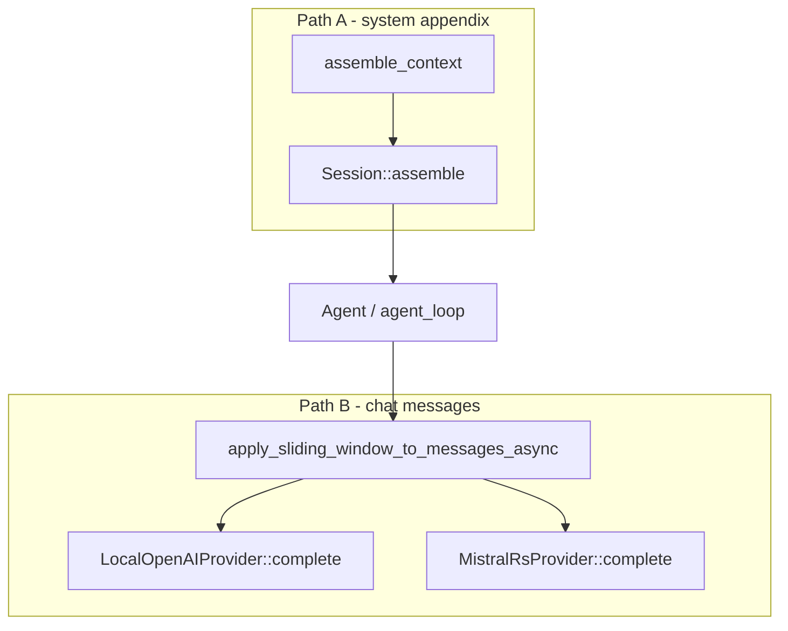

# Context assembly audit (S10 — ROADMAP_CLAUDE_UPGRADE Task 1.1)

**Date:** 2026-04-09  
**Purpose:** Trace how session **system** context and **chat message** context are built, where trimming happens, and what env vars apply. Feeds **Task 1.2** (sliding semantic window) and **Task 1.3** (tests).

**Related:** [ROADMAP_CLAUDE_UPGRADE.md](ROADMAP_CLAUDE_UPGRADE.md) Phase 1 · [context_window.rs](../src/context_window.rs) · [local_openai.rs](../src/local_openai.rs) · [context_assembly.rs](../src/context_assembly.rs) · [session.rs](../src/session.rs)

---

## 1. Two different “context” paths

| Path | What it is | Primary code |
|------|------------|--------------|
| **A. System prompt appendix** | Brain, ego, tasks, episodes, COS snapshot, tool health, etc. | [`assemble_context()`](../src/context_assembly.rs) |
| **B. Chat history (messages)** | User/assistant/tool turns sent to the model | [`apply_sliding_window_to_messages_async()`](../src/local_openai.rs) |

They are **independent**: (A) is concatenated into the system string before the agent run; (B) runs inside each `Provider::complete` (HTTP `LocalOpenAIProvider`, in-process `MistralRsProvider`).

---

## 2. Path A — `assemble_context()`

**File:** [`src/context_assembly.rs`](../src/context_assembly.rs)

- **Entry:** `pub fn assemble_context() -> String`
- **Consumer:** [`Session::assemble`](../src/session.rs) stores the string; it becomes part of the system prompt alongside soul / instructions.
- **Behavior:** Builds a large markdown-ish block `[CHUMP CONTEXT — auto-loaded…]` with sections gated by **`CHUMP_HEARTBEAT_TYPE`** (work / research / cursor_improve / ship / empty=CLI).
- **Truncation:** Per-section **character** caps (e.g. COS weekly `CHUMP_COS_WEEKLY_MAX_CHARS`, brain autoload `MAX_FILE_CHARS` 2000), not global token counting. No call to `context_window::approx_token_count` here.
- **Not covered here:** Semantic retrieval of older “middle” system sections — Phase 1.2 scope if system prompt grows unbounded (today mitigated by round-type gating).

---

## 3. Path B — sliding window (chat `messages`)

**File:** [`src/local_openai.rs`](../src/local_openai.rs) · **Providers:** [`LocalOpenAIProvider::complete`](../src/local_openai.rs), [`MistralRsProvider`](../src/mistralrs_provider.rs) (both call **`apply_sliding_window_to_messages_async`**).

**Env / helpers** ([`context_window.rs`](../src/context_window.rs)):

| Env | Role |
|-----|------|
| `CHUMP_CONTEXT_MAX_TOKENS` | Hard cap: approximate tokens (system + messages) before dropping older **chat** messages from the front |
| `CHUMP_CONTEXT_SUMMARY_THRESHOLD` | Soft threshold: when exceeded, trim older messages (approx chars/4). If `CHUMP_CURRENT_SLOT_CONTEXT_K` > 32, threshold is **doubled** |
| `CHUMP_CONTEXT_VERBATIM_TURNS` | If > 0, keep at least this many recent **message rows** (min 2); else fall back to `CHUMP_MAX_CONTEXT_MESSAGES` (default **20**) |
| `CHUMP_MAX_CONTEXT_MESSAGES` | Max messages when `CHUMP_CONTEXT_VERBATIM_TURNS` is 0/unset |
| `CHUMP_CONTEXT_HYBRID_MEMORY` | When **`1`** / **`true`**, long-term memory block uses [`memory_tool::recall_for_context`](../src/memory_tool.rs) (FTS + embeddings + graph **RRF** when embed server / in-process embed is up); else **FTS5 keyword** only |
| `CHUMP_CONTEXT_MEMORY_SNIPPETS` | Max memory lines to inject after a trim (default **8**) |

**Algorithm (summary):**

1. **Message-count cap:** `sliding_window_trim_messages` keeps only the last `cap` messages.
2. **Token budget:** If `threshold > 0` or `hard_cap > 0` and a system prompt is present, drop a prefix of older messages when the approximate token budget is exceeded.
3. **Retrieval injection:** Session FTS block is always attempted when trim fires. Long-term memory: **async** path uses hybrid recall when env is on; otherwise **`memory_db::keyword_search`**. **`apply_sliding_window_to_messages`** (sync) remains FTS5-only for memory.
4. **Synthetic user notice** when trim fired: verbatim block if any retrieval text; else “Earlier in this conversation…”.

**Important:** No delegate LLM summarization of middle turns. Retrieved memory lines are **stored DB text** or **RRF-ranked** memory entries, not model-generated summaries.

---

## 4. Remaining gaps (post Phase 1 Tasks 1.2–1.3)

| Area | Follow-up |
|------|-----------|
| **Query representation** | Still a single **latest user** string as hint; multi-query / middle-turn fusion is future work |
| **System prompt (Path A)** | No embedding-based pruning of `assemble_context` sections |
| **Tests** | Unit tests cover trim + notice; session FTS + hybrid recall need integration tests with DB + embed fixtures |

---

## 5. Quick grep anchors for future edits

- `CHUMP_CONTEXT_SUMMARY_THRESHOLD` — `context_window.rs` + `summary_threshold()`
- `apply_sliding_window_to_messages_async` — `local_openai.rs`, `mistralrs_provider.rs`
- `sliding_window_trim_messages` / `SlidingInjectCtx` — `local_openai.rs`
- `assemble_context` — `context_assembly.rs`, `session.rs`

---

**Phase 1 status:** Tasks **1.1** (this doc), **1.2** (hybrid memory opt-in), **1.3** (trim + notice tests) complete. **Next (Phase 2):** `ROADMAP_CLAUDE_UPGRADE.md` edit / patch tooling.
