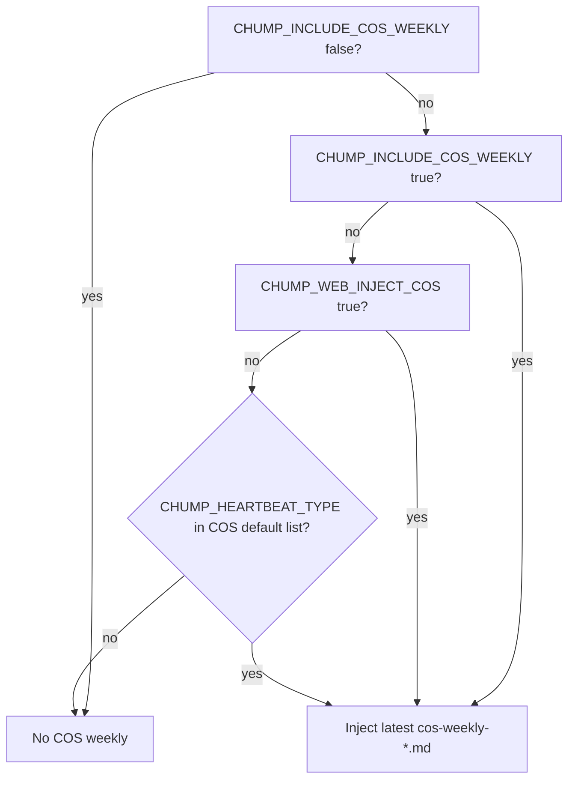

# Context precedence (brain, assembly, web)

**Purpose:** One place to answer “what the model sees” when **heartbeat**, **PWA/web chat**, **COS weekly**, and **brain files** all exist. Implementation: `src/context_assembly.rs` (`assemble_context`), `src/session.rs`, `src/discord.rs` (`build_chump_agent_web_components`), `src/web_server.rs` (chat handler).

## End-to-end order (single user turn)

What the agent receives is built in **layers** (later layers do not overwrite earlier system text; they append in the prompt the runtime builds):

1. **Base system instructions** — Soul / persona from `chump_system_prompt(...)` (includes Mabel vs Chump variant).
2. **`[CHUMP CONTEXT — auto-loaded…]` block** — Output of **`context_assembly::assemble_context()`**, captured when `Session::new().assemble()` runs (web and Discord agent builds).
3. **Conversation history** — Prior turns from the session manager (`sessions/web/<id>/…` for web).
4. **Current user message** — Including any **attachments** expanded inline *before* the visible user text (web server prepends `[Attachment: …]` blocks).

## What `assemble_context()` includes (high level)

The function always opens with the bracketed header, restores blackboard once, then **conditionally** adds sections based on **`CHUMP_HEARTBEAT_TYPE`** (empty string = **web / generic CLI** path) and env flags.

| Content | Typical web/PWA (`CHUMP_HEARTBEAT_TYPE` unset) | Heartbeat rounds (`work`, `ship`, `research`, …) |
|--------|-----------------------------------------------|-----------------------------------------------------|
| **`state_db` ego fields** (focus, mood, session #, …) | Yes, if DB available | Yes |
| **`CHUMP_BRAIN_AUTOLOAD` files** | Yes | Yes |
| **`portfolio.md` summary** | Yes, if present | Yes |
| **Ship-only injections** (playbook, log tail) | No | Yes when type is `ship` |
| **Open tasks (top 5)** | Yes (`is_cli`) | Yes for `work` / `cursor_improve` / `doc_hygiene` / `is_cli`; assignee queues extra for `work` |
| **COS weekly snapshot** | Only if **`CHUMP_WEB_INJECT_COS=1`** (or **`CHUMP_INCLUDE_COS_WEEKLY=1`**) — see below | Yes for COS-oriented types when `CHUMP_INCLUDE_COS_WEEKLY` not hard-off |
| **Recent episodes** | Yes: last 3 + frustrating pattern block (`is_cli`) | Narrower sets for `research` / `cursor_improve` / `doc_hygiene` |
| **Schedule due** | Yes (`is_cli`) | Usually no for typed heartbeats |
| **Ask-Jeff queues** | Yes (`is_work` \|\| `is_cli`) | `work` only for assignee-oriented bits |
| **Git / file-watch “what changed”** | Yes (`is_cli` + explicit repo) | `cursor_improve` / `doc_hygiene` / `is_cli` |
| **Consciousness / precision / tool health** | Per env and regime | Same |

Hard rule: **`CHUMP_INCLUDE_COS_WEEKLY=0|false`** disables COS weekly injection **everywhere**, including web.

## COS weekly on web (`CHUMP_WEB_INJECT_COS`)

Default COS-oriented heartbeat types include `work`, `cursor_improve`, `doc_hygiene`, `discovery`, `opportunity`, `weekly_cos` (see `cos_weekly_default_rounds` in `context_assembly.rs`). **Web chat** normally has an **empty** heartbeat type, so without **`CHUMP_WEB_INJECT_COS`** the weekly file is **not** injected.

## Task contract vs chat

Task-specific **contract text** (when used) is attached by the agent/tooling path for that task, not by this doc’s stack chart. Prefer **`assemble_context` task lists** as the global “what’s open” view; durable task bodies live in the DB and can be pulled by tools.

## Related docs

- [CHUMP_BRAIN.md](CHUMP_BRAIN.md) — brain layout, portfolio, COS files  
- [COS_DECISION_LOG.md](COS_DECISION_LOG.md) — decisions under `cos/decisions/`  
- [OPERATIONS.md](OPERATIONS.md) — env and heartbeats  
- [WEB_API_REFERENCE.md](WEB_API_REFERENCE.md) — web session, chat API, **`GET /api/cos/decisions`** (newest decision files)  
