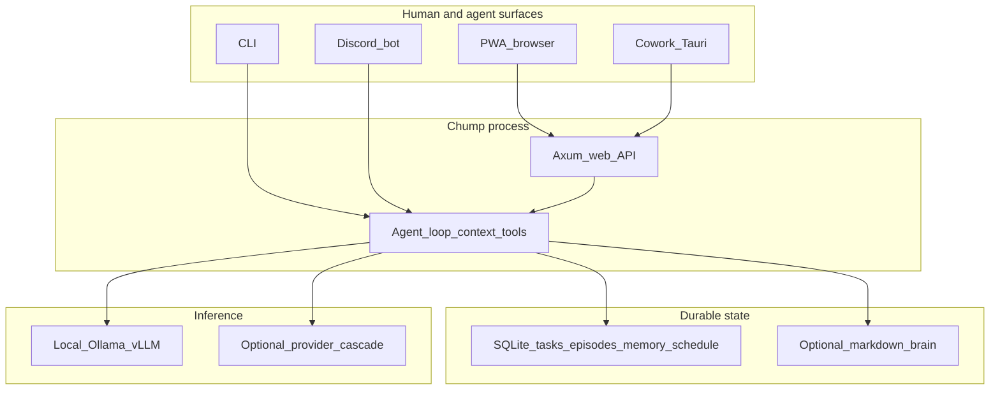

# Chump: showcase and academic review packet

**Purpose:** This document is the **zoomed-out entry point** for two audiences: people who need a **credible product story** (showcase, hiring, partners, pilots) and people who need **academic or technical review** (structure, claims, evidence, limits). It does not replace deep references; it **routes** you to them.

**Companion:** The implementation-heavy technical report is [DOSSIER.md](DOSSIER.md). The master doc list is [00-INDEX.md](00-INDEX.md). Day-to-day navigation is [README.md](README.md).

---

## 1. Executive one-pager

**What it is:** Chump is a **self-hosted**, **single-tenant** AI agent system implemented primarily in **Rust**. It connects to **OpenAI-compatible** inference (local Ollama / vLLM-MLX, optional multi-provider cascade). It is **not** a thin chat wrapper: it persists **SQLite-backed** state (tasks, episodes, memory, schedules), exposes a large **tool surface** (repository, git, GitHub, search, delegation, audits), and ships multiple **interaction surfaces**—CLI, **web PWA**, optional **Discord** bot, and a **Tauri desktop shell** (“Cowork”) that wraps the same PWA against a local HTTP sidecar.

**Who it is for:** Operators who want **ownership of data and runtime** (on-prem or personal hardware), a **single coherent agent** with durable context, and optional **24/7 automation** (heartbeats, scheduled roles, fleet companions). The project explicitly documents **market positioning**, **pilot metrics**, and **wedge** narratives—see [MARKET_EVALUATION.md](MARKET_EVALUATION.md), [PWA_WEDGE_PATH.md](PWA_WEDGE_PATH.md), [WEDGE_PILOT_METRICS.md](WEDGE_PILOT_METRICS.md).

**Differentiation (honest):** Strength is **integration depth** (memory + tools + web API + multi-surface UX + ops scripts) under **your** keys and disk. Weakness is **not** “easiest chat UI in the world”—it is a **systems** product: reward scales with willingness to configure, run roles, and curate the brain.

**License:** [MIT](../LICENSE).

**Primary engineering environments:** **macOS** and **Linux** (README states Windows via WSL2). This packet notes **MacBook-centric development** explicitly in §8.

---

## 2. Problem statement and thesis (reviewer framing)

**Problem:** Knowledge workers and small teams increasingly rely on **opaque, hosted** assistants. That trades convenience for **data residency**, **repeatable automation**, **auditable tool policy**, and **composable** integration with git, issue trackers, and local inference.

**Thesis:** A **locally operated** agent loop—with explicit tool policy, durable state, and first-class **automation surfaces** (web API, heartbeats, optional fleet)—can serve as a **personal or team chief-of-staff** for shipping work (code, research, operations) while keeping **ground truth** on disk the operator controls.

**Scope boundary:** Chump is **engineering infrastructure** and **workflow software**, not a claim of artificial general intelligence. Speculative research directions are **gated** and documented separately—see [CHUMP_TO_COMPLEX.md](CHUMP_TO_COMPLEX.md) and [ECOSYSTEM_VISION.md](ECOSYSTEM_VISION.md) (Horizon 4).

---

## 3. System overview (medium altitude)

**Narrative:** The **agent loop** assembles context (system prompt, brain excerpts, filtered history, summaries under pressure), calls tools under policy, and writes state. The **web server** serves the PWA and JSON APIs; **Cowork** is a **desktop shell** that loads the same web assets and bridges IPC for health, approvals, and chat submission—see [TAURI_FRONTEND_PLAN.md](TAURI_FRONTEND_PLAN.md), [WEB_API_REFERENCE.md](WEB_API_REFERENCE.md).

**Deeper architecture:** [ARCHITECTURE.md](ARCHITECTURE.md), [DOSSIER.md](DOSSIER.md) §2–3.

---

## 4. Ecosystem vision (product story)

**One-sentence vision:** A **personal operations team**—Chump on a Mac (builder), optional **Mabel** on Android (sentinel/patrol), **PWA** as primary command surface—so one coherent system replaces scattered bots. Source: [ECOSYSTEM_VISION.md](ECOSYSTEM_VISION.md).

**Horizons (abbreviated):**

| Horizon     | Emphasis                                                 | Doc anchor                                              |
| ----------- | -------------------------------------------------------- | ------------------------------------------------------- |
| H1 Now      | Ship from portfolio, dashboard visibility, roles running | ECOSYSTEM_VISION §1, [OPERATIONS.md](OPERATIONS.md)     |
| H2 Next     | Fleet symbiosis, single report, Mabel sentinel           | [FLEET_ROLES.md](FLEET_ROLES.md), ROADMAP fleet section |
| H3 Later    | In-process inference, richer automation                  | [TOP_TIER_VISION.md](TOP_TIER_VISION.md)                |
| H4 Frontier | Explicitly gated research motifs                         | [CHUMP_TO_COMPLEX.md](CHUMP_TO_COMPLEX.md) §3           |

**“Chief of staff” product line:** Instrumentation, decision logs, discovery scripts—[PRODUCT_ROADMAP_CHIEF_OF_STAFF.md](PRODUCT_ROADMAP_CHIEF_OF_STAFF.md).

---

## 5. Evidence, evaluation, and quality (what reviewers can verify)

| Layer                   | What it shows                                                     | Where                                                                        |
| ----------------------- | ----------------------------------------------------------------- | ---------------------------------------------------------------------------- |
| CI                      | `fmt`, tests, clippy, battle sim, golden path, **PWA Playwright** | [.github/workflows/ci.yml](../.github/workflows/ci.yml)                      |
| Desktop shell E2E       | **Tauri WebDriver** on **Linux** (real `chump-desktop` window)    | `e2e-tauri/`, job `tauri-cowork-e2e` in CI                                   |
| Agent stress            | Battle QA harness and self-heal workflow                          | [BATTLE_QA.md](BATTLE_QA.md), [BATTLE_QA_SELF_FIX.md](BATTLE_QA_SELF_FIX.md) |
| Onboarding path         | External golden path (no Discord)                                 | [EXTERNAL_GOLDEN_PATH.md](EXTERNAL_GOLDEN_PATH.md)                           |
| Pilot / metrics         | SQL/API recipes, pilot summary export                             | [WEDGE_PILOT_METRICS.md](WEDGE_PILOT_METRICS.md), `GET /api/pilot-summary`   |
| Intent behavior         | Labeled harness + procedure                                       | [INTENT_CALIBRATION.md](INTENT_CALIBRATION.md)                               |
| Trust / rollback limits | What automated rollback does **not** promise                      | [TRUST_SPECULATIVE_ROLLBACK.md](TRUST_SPECULATIVE_ROLLBACK.md)               |
| Manual UX               | 20-step matrix (PWA + Cowork)                                     | [UI_MANUAL_TEST_MATRIX_20.md](UI_MANUAL_TEST_MATRIX_20.md)                   |

**Academic honesty:** The project separates **documented procedures** (intent calibration, pilot SQL) from **reported user research**—see [MARKET_EVALUATION.md](MARKET_EVALUATION.md) (e.g. Phase 2 execution checklist in [ROADMAP.md](ROADMAP.md)). Claims about product–market fit should trace to that evidence, not to README adjectives.

---

## 6. Ethics, safety, and governance (reviewer checklist)

- **Single-tenant:** You run the binary; secrets live in **your** `.env`. No mandatory vendor cloud for core loop.
- **Tool policy:** Allow / deny / ask, optional approval flows—[TOOL_APPROVAL.md](TOOL_APPROVAL.md), [ARCHITECTURE.md](ARCHITECTURE.md).
- **Autonomy boundaries:** Executive mode and dangerous tools are **explicitly** configured; heartbeats and ship loops are documented in [OPERATIONS.md](OPERATIONS.md).
- **Speculative execution:** Limits of rollback and trust are stated in [TRUST_SPECULATIVE_ROLLBACK.md](TRUST_SPECULATIVE_ROLLBACK.md).
- **Discord / social surface:** Bot behavior is governed by soul/prompt and tool policy; intent patterns are documented in [INTENT_ACTION_PATTERNS.md](INTENT_ACTION_PATTERNS.md).

This is **not** a substitute for organizational IRB-style review if you deploy in regulated environments—see also [DEFENSE_MARKET_RESEARCH.md](DEFENSE_MARKET_RESEARCH.md) and related compliance-oriented docs if that vertical applies.

---

## 7. Related work (positioning, not a literature review)

**vs hosted chat products:** Chump optimizes for **local state**, **git/GitHub**, **scheduling**, and **automation**—not for lowest-friction consumer chat.

**vs IDE copilots:** Chump is **runtime-agnostic** (Discord, web, CLI, desktop) and **durable** across sessions via SQLite and brain; it is not locked to a single editor buffer.

**vs research “agents” papers:** Many papers describe **episodic** demos; this codebase emphasizes **operations** (logging, roles, battle QA, CI, pilot exports). Cite **artifacts** (scripts, API routes, evaluation docs) when comparing.

**Human–AI collaboration:** Chump–Cursor protocol and handoffs—[CHUMP_CURSOR_PROTOCOL.md](CHUMP_CURSOR_PROTOCOL.md), [AGENTS.md](../AGENTS.md).

---

## 8. Developing on a MacBook: validation map

Many contributors run **macOS** locally. Automated UI coverage is **split by platform capability**:

| Concern                         | Local Mac                                                  | CI (typical)                                                                                  |
| ------------------------------- | ---------------------------------------------------------- | --------------------------------------------------------------------------------------------- |
| PWA in Chromium                 | **Yes** — `scripts/run-ui-e2e.sh` (Playwright)             | **Yes** — same suite on `ubuntu-latest`                                                       |
| Tauri **Cowork** shell          | **No official WKWebView WebDriver** from Apple/Tauri stack | **Yes** — `tauri-cowork-e2e` uses **Linux** + `tauri-driver` + WebKitWebDriver (`e2e-tauri/`) |
| Rust / unit / integration tests | **Yes** — `cargo test`                                     | **Yes**                                                                                       |

**Implication for showcase:** You can honestly say **desktop shell E2E is exercised in CI on Linux**, while **Mac developers** rely on **manual Cowork checks** ([UI_MANUAL_TEST_MATRIX_20.md](UI_MANUAL_TEST_MATRIX_20.md), [UI_WEEK_SMOKE_PROMPTS.md](UI_WEEK_SMOKE_PROMPTS.md)) plus **PWA** automation locally. Optional future: community macOS WebDriver bridges—see `e2e-tauri/README.md`.

---

## 9. Reading paths (time-boxed packets)

### 9.1 Showcase / investor / partner (≈20 minutes)

1. This file §1 and §4.
2. [README.md](../README.md) — differentiation + quick start.
3. [MARKET_EVALUATION.md](MARKET_EVALUATION.md) — ICP and competitive framing (skim §1–3).
4. [PRODUCT_CRITIQUE.md](PRODUCT_CRITIQUE.md) — external launch gate (skim).

### 9.2 Academic or technical reviewer (≈90 minutes)

1. [DOSSIER.md](DOSSIER.md) — full technical report.
2. [ARCHITECTURE.md](ARCHITECTURE.md) — soul, memory, tools, policy.
3. §5–6 of **this packet** + [TRUST_SPECULATIVE_ROLLBACK.md](TRUST_SPECULATIVE_ROLLBACK.md).
4. One evaluation deep dive: either [BATTLE_QA.md](BATTLE_QA.md) **or** [INTENT_CALIBRATION.md](INTENT_CALIBRATION.md).

### 9.3 Deep dive (multi-day)

- [00-INDEX.md](00-INDEX.md) — complete library in dossier order.  
- [ROADMAP.md](ROADMAP.md) + [ROADMAP_PRAGMATIC.md](ROADMAP_PRAGMATIC.md) — what is actually planned.  
- [CHUMP_TO_COMPLEX.md](CHUMP_TO_COMPLEX.md) — research-grade backlog and gates.

---

## 10. Demo and collateral pointers (showcase)

- **Visual:** PWA preview in [README.md](../README.md); additional assets under `docs/img/` if present.  
- **Live demo script (minimal):** Golden path in README; wedge smoke [scripts/wedge-h1-smoke.sh](../scripts/wedge-h1-smoke.sh).  
- **API surface for reviewers:** [WEB_API_REFERENCE.md](WEB_API_REFERENCE.md).  
- **Ops credibility:** [OPERATIONS.md](OPERATIONS.md) — roles, heartbeats, env tables.  
- **PDF white papers (bundled Markdown → PDF):** [docs/white-paper-manifest.json](white-paper-manifest.json) lists chapters per volume (including **external golden path**, **capability checklist**, and PDF-only reader appendices); run `./scripts/build-white-papers.sh` (Pandoc + LaTeX, or `./scripts/build-white-papers.sh --docker`, or **`--chrome-pdf`** on a Mac with Chrome and no TeX). Cross-links to Markdown files outside the manifest are rewritten so shared PDFs stand alone. Outputs under `dist/white-papers/`. **Roadmap to maximize PDF completeness:** [WHITE_PAPER_COMPLETION_PLAN.md](WHITE_PAPER_COMPLETION_PLAN.md).

---

## 11. Suggested citation (informal)

If referencing this repository in a paper, memo, or syllabus, a compact citation line:

> *Chump* — open-source (MIT), self-hosted Rust agent with SQLite state, OpenAI-compatible inference, web PWA and optional Discord; technical dossier: `docs/DOSSIER.md`; showcase packet: `docs/SHOWCASE_AND_ACADEMIC_PACKET.md`.

Adjust to your style guide (ACM, IEEE, Chicago).

---

## 12. Packet index (map section → canonical doc)

| Topic                  | Primary doc                                                            |
| ---------------------- | ---------------------------------------------------------------------- |
| Full technical dossier | [DOSSIER.md](DOSSIER.md)                                               |
| Vision and horizons    | [ECOSYSTEM_VISION.md](ECOSYSTEM_VISION.md)                             |
| Roadmap truth          | [ROADMAP.md](ROADMAP.md)                                               |
| Market / interviews    | [MARKET_EVALUATION.md](MARKET_EVALUATION.md)                           |
| Architecture           | [ARCHITECTURE.md](ARCHITECTURE.md)                                     |
| Web API                | [WEB_API_REFERENCE.md](WEB_API_REFERENCE.md)                           |
| Cowork / Tauri         | [TAURI_FRONTEND_PLAN.md](TAURI_FRONTEND_PLAN.md)                       |
| Mabel / fleet          | [MABEL_DOSSIER.md](MABEL_DOSSIER.md), [FLEET_ROLES.md](FLEET_ROLES.md) |
| Battle QA              | [BATTLE_QA.md](BATTLE_QA.md)                                           |
| Chump ↔ Cursor         | [CHUMP_CURSOR_PROTOCOL.md](CHUMP_CURSOR_PROTOCOL.md)                   |
| Speculative / research | [CHUMP_TO_COMPLEX.md](CHUMP_TO_COMPLEX.md)                             |

---

*Last organizational note:* Treat [CHANGELOG.md](../CHANGELOG.md) as the **temporal** anchor for what shipped when; treat [ROADMAP.md](ROADMAP.md) as the **intent** anchor for what is intended next.