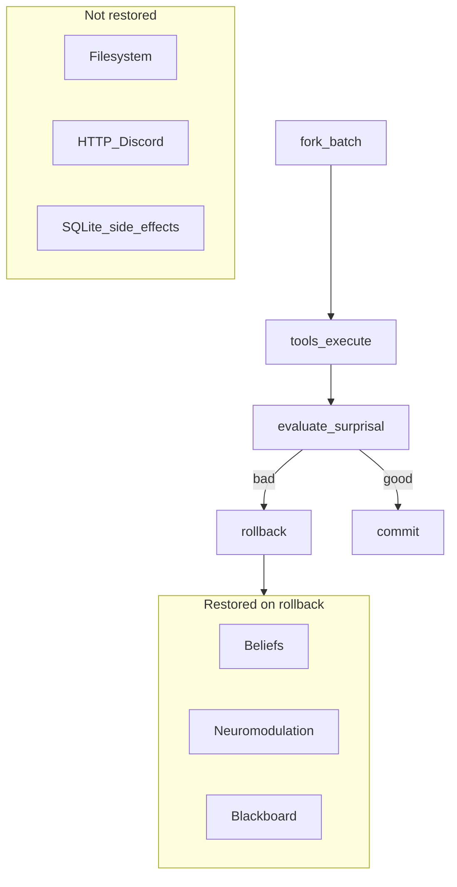

# Trust: speculative batches and rollback (public summary)

**Audience:** Buyers and operators who need to know **what rolls back** when the agent “undoes” a multi-tool attempt.

**Full decision record:** [ADR-001-transactional-tool-speculation.md](ADR-001-transactional-tool-speculation.md)

---

## One-sentence truth

**In-process speculative evaluation** can **restore beliefs, neuromodulation, and blackboard state** after a bad multi-tool batch, but **cannot** reverse filesystem writes, HTTP calls, Discord posts, or SQLite changes made by tools during that batch.

---

## Diagram (memory vs environment)

**Sandbox (`sandbox_run`):** Separate path—runs a **bounded shell command** in a **git worktree** when `CHUMP_SANDBOX_ENABLED=1`; see ADR **E2 baseline**. It is **not** automatically wired for every tool in speculative batches yet.

---

## Operator controls

| Control | Purpose |
|---------|---------|
| `CHUMP_SPECULATIVE_BATCH=0` | Disable speculative fork/evaluate path if behavior confuses operators |
| Tool approval / `CHUMP_TOOLS_ASK` | Require human allow for risky tools ([TOOL_APPROVAL.md](TOOL_APPROVAL.md)) |
| `CHUMP_SANDBOX_ENABLED=1` | Enable explicit sandbox tool for repo-scoped commands |

---

## Related

- [METRICS.md](METRICS.md) §1b (speculative batch metrics)  
- [ROADMAP_REMAINING_GAPS.md](ROADMAP_REMAINING_GAPS.md)  
- [WEDGE_PILOT_METRICS.md](WEDGE_PILOT_METRICS.md)  
