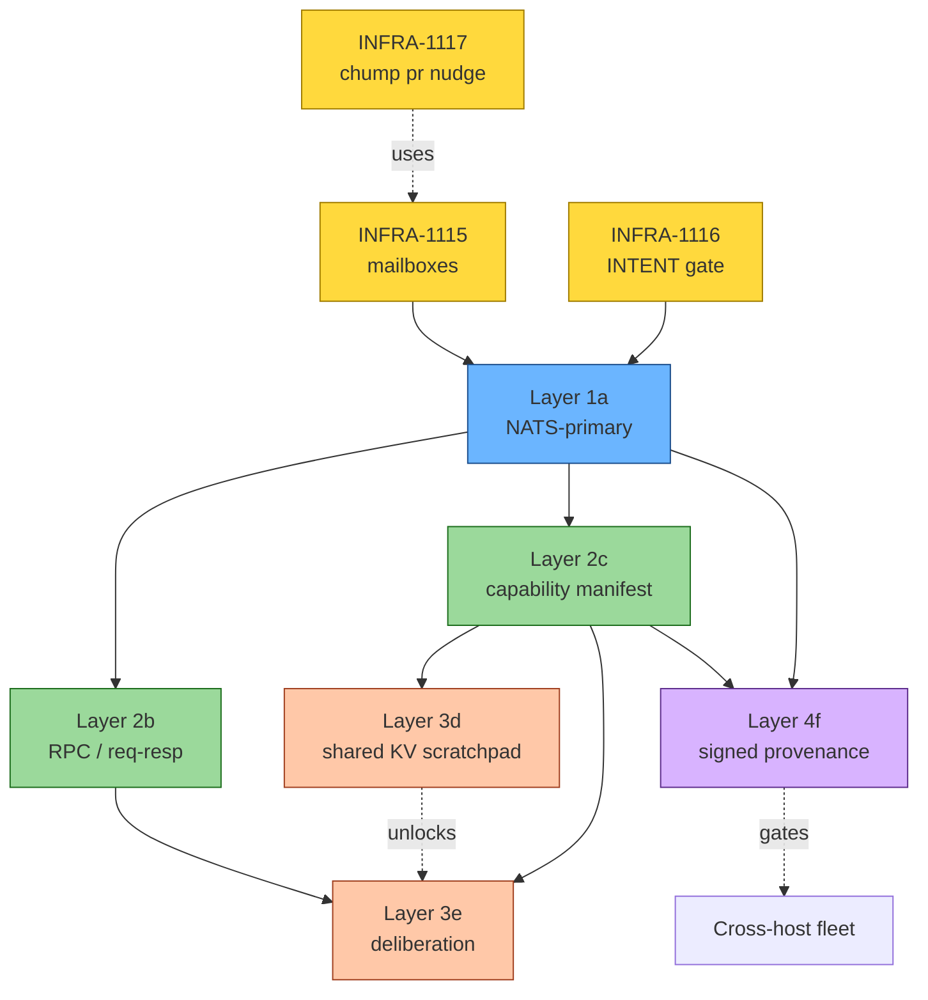

# A2A Roadmap — toward world-class fleet coordination

> Filed under META-061. Read alongside [`AGENTS.md`](../../AGENTS.md), [`CLAUDE.md`](../../CLAUDE.md), [`scripts/coord/broadcast.sh`](../../scripts/coord/broadcast.sh), and [`crates/chump-coord/src/lib.rs`](../../crates/chump-coord/src/lib.rs).

## TL;DR

Chump already has more a2a infrastructure than most multi-agent systems (atomic NATS-backed gap claims, JetStream event bus, work-board subtasks, help-requests with capability hints, file-fallback for offline-solo-dev). The gap between **what exists** and **world class** is six layers: **NATS-primary delivery**, **request/response RPC**, **capability discovery**, **shared KV scratchpad**, **multi-agent deliberation**, and **signed provenance**.

This doc inventories the current state, defines the "world class" SLO, designs each of the six layers (what exists, what's missing, what to build), sets per-layer release gates, and closes with the migration plan + threat model.

## What "world class" means here

> A 32-worker fleet across 4 machines with **zero operator intervention for 7 consecutive days**, **< 5% waste rate**, **< 1% race-induced corruption**, **mean PR-time-to-merge < 30 minutes**, and **no cross-host trust assumption violated**.

These numbers come from the operator's project_offline_local_llm_mission memory and the FLEET_SLOS.md targets. The benchmark is **measured**, not aspirational: when META-061 closes, we will have a 7-day production fleet run that meets every threshold.

| SLO | Today (2026-05-13) | Target |
|---|---|---|
| Operator interventions / 24h | ~8 (rate-limit recovery, orphan rescue, race repair) | 0 |
| Fleet waste rate | ~20% (single-machine, 2 workers) | < 5% |
| Race-induced corruption events / 24h | 3-5 (INFRA-779 family) | < 1% of claims |
| Mean PR-time-to-merge | 4-8 hours (with rate-limit days) | < 30 min |
| Cross-host workers | 0 (single machine) | 4 machines |

## Comparable prior art

| System | What we borrow | What we don't |
|---|---|---|
| **Erlang/OTP supervision trees** | Worker death → handoff → restart | Distributed message-passing is too tight; we want operator-visible audit |
| **Akka clusters** | Capability-typed actors, gossip-based membership | JVM weight; we prefer NATS-native + bash |
| **Ray** | Task graph with capability-routed workers | Centralized scheduler; we want decentralized claim |
| **ROS2 / DDS** | Type-safe message contracts, QoS profiles | Field-of-view assumption (single-robot); doesn't fit code-agent semantics |
| **Tendermint / BFT consensus** | Signed provenance, equivocation detection | Quorum overhead; in-fleet trust assumed for v1 |
| **ActivityPub federation** | Cross-fleet message format, signed origin | Public web semantics; we want enterprise-grade privacy |
| **Multi-agent RL coordination** | Self-play deliberation primitives, capability auctions | Learned policies; we prefer deterministic for now |

What chump uniquely needs that none of these solve:
1. **File-based audit trail as first-class**: ambient.jsonl must remain inspectable by `tail -f` so a solo dev with no daemon running can debug.
2. **Bash-callable from anywhere**: every primitive accessible via `scripts/coord/*.sh` so non-Rust fleets (Cursor, opencode, manual) can participate.
3. **Offline-first**: NATS optional, never required; the 4-Pi mesh case is the design constraint.

## Today's stack — inventory

| Surface | What it does | Where |
|---|---|---|
| `ambient.jsonl` | Append-only file event log; read-by-all, broadcast-only | `.chump-locks/ambient.jsonl` |
| `broadcast.sh` | Send INTENT/HANDOFF/STUCK/DONE/WARN/ALERT to ambient + NATS | `scripts/coord/broadcast.sh` |
| File leases | Per-session JSON in `.chump-locks/<session>.json` with paths + expiry | `scripts/coord/gap-claim.sh` |
| NATS KV `chump_gaps` | Atomic gap-claim mutex with TTL | `chump-coord::try_claim_gap` |
| NATS JetStream `chump.events.*` | Coordination event bus (24h TTL) | `chump-coord::publish_event` |
| Work-board (FLEET-008) | Subtask post / claim / complete with capability requirements | `chump-coord::work_board` |
| Help-requests (FLEET-010) | Blocker classification + capability-targeted help asks | `chump-coord::help_request` |
| GitHub PR comments | Side-channel for cross-session nudges | manual via `gh api`, mechanized in INFRA-1117 |
| Gap registry titles | `PR #N stuck [ORPHAN]` auto-filed nudges | `chump pr-triage-bot` |
| State.db gap status | Passive coordination via shared canonical store | `.chump/state.db` |

What's **already done** (mapped to the six target layers, in advance of the layer-by-layer designs below):

- **Layer 1 (NATS-primary):** primitives exist (`chump-coord` connects, KV, JetStream); workers **publish** but **don't subscribe** as primary path
- **Layer 2b (RPC):** help-requests exist as one-shot ask, but no reply-subject correlation, no timeout-per-call
- **Layer 2c (capability discovery):** `Requirement` struct exists in work_board, `needed_capability` in help-requests — but no session-level manifest published anywhere
- **Layer 3d (shared KV):** `chump_gaps` bucket exists as claim-mutex only; no general "scratchpad" namespace
- **Layer 3e (deliberation):** not started
- **Layer 4f (signed provenance):** not started

## Architectural principles

These constrain every layer design below.

1. **Local-first, not local-only.** Every primitive must work on a single machine with no NATS. NATS, when available, is an accelerator + multi-machine enabler, never a precondition.
2. **File audit trail is canonical.** Any event delivered via NATS MUST also write to ambient.jsonl (the audit trail is the source of truth for "what happened"). NATS provides delivery speed; files provide forensics.
3. **No quorum, no consensus.** In-fleet trust is assumed for v1. The four-Pi mesh trusts itself. Cross-fleet federation is a v2 problem (Layer 4f's signed-provenance + trust-anchor lays the groundwork).
4. **Schema evolution is mandatory.** Every message format has `schema_version`; readers MUST tolerate forward-compat fields. We never break old agents at flag-day.
5. **Bash-callable.** Every Rust primitive has a `scripts/coord/<name>.sh` wrapper so non-Rust harnesses (opencode, codex, manual) can participate in coordination.
6. **Observability before behavior.** Every new event kind is registered in `EVENT_REGISTRY.yaml` before any consumer reads it. Pre-commit guard enforces.
7. **Fail-open over deadlock.** When the coordination layer itself fails (NATS down, ambient.jsonl corrupted, KV unreachable), worker behavior degrades gracefully — never deadlocks the fleet on coordination errors.
8. **Reversible.** Every layer ships with a sunset criterion. If a layer has < 5% real usage 6 months after ship, deprecation review.

## The six layers



The three tactical gaps (yellow) ship now to fix immediate friction. Layer 1a is the unlock for everything else. 2b and 2c are independent of each other but both depend on 1a. 3d/3e build on capability discovery (2c). 4f cross-cuts everything and gates multi-machine deployment.

---

### Layer 1a — NATS-primary delivery, file-fallback secondary

**Status:** primitives exist (chump-coord publishes); the consume side is what's new.

**Today:** workers write to ambient.jsonl AND chump-coord publishes to JetStream. Workers READ from ambient.jsonl only. NATS is essentially write-only telemetry.

**Frontier:** workers subscribe to `chump.events.>` at session start. New events arrive via push, not poll. File writes continue as audit trail. Worker latency from "event happened" to "I saw it" drops from `poll interval` (typically 5-30s) to `single-digit ms`.

**Why it's the unlock:** RPC needs sub-second latency. Capability manifest updates need to propagate. Multi-machine requires a real bus, not a shared filesystem. Layer 1a is the price of admission to layers 2-4.

**Design sketch:**

- New `chump-coord` API: `pub async fn subscribe_events(filter: EventFilter) -> Stream<CoordEvent>`.
- Worker loop integration: `worker.sh` starts a subscriber subprocess that tails NATS into per-session inbox (composes cleanly with INFRA-1115).
- When NATS is unreachable: worker falls back to ambient.jsonl polling (existing behavior) within 5 seconds; emits `kind=fleet_a2a_degraded`.
- Recovery path: NATS-watcher detects reconnection; emits `kind=fleet_a2a_recovered`; subscriber resumes from a JetStream durable name so no events are missed during the gap.
- Backpressure: if subscriber consumer is slow, JetStream's `max_ack_pending` bounds the buffer; oldest gets dropped with `kind=fleet_a2a_backpressure` event so it's visible.

**Migration plan:**

- Feature-gate via `CHUMP_A2A_LAYER=1` (default 0 in v0.1.1; default 1 in v0.1.2 after 30 days of telemetry).
- File-fallback NEVER deleted in v1; sunset criterion is *3 production fleets running NATS-primary for 60 days with no fallback-engaged events* (per Layer 1a release gate).

**Open questions:**

- (1a-Q1) JetStream durable consumer naming — per-session or shared with replay? Tradeoff: per-session is clean isolation but cardinality grows with fleet size.
- (1a-Q2) When a worker restarts, do we replay missed events or skip ahead? For INTENT events, replay matters (other agents might have INTENTs we should respect). For DONE events, skip is fine.
- (1a-Q3) Should `ambient.jsonl` get a rotation policy tightened (INFRA-1071 covers some of this) once NATS is primary, since it becomes audit-only?

**Performance budget:**

- Send latency: < 5ms p99 to JetStream
- End-to-end (publisher → subscriber receive): < 50ms p99 on single-host
- Cross-host: < 200ms p99 on LAN
- Bandwidth at 32 workers × 4 hosts: < 100 KB/s aggregate

**Release gate (Layer 1a v0):** 7 days of single-host fleet running NATS-primary; no `fleet_a2a_degraded` events; subscriber latency p99 < 50ms; one chaos test killing NATS mid-cycle and asserting fallback within 5s.

---

### Layer 2b — RPC / request-response

**Status:** help-requests exist as one-shot ask with capability hint; no reply correlation, no timeout.

**Today:** Agent A files a `HelpRequest` to NATS. Agent B with capability X may or may not pick it up; A has no way to know when (or if) B responded.

**Frontier:** Every RPC carries a `request_id` and `reply_to` subject. Server-side handler MUST respond (success, error, or `timeout`) within a client-specified deadline. Caller blocks (or async-awaits) with timeout. Common wrappers:

- `ask_eta(gap_id) -> Duration` — "when do you think you'll finish that?"
- `ask_overlap(paths) -> Vec<Session>` — "anyone else touching these?"
- `ask_handoff(gap_id) -> (commit_sha, last_step)` — "give me your WIP and stand down."

**Why it matters:**

- INFRA-1116 INTENT enforcement gets a "two-phase commit" path: when overlap detected, *ask* the other session before refusing.
- Deliberation (Layer 3e) is built on RPC.
- `chump pr nudge` can ask the owner-session "are you still working on this PR?" before commenting.

**Design sketch:**

- NATS request-reply primitive (already supported by async-nats).
- `chump-coord::call_rpc(target_session, method, args, timeout) -> Result<Response>` — strongly-typed wrapper.
- `chump-coord::serve_rpc(method, handler)` — register on the receiving side; handler runs on a per-session subscription thread.
- Bash wrapper: `scripts/coord/rpc.sh call <session> <method> <json-args>` for non-Rust callers.
- Tracing: each RPC emits `a2a_rpc_started` and `a2a_rpc_finished` with `latency_ms`; surfaced in fleet-status.

**Idempotency:** every RPC carries `request_id`. Server-side handler MUST de-dup within 60s — retries are expected (network blips, timeout reissues).

**Deadlines:** client sets `timeout_ms`; default 10s; server emits `a2a_rpc_timeout` if exceeded. No infinite RPC calls allowed; that's how fleets deadlock.

**Use-case wrappers shipped with Layer 2b:**

1. `ask-eta` — "estimate remaining seconds on gap"
2. `ask-overlap` — "anyone holding INTENT on these paths"
3. `ask-handoff` — "stand down, give me your WIP"
4. `ask-progress` — "what fraction complete + last commit"
5. `ask-capability` — "do you have capability X"

**Open questions:**

- (2b-Q1) Synchronous-only or pub-sub-with-correlation? Sync is simpler but blocks the caller; async is the right shape for the worker loop. Recommendation: async with deadline.
- (2b-Q2) Should RPCs persist (durable JetStream) or be ephemeral (NATS core)? Recommendation: ephemeral. RPC retries are the caller's responsibility.
- (2b-Q3) Server-side handler crashes mid-call — do we surface as timeout or as `handler_crashed`? Recommendation: explicit `handler_crashed` kind so debug knows.

**Performance budget:**

- Single-hop RPC: < 50ms p99 local, < 200ms p99 cross-host
- Throughput: > 1000 RPCs/s per session

**Release gate (Layer 2b v0):** 5 use-case wrappers all instrumented; chaos test killing handler mid-call; 7-day fleet run with > 10 RPC/min sustained, no `handler_crashed` events.

---

### Layer 2c — Capability discovery / session manifest

**Status:** `Requirement` struct exists in work_board.rs; `needed_capability` field in help-requests. But no **session-level** "here's what I am" manifest published anywhere.

**Today:** Picker assigns work blindly. PR-nudge can't route to the right owner-session because it doesn't know which session matches which PR. Multi-machine fleets can't differentiate "this gap needs an M4 host" from "this gap needs the larger model".

**Frontier:** Each session publishes a self-describing manifest at startup AND on heartbeat. The manifest includes:

```yaml
session_id: claim-infra-1080-87804-1778725091
$schema: chump-capability-v1
started_at: 2026-05-13T22:55:01Z
host: jeffadkins-mac-studio
worktree_path: /private/tmp/chump-infra-1080
worktree_clean: true
repo: chump
chump_version: 0.1.1
model: opus
harness: claude
current_domain: INFRA
current_gap_id: INFRA-1080
available_features: [worktree_isolation, nats_primary, rpc_layer]
hardware: {ram_gb: 64, gpu: m4-max}
languages: [rust, bash, typescript]
heartbeat_at: 2026-05-13T23:01:42Z
```

Published to NATS KV bucket `chump_capabilities` keyed by `session_id`, TTL = 5 minutes (refreshed by heartbeat).

**Why it matters:**

- Picker can route gap classes to best-fit sessions (e.g., PWA gaps → sessions with `worktree_clean=true` and `model=sonnet`).
- INFRA-1117 `chump pr nudge` can target the right owner-session for mailbox routing.
- Multi-machine fleets can advertise host-specific resources (GPU, RAM, peripherals).
- Layer 3e deliberation uses manifest fields to determine "who should win an overlap claim" (e.g., the session with the deeper progress, or the cleaner worktree).

**Design sketch:**

- New `chump-coord` API: `publish_capability(manifest: CapabilityManifest)` writes to NATS KV; `list_capabilities() -> Vec<CapabilityManifest>` for picker consumption.
- Worker loop publishes on cycle start, refreshes on heartbeat.
- TTL: 5 minutes; reader treats stale-by-> as session probably-dead.
- Schema versioned via `$schema` field; readers tolerate forward-compat additions and skip unknown fields. New required fields require schema version bump.
- File audit: every manifest publish appends a snapshot to `.chump-locks/capabilities/<session>.jsonl` for forensics.

**Manifest schema evolution policy:**

- Backward-compat for 90 days minimum.
- New required fields → bump major version (`chump-capability-v2`).
- New optional fields → no version bump; old readers ignore.
- Field removal requires a sunset announcement + 30-day deprecation window.

**Open questions:**

- (2c-Q1) Hardware fields — do we publish IP address? GPU model? Risk of leaking host info to a less-trusted fleet member. Recommendation: opt-in via `CHUMP_PUBLISH_HARDWARE=1`; default off in v0.
- (2c-Q2) Refresh cadence — 30s heartbeat is generous. Could go to 10s for faster discovery, but bandwidth scales. Recommendation: 30s; tune later.
- (2c-Q3) Manifest auth — anyone can publish under any `session_id`. Security mitigation comes from Layer 4f (signed); pre-Layer-4f, trust-on-first-publish.

**Performance budget:**

- Manifest publish: < 10ms p99
- `list_capabilities()` on 32-worker fleet: < 50ms p99
- KV bandwidth at 32 sessions × 30s refresh: ~ 10KB/s

**Release gate (Layer 2c v0):** picker actively consults manifests for ≥ 1 routing decision per gap; 7-day fleet run with manifest TTL respected (no false-positive stale-session detections).

---

### Layer 3d — Shared KV scratchpad

**Status:** `chump_gaps` KV bucket exists for claim mutex; no general scratchpad.

**Today:** Common state (current main HEAD, fleet size, active pillar focus, last-known-good chump binary) is derived independently by every agent every cycle. Wasteful and races.

**Frontier:** New NATS KV bucket `chump_scratch` with seed keys:

| Key | Type | Updater | Consumer |
|---|---|---|---|
| `main.head.sha` | string | last-merged worker writes; CI watches | every agent at session start (avoids re-querying) |
| `fleet.size` | int | fleet-status writer | picker, scale-decisions |
| `pillar.focus` | string | Mission Driver | gap-picker, briefing |
| `last_known_good.chump_binary` | sha | doctor on success | startup verification |
| `red_letter.last_ts` | iso-ts | red-letter dispatcher | briefing skill |
| `ci.flake_classification` | map<test, reason> | CI rollup | pre-push gate (synergy w/ KNOWN_FLAKES.yaml) |

Conflict policy per key:

- Numeric counters → last-writer-wins (idempotent).
- String pointers (HEAD SHA) → CAS-required (atomic compare-and-set; loser retries with new base).
- Map updates → CAS on serialized blob, with merge function applied by the writer.
- Documented per-key in `docs/design/A2A_SCRATCHPAD_KEYS.md`.

**Why it matters:**

- Removes redundant work (every agent re-deriving `main.head.sha`).
- Removes races (two agents both write `last_known_good.chump_binary` without coordination).
- Enables agent-prompt injection: top-N scratchpad keys auto-injected into the agent's system prompt (capped at 500 tokens) — agents start with fleet-wide shared context.

**Eviction:** TTL = 24h by default. Long-lived entries explicitly mark `ttl=infinite` with operator-review trail. KV history depth = 5 for forensics.

**Open questions:**

- (3d-Q1) How does agent-prompt injection survive cache turn-over? Recommendation: snapshot at session start, refresh on heartbeat if cache TTL exceeded.
- (3d-Q2) Schema for value types — typed JSON or freeform string? Recommendation: JSON with per-key schema in `A2A_SCRATCHPAD_KEYS.md`.
- (3d-Q3) Cross-fleet sharing — should scratchpad federate? Recommendation: deferred to Layer 4f trust-anchor.

**Performance budget:**

- Read (cached): < 1ms
- Read (cache miss): < 20ms p99
- Write (last-writer-wins): < 50ms p99
- Write (CAS): < 100ms p99 (one retry on conflict)

**Release gate (Layer 3d v0):** 5 seed keys live; agent-prompt injection wired; 7-day fleet run with measurable reduction in redundant `git rev-parse origin/main` calls (target: > 80%).

---

### Layer 3e — Multi-agent deliberation primitives

**Status:** not started. Today, overlapping claims either race (two agents both ship, one wins) or get human-resolved.

**Consensus merge gate (INFRA-2274 / INFRA-2310) — SHADOW mode active as of 2026-06-02:**
The consensus merge gate (built in `scripts/coord/bot-merge.sh`, ~line 2922) is now running in SHADOW mode (`CHUMP_CONSENSUS_MERGE_GATE=1`) across all fleet launcher surfaces: `launchd/com.chump.fleet-daemon.plist`, `launchd/com.chump.opus-curator.plist`, and `scripts/dispatch/run-fleet.sh` (propagated to all worker panes). In shadow mode the gate is **log-only and can never block a merge** — when `chump consensus-tally` returns non-PASSED it emits `kind=consensus_gate_would_block` to `ambient.jsonl` and proceeds normally. After ~7 days of observation, review the rate with:

```bash
grep consensus_gate_would_block .chump-locks/ambient.jsonl | wc -l
grep consensus_gate_approved    .chump-locks/ambient.jsonl | wc -l
```

When the would_block rate is understood and acceptable, the operator sets `CHUMP_CONSENSUS_MERGE_GATE=enforce` in their shell rc (or the plist env) to activate the hard-blocking path (per INFRA-2274 / META-195). Do **not** set enforce without reviewing the ambient data first.

**Frontier:** Structured "two agents on overlapping work decide together" protocol. Built on RPC (Layer 2b) + capability manifest (Layer 2c) + scratchpad (Layer 3d).

**Decision flow** (when INTENT-overlap detected per INFRA-1116):

1. Detecting session opens an RPC `ask_progress(gap_id)` to the other session.
2. Both sessions return: `{percent_complete, last_commit_sha, last_activity_ts, remaining_acceptance_criteria[]}`.
3. Deterministic comparator (codified in `chump-coord::deliberate`):
   - Higher `percent_complete` wins.
   - On tie: more recent `last_commit_sha` wins.
   - On further tie: older `started_at` wins (seniority).
4. Loser broadcasts `HANDOFF` with WIP commit SHA + remaining-AC; lease retracts.
5. Winner reads HANDOFF, optionally cherry-picks the WIP, continues.

**Why a deterministic comparator?** Both sides must agree on who wins without a third party. Determinism + complete-information (everyone shares the same algorithm) → no coordinator needed.

**Fairness monitoring:**

- Each session tracks `deliberation_wins` / `deliberation_losses` counter (in scratchpad).
- If one session wins > 80% over 50 deliberations, that's a red flag (greedy/buggy/lucky agent). Operator alerted via `kind=deliberation_fairness_violation`.

**Edge cases handled:**

- One side unresponsive to RPC: timeout → detected side wins (stuck side gets stale-session reaper'd).
- Both sides report 0% progress: older `started_at` wins (no work was done; no harm in either choice).
- Both sides have committed WIP that conflicts: loser uploads its WIP as an attached patch in HANDOFF; winner decides whether to merge.
- Three+ way overlap: deliberation runs pairwise in deterministic order (by `session_id` lex).

**Open questions:**

- (3e-Q1) Should winner be obligated to incorporate loser's WIP, or is "ack and ignore" acceptable? Recommendation: ack and ignore is fine; loser keeps their branch alive 24h so winner can pull if wanted.
- (3e-Q2) Comparator override per-domain — some domains (CREDIBLE) prefer "more tests" over "more LOC". Recommendation: layer 3e v0 ships single comparator; per-domain customization deferred to v1.
- (3e-Q3) Equity vs efficiency — single agent always winning may be efficient (it's good at the work) but bad for fleet diversity. Recommendation: don't optimize for equity at v0; track + alert if it becomes a problem.

**Performance budget:**

- Single deliberation: < 500ms p99 (two RPC round-trips + comparator)
- Total per-cycle deliberation count: bounded by overlap frequency, target < 1/min

**Release gate (Layer 3e v0):** comparator deterministic (property-tested over 10K random scenarios); fairness monitor live; 7-day fleet run with > 5 deliberations resolved, no operator-interventions for overlap.

---

### Layer 4f — Signed provenance

**Status:** not started. Every event is unsigned; cross-host trust assumes everyone is friendly.

**Frontier:** ED25519 keypair generated at session start. Public key published in capability manifest (Layer 2c). Every ambient.jsonl + NATS message signed; verifier reads public key from manifest at receive time.

**Why it matters:**

- Misbehaving fleet-internal agent (compromised model, prompt injection, buggy code) becomes detectable.
- Cross-fleet federation becomes viable (a `chump-trust-anchor` operator-key signs each session's public key; remote fleets accept only trust-anchored manifests).
- Replay attacks detectable (signed timestamps).
- Equivocation (same session publishing contradictory messages) detectable.

**Design sketch:**

- Key generation: at session start, `chump init-session-key` generates ED25519 keypair → `.chump-locks/keys/<session-id>.{pub,priv}`. Private key locked to session lifetime (deleted on session end).
- Manifest carries `pubkey_b64`. KV TTL = 5 min; key rotation = session restart.
- Every `broadcast.sh` invocation + NATS publish appends `sig: <base64>` field. Signature covers `{event, session, ts, gap, files, body}` (everything content-bearing; not the `sig` field itself).
- Verifier reads pubkey from current manifest; signature mismatch → event dropped + `kind=sig_verification_failed` to ambient.
- Old pubkeys archived for 30 days in `.chump-locks/keys-archive/<yyyy-mm>/<session-id>.pub` for retroactive audit.

**Key revocation:**

- Operator marks a session pubkey as revoked via `chump revoke-key <session_id> --reason "<text>"`.
- Revoked-keys list lives in scratchpad key `keys.revoked` (Layer 3d).
- Verifier checks revoked-list before accepting; revoked → drop with `sig_verification_revoked`.

**Trust model (in-fleet, v1):**

- All sessions on same machine trust each other (operator runs them).
- Cross-machine fleets require an operator-signed `trust-anchor.pub` config.
- Trust-anchor's signature on a session pubkey is what makes it "this is one of us".
- Pre-anchor: session pubkeys self-sign and propagate via NATS; operator vets manually.
- This sets up cross-fleet federation (v2): each fleet has a public trust-anchor; fleets that share a parent trust-anchor can intercommunicate.

**Threat model documented in [`docs/design/A2A_SECURITY.md`](./A2A_SECURITY.md) (sibling deliverable of this gap):**

| Threat | Mitigation |
|---|---|
| Compromised local agent emits bogus INTENT | Signed → operator sees `sig_verification_failed` storm → revoke |
| Prompt-inject causes agent to spew events | Same as above; key revocation is the kill-switch |
| Replay of old DONE event | Timestamps signed; reader rejects `ts < now - 5min` |
| Cross-fleet impersonation | Trust-anchor signature required for inbound network messages |
| Equivocation (one session publishes two contradictory messages) | Signed → audit log catches; operator alerted |
| Operator-side trust-anchor key theft | Key rotation policy; airgapped backup |

**Open questions:**

- (4f-Q1) Performance cost of signing every event — measured (target < 5ms per signature). Probably fine but verify.
- (4f-Q2) Where do we store the private key? Filesystem with 0600? OS keychain? Recommendation: filesystem 0600 for v1; OS keychain integration in v1.1.
- (4f-Q3) Migration — existing unsigned events from agents not yet upgraded. Recommendation: feature-gate (CHUMP_A2A_LAYER=4 enables verify-required); transition with warn-only period.

**Performance budget:**

- Signing per event: < 5ms p99
- Verification per event: < 5ms p99
- Combined overhead at 32 workers × 100 events/min: < 0.5 CPU

**Release gate (Layer 4f v0):** all six layers under signed-event mode for 7 days; one chaos test revoking a key mid-cycle; threat-model doc reviewed by 2 external reviewers.

---

## Sequencing — what ships when

The user can grant resources in any order, but the dependency graph is real:

1. **Tactical first (now):** INFRA-1115, INFRA-1116, INFRA-1117. These unlock daily friction and feed mailbox/INTENT infrastructure that the later layers reuse.
2. **Foundation (after tactical):** Layer 1a. Unblocks everything below.
3. **Interactive (parallel after 1a):** Layer 2b and 2c can ship independently.
4. **Collaborative (after 2b+2c):** Layer 3d, then 3e.
5. **Safety (cross-cuts; ship before multi-machine):** Layer 4f.

A reasonable calendar (assuming one engineer half-time):
- Tactical: 1 week
- Layer 1a: 1 week
- Layer 2b + 2c: 2 weeks (parallel)
- Layer 3d: 1 week
- Layer 3e: 2 weeks
- Layer 4f: 2 weeks

Total: ~9 weeks of half-time work. Multi-engineer parallelization can cut this to ~5 weeks.

## Migration plan

Single feature flag: `CHUMP_A2A_LAYER=<N>` selects the highest layer in use. Each layer ships with backward compatibility for one major version:

| Flag | Default | Behavior |
|---|---|---|
| `CHUMP_A2A_LAYER=0` | v0.1.x | Today's behavior (file-fallback, broadcast-only) |
| `CHUMP_A2A_LAYER=1` | v0.2.x | NATS-primary subscribe; file audit; tactical mailbox/INTENT/nudge active |
| `CHUMP_A2A_LAYER=2` | v0.3.x | RPC + capability manifest live |
| `CHUMP_A2A_LAYER=3` | v0.4.x | Shared scratchpad + deliberation live |
| `CHUMP_A2A_LAYER=4` | v0.5.x | Signed provenance required for cross-host |

Older agents (lower flag) are treated as "layer 0 peers" by newer agents — they receive only ambient.jsonl events and broadcast.sh-shaped messages. Newer agents include backward-compatible event shapes.

## Sunset criteria

| What sunsets | Trigger |
|---|---|
| File-fallback for delivery | 90 days of fleets running NATS-primary with zero `fleet_a2a_degraded` events |
| broadcast.sh shell wrapper | Replaced by `chump broadcast` subcommand; old shell stays as wrapper for one minor version |
| Unsigned events | Layer 4f production for 60 days; then unsigned events dropped at verifier |
| Per-session inbox files | When NATS inbox subscription proven reliable, files become audit-only |

## Cost budget

At a 32-worker fleet across 4 machines:

| Resource | Budget | Measured by |
|---|---|---|
| NATS bandwidth | < 100 KB/s aggregate | NATS server stats |
| Audit-log writes | < 50 MB/day | ambient.jsonl rotation |
| CPU overhead per worker | < 0.1 CPU | profiled in chaos test |
| Memory overhead per worker | < 50 MB | resident size |
| Signing cost | < 5ms per event p99 | Layer 4f bench |

CI guard tracks regressions: if a layer's release-gate run shows > 110% of budget, ship is blocked.

## Adoption metrics

Per CLAUDE.md MISSION-PM:

- `chump fleet-status` grows an "a2a layer in use" breakdown.
- `chump waste-tally` classifies a2a-related waste (race-induced corruption, redundant queries, missed events).
- Quarterly review of which layers see real usage.
- Kill-criteria: a layer with < 5% usage 6 months after ship triggers deprecation review.

## Open questions register

Master list, indexed by layer:

- (1a-Q1) JetStream durable consumer naming
- (1a-Q2) Event replay vs skip-on-restart
- (1a-Q3) ambient.jsonl rotation tightening post-Layer-1a
- (2b-Q1) Sync vs async RPC shape
- (2b-Q2) Durable vs ephemeral RPC channel
- (2b-Q3) Handler crash surfacing
- (2c-Q1) Hardware-field publication opt-in policy
- (2c-Q2) Manifest refresh cadence
- (2c-Q3) Manifest auth pre-Layer-4f
- (3d-Q1) Agent-prompt injection cache turn-over
- (3d-Q2) Scratchpad value type schema
- (3d-Q3) Cross-fleet scratchpad federation
- (3e-Q1) Loser WIP incorporation policy
- (3e-Q2) Per-domain comparator customization
- (3e-Q3) Equity vs efficiency in deliberation outcomes
- (4f-Q1) Performance cost of signing
- (4f-Q2) Private key storage
- (4f-Q3) Pre-Layer-4 migration policy

Quarterly review in `docs/process/A2A_REVIEW.md` resolves each Q with a decision + rationale.

## Acceptance gate (this roadmap doc)

This document closes META-061's first AC. The next AC is to file the six layer-gaps with comparable depth. Those gaps:

- **INFRA-A2A-LAYER1A** — NATS-primary delivery, subscribe path + fallback
- **INFRA-A2A-LAYER2B** — RPC / req-resp with 5 use-case wrappers
- **INFRA-A2A-LAYER2C** — Capability manifest + schema evolution policy
- **INFRA-A2A-LAYER3D** — Shared KV scratchpad with seed keys + agent-prompt injection
- **INFRA-A2A-LAYER3E** — Deliberation primitives with deterministic comparator + fairness monitor
- **INFRA-A2A-LAYER4F** — Signed provenance with key rotation + revocation + trust-anchor

Each gap inherits this doc's principles and adds layer-specific design + AC. META-061 itself remains open until all six are at minimum Layer-Acceptance Gate v0 (filed + AC + dependency-graph linked back to this doc).

## See also

- [`AGENTS.md`](../../AGENTS.md) — coordination rules and pillar definitions
- [`docs/process/CLAUDE_GOTCHAS.md`](../process/CLAUDE_GOTCHAS.md) — operational gotchas
- [`docs/process/FLEET_SLOS.md`](../process/FLEET_SLOS.md) — pillar-by-pillar SLO targets
- [`crates/chump-coord/src/lib.rs`](../../crates/chump-coord/src/lib.rs) — existing primitives
- [`scripts/coord/broadcast.sh`](../../scripts/coord/broadcast.sh) — current a2a entry point
- [`docs/observability/EVENT_REGISTRY.yaml`](../observability/EVENT_REGISTRY.yaml) — canonical event-kinds list
