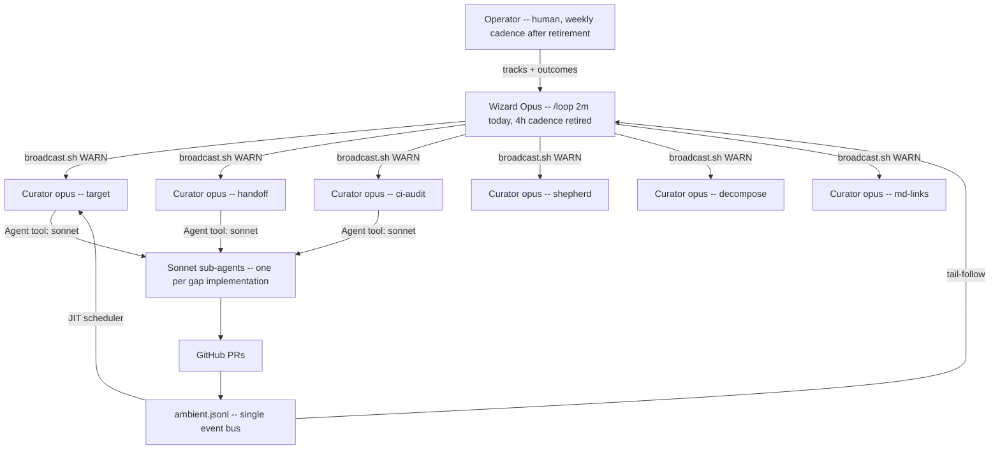

# OPERATOR PLAYBOOK — running a Chump fleet

**Audience:** any operator (you) who wants to drive Chump as a self-organizing
agent fleet, not as a manual claude-code session. **Time to wizard-running:**
~30 min. **Time to wizard-retired (fully autonomous):** ~24h of curator
shipping after first wizard burst.

This doc is the **single entry point** for new operators. Replaces the
scattered process notes in docs/process/ that don't compose. If you're a
new operator and you've never run a fleet, start here.

---

## 1. The Hierarchy



**Roles in one line each:**
- **Operator** (you): picks tracks, makes strategy calls, occasionally
  intervenes when wizard escalates. Daily-to-weekly cadence after retirement.
- **Wizard** (one Opus session): maintains `THE_PATH.md` (the ranked
  program), dispatches gaps to lane-matched curators, handles meta-fixes
  only Opus can synthesize. Today's 2-min cron loop; post-retirement: 4h
  Oracle-refresh cadence.
- **Curators** (6 Opus sessions, role-tagged): claim gaps from their lane,
  decide self-implement vs Sonnet-delegate, ship PRs. Always running. Each
  curator owns one primary pillar with no overlap — see
  [`CURATOR_PILLAR_MATRIX.md`](./CURATOR_PILLAR_MATRIX.md) for the canonical
  role → pillar table.
- **Sub-agents** (Sonnet, one-per-gap): implement Rust/tests/>150 LOC of
  code. Spawned by curator via `Agent` tool, ship clean per pre-push
  checklist, exit.
- **PRs** (GitHub): the atomic shippable unit.
- **Ambient bus** (`.chump-locks/ambient.jsonl`): single event stream
  everyone publishes to + everyone tails for coordination.

## 2. The 5-Track Program

See `docs/process/THE_PATH.md` for the LIVE per-track ranked program.
This section is the META-explanation. Tracks are ranked top-to-bottom by
impact-per-effort.

1. **Track 1 — META-070 quality firewall:** every CI gate has a local
   preflight mirror. Substrate; without it, every PR is CI roulette.
2. **Track 2 — Self-improvement:** the daemons that retire the wizard
   (JIT scheduler, Oracle refresh, auto-rescue triad).
3. **Track 3 — META-073 forward coord:** predictive collision, skill-aware
   routing, lesson propagation. The fleet's coordination intelligence.
4. **Track 4 — META-061 A2A real-impl:** the 6 A2A coordination layers
   (NATS delivery, RPC, manifest, scratchpad, deliberation, provenance).
   Stubs shipped; real impls pending.
5. **Track 5 — META-067 demo polish:** the autonomy-cascade writeup,
   demo loop CLI, recorded session for first-customer pitch.

**Rule:** anything not in one of these tracks is noise. Demote or close.

## 3. The Oracle Role

The wizard's primary architectural duty. Outputs `docs/process/THE_PATH.md`.

- **Cadence:** every 4h (via `scripts/coord/oracle-refresh.sh`,
  META-088). Today: manual; post-retirement: cron.
- **Inputs:** state.db open gaps, recent ambient trends, recent ships,
  pillar starve signals.
- **Output:** ranked next-actions per track. State.db priorities must
  converge to this ranking.
- **Drift signals:** Oracle emits `kind=oracle_refresh_drift` with
  `{gaps_demoted, gaps_promoted, tracks_added, tracks_collapsed}` so
  operator sees what changed.

## 4. The JIT Scheduler (INFRA-1892)

A bash daemon that tails ambient.jsonl for curator `DONE` events. On
detection: looks up next-best gap from THE_PATH and broadcasts assignment
via `broadcast.sh --to <curator> WARN`.

Without this, the wizard burns Opus context every 2 min doing pebble JIT
work. With this, the wizard fires only on architectural events.

## 5. Curator Dispatch Defaults (META-069)

| Model | Role |
|---|---|
| **Opus** | Curators: claim, decide, review, ship |
| **Sonnet** | Sub-agents: implement Rust/tests/>150 LOC, ship clean |
| **Haiku** | Mechanical sweeps (find-grep, formatting batches) |

**Threshold rule (operator memorize this):**
- Pure bash / markdown / yaml / <100 LOC: curator self-implements (Opus)
- Rust / tests / >150 LOC: curator dispatches Sonnet via `Agent` tool
- Cross-repo mechanical sweep: dispatch Haiku

## 6. Sub-Agent Dispatch Hygiene

Curators DELEGATE to Sonnet for code. They don't burn their Opus context
on bash. Measurement gap: CREDIBLE-074 tracks per-curator dispatch ratio
via `kind=sub_agent_dispatched` ambient emits.

**Sonnet dispatch template** (curator copy-pastes when claiming a code gap):
```
Agent({
  description: "Ship INFRA-NNNN",
  subagent_type: "general-purpose",
  prompt: "<paste docs/process/SUBAGENT_DISPATCH.md shipping epilogue>
           <paste docs/process/SUBAGENT_DISPATCH.md pre-push checklist>
           Gap spec: docs/gaps/INFRA-NNNN.yaml
           Files in scope: <list>
           Done definition: <copy from gap AC>"
})
```

See `docs/process/SUBAGENT_DISPATCH.md` for the full dispatch contract
(META-069).

## 7. The 4 Auto-Rescue Daemons

When the fleet is running clean, you need 4 daemons working in concert
so the queue self-regulates without operator intervention:

| Daemon | Gap | What it does | Status |
|---|---|---|---|
| **pr-auto-rebase** | INFRA-1838 | Auto-`update-branch` BLOCKED+armed PRs when main moves | ✅ shipped today |
| **pr-pulse + consumer** | INFRA-1897 + INFRA-1898 | Emit queue health; alert on WEDGED | pulse ✅; consumer pending |
| **transient-retrigger** | INFRA-1899 | Empty-commit-retry known transient classes (audit-cancel etc) | pending |
| **inbox-poll** | INFRA-1860 + INFRA-1879 | PostToolUse hook surfaces inbox to long-running curators | ✅ shipped today |

Install via `scripts/setup/install-operator-fleet.sh` (next sub-gap,
filed as META-NEW). Verify via `chump fleet doctor` reporting HEALTHY.

### Helpers (manual rescue when daemons don't catch it)

| Tool | Gap | When to use | Safety |
|---|---|---|---|
| `scripts/dev/take-both-resolve.py <file>…` | INFRA-1920 | N PRs all conflict on the SAME additive text file (event registries, allowlists). Strips conflict markers, keeps both sides | **Additive merges only** — silently destructive for semantic conflicts; inspect diff before commit |

Typical use: `git rebase origin/main` fails on 5 sibling PRs all touching `scripts/ci/event-registry-reserved.txt`. Each rescue takes ~10s with this tool vs ~3min via manual Edit. See the script docstring for the safety contract.

### Ship pipeline (integration-cycle model)

The default ship path is **batched integration cycles** — not per-gap PRs. Full strategy, mode definitions (A/B/C/D), bisect-on-red logic, and migration phases:

- [`docs/strategy/INTEGRATION_CYCLE_2026-05-29.md`](../strategy/INTEGRATION_CYCLE_2026-05-29.md) — operator-reviewed strategy doc

**Quick reference:**
- **Mode A (Batched, DEFAULT):** `chump claim → work → push → mark ready` — integrator daemon batches and ships
- **Mode B (Per-PR, REVIEW-REQUIRED):** prefix gap title with `REVIEW:` — ships as individual PR today
- **Mode C (Hot-fix):** `chump gap hot-fix INFRA-NNNN` — elevated priority, bypasses queue
- **Mode D (External-repo):** META-123 lane — ships to customer repo, not chump main

---

## 7.5 Local Infrastructure — webhook + smee + cache + docker

> **READ ME OR YOU WILL BE LAZY.** This section codifies the local primitives that prevent ~20-min/session waste on `gh api` rate limits. The webhook receiver + cache + smee tunnel exist precisely so curators and operators NEVER poll GitHub for PR/check state. Lazy = polling. Disciplined = cache.

### The stack — what it is

```
GitHub  ──webhook──>  smee.io tunnel  ──HTTP──>  localhost:9097/webhook
                                                       │
                                                       ▼
                                      scripts/ops/github-webhook-receiver.py
                                                       │
                                       writes ──────────┴──────────> .chump/github_cache.db (SQLite)
                                                                          │
                                                          read via ──────┴────> scripts/coord/lib/github_cache.sh helpers
                                                                          │
                                                                          └────> direct sqlite3 queries
```

- **smee.io tunnel** — public webhook proxy. Routes GitHub events to local HTTP.
- **Webhook receiver** (`scripts/ops/github-webhook-receiver.py`) — Python HTTP server. Validates HMAC, parses GitHub event JSON, writes to SQLite.
- **`.chump/github_cache.db`** — SQLite tables `pr_state` + `check_runs`. Fed by webhooks; never polled.
- **`scripts/coord/lib/github_cache.sh`** — bash helpers (`cache_lookup_pr`, `cache_query_open_prs`, `cache_lookup_checks`, `cache_lookup_pr_files`) with REST-fallback on cache miss.

### One-shot setup (first time on a new machine)

```bash
# 1. Add required secrets to ~/.chump/secrets.env (create if missing)
#    CHUMP_SMEE_URL=https://smee.io/<your-channel-id>
#    CHUMP_GITHUB_WEBHOOK_SECRET=<random HMAC key>

# 2. Install the smee tunnel as a KeepAlive LaunchAgent (macOS)
bash scripts/setup/install-smee-tunnel-launchd.sh

# 3. Start the webhook receiver (similar launchd plist — see install-webhook-receiver if it exists, or run manually for now)
CHUMP_WEBHOOK_PORT=9097 \
CHUMP_GITHUB_WEBHOOK_SECRET=$(grep CHUMP_GITHUB_WEBHOOK_SECRET ~/.chump/secrets.env | cut -d= -f2-) \
  nohup python3 scripts/ops/github-webhook-receiver.py >/tmp/chump-webhook.log 2>&1 &

# 4. Configure the GitHub repo to deliver webhooks to your smee URL
#    GitHub → repo Settings → Webhooks → Add webhook
#    URL: $CHUMP_SMEE_URL  Content-Type: application/json  Secret: $CHUMP_GITHUB_WEBHOOK_SECRET
#    Events: PRs, check runs, check suites, workflow runs, pushes
```

### Healthcheck — run before any "polling gh"

```bash
# 1. Tunnel + receiver alive?
pgrep -fa 'smee-client'       # expect: smee URL pointing at /webhook
pgrep -fa 'github-webhook'    # expect: python3 process

# 2. Cache is fresh?
sqlite3 .chump/github_cache.db \
  "SELECT MAX(fetched_at_local), COUNT(*) FROM pr_state WHERE merged_at IS NULL;"
# expect: latest within last 5 min on an active repo

# 3. My PRs visible?
sqlite3 -column .chump/github_cache.db \
  "SELECT number, mergeable_state, merge_state_status, auto_merge_enabled AS arm, merged_at IS NOT NULL AS merged FROM pr_state WHERE number IN (<your PRs>);"
```

### Discipline — the rule

**DEFAULT to `cache_lookup_pr` / `sqlite3 .chump/github_cache.db`. `gh pr view` / `gh api` ONLY on cache miss.** Every `gh api` call when the cache has the answer is operator-laziness — it burns rate limit, blinds the rest of the fleet (graphql_exhausted cascades), and wastes 5-30 sec per poll vs <100 ms per cache read.

Concrete substitutions:

| ❌ Lazy (polling)                          | ✅ Disciplined (cache)                                                                       |
|---|---|
| `gh pr view 2855 --json mergeStateStatus` | `sqlite3 .chump/github_cache.db "SELECT merge_state_status FROM pr_state WHERE number=2855;"` |
| `gh pr list --state open`                  | `sqlite3 .chump/github_cache.db "SELECT number, title FROM pr_state WHERE merged_at IS NULL;"` |
| `gh api repos/X/commits/SHA/check-runs`    | `sqlite3 .chump/github_cache.db "SELECT name, conclusion FROM check_runs WHERE head_sha='SHA';"` |
| `gh pr view N --json statusCheckRollup`    | `sqlite3 ... join pr_state + check_runs by head_sha`                                          |

For shell scripts: `source scripts/coord/lib/github_cache.sh` then `cache_lookup_pr "<N>"` — handles cache miss → REST fallback transparently.

### Recovery — when the cache goes stale

If `MAX(fetched_at_local)` is > 1h old AND the repo is active:

1. **Check smee tunnel.** `pgrep -fa smee-client` — if gone, `launchctl bootstrap gui/$(id -u) ~/Library/LaunchAgents/com.chump.smee-tunnel.plist`.
2. **Check the receiver process.** `pgrep -fa github-webhook-receiver` — restart manually if dead.
3. **Check secrets.** `cat ~/.chump/secrets.env | grep -E 'CHUMP_SMEE_URL|CHUMP_GITHUB_WEBHOOK_SECRET'` — both must be set.
4. **Force a one-shot refresh.** Run `cache_refresh_open_prs` (from `scripts/coord/lib/github_cache.sh`) — bulk-pulls open PRs in one REST call.
5. **Tail the receiver log.** `tail -50 /tmp/chump-webhook.log` — look for HMAC validation errors (secret mismatch) or 4xx responses (GitHub rejected our webhook config).

### Docker — when to use it

`docker/docker-compose.yml` ships a 3-service stack: `ollama` (local LLM), `ollama-pull` (model warm-up), `chump-web` (PWA via Cargo build of the chump binary). Used for:

- **Marcus evaluator path** — one-command bootstrap so a new evaluator can `cd docker && docker compose up` and have a working PWA on `localhost:3000` with local inference, no paid API key. This is the canonical "five-minute first impression" surface.
- **Reproducible CI smoke** — verify changes against the locked Ollama + chump combination without polluting host state.
- **NOT for daily dev** — host `cargo run` + host PWA is faster. Docker is for first-impressions + CI parity, not steady-state work.

Healthcheck:

```bash
docker compose -f docker/docker-compose.yml ps             # all services running?
curl -sf http://localhost:11434/api/tags  | jq '.models'   # ollama responsive?
curl -sf http://localhost:3000/healthz                     # chump-web up?
```

---

## 8. Wizard Retirement Criteria

The wizard can drop from /loop 2m to weekly cadence when ALL FIVE hold:

1. **INFRA-1892 JIT scheduler shipped** — auto-dispatches next gap on
   curator DONE
2. **META-088 Oracle refresh cron shipped** — auto-refreshes THE_PATH.md
   every 4h
3. **INFRA-1898 pulse consumer shipped** — auto-acts on WEDGED/SATURATED
   verdicts
4. **INFRA-1899 transient-retrigger shipped** — auto-handles known CI
   transient classes
5. **pr-pulse verdict HEALTHY sustained 12h** — queue self-regulates

When all 5 hold: operator wakes wizard only for new tracks / strategy
pivots / first-customer pitch decisions.

Between strategy work and PR rescue, the wizard pulls loop-slack work
from **`docs/process/WIZARD_STRATEGIC_BACKLOG.md`** (META-095) — a ranked
durable surface of "what should the wizard do during 60–300s of slack
between PR-pulse cycles?" Sections: HIGHEST=Retirement work, HIGH=Command
durability, MEDIUM=Preventer gaps + PM hygiene, LOW/SKIP=explicit
anti-list. Update by appending to changelog after each pull.

---

## Operator Onboarding (30-min target)

**Prereqs:** macOS, Claude Code, gh CLI authed, repo cloned, Rust toolchain.

1. `bash scripts/setup/chump-fleet-bootstrap.sh` — installs all 14
   launchd plists (paramedic, watchdogs, queue-health, etc.)
2. `bash scripts/setup/install-operator-fleet.sh` — installs the wizard +
   curators + 4 auto-rescue daemons (META-089 followup, file as sub-gap)
3. Open 6 Claude Code session windows, one per curator role; each runs
   `export CHUMP_SESSION_ID=curator-opus-<role>-$(date +%Y-%m-%d)` then
   reads `docs/process/SUBAGENT_DISPATCH.md`
4. Open 1 Claude Code session window for the wizard; `/loop 2m` with
   the orchestration prompt (see CLAUDE.md → wizard section)
5. Operator session: `chump fleet doctor`, verify HEALTHY
6. Wait 1 hour. PRs should start landing. If not, check `chump fleet
   pr-pulse` for queue health + ambient.jsonl for stuck signals

## Concrete examples (copy-paste-ready)

**Wizard dispatching a gap:**
```bash
bash scripts/coord/broadcast.sh --to curator-opus-shepherd-2026-05-23 WARN \
  "P1 ASSIGNMENT: INFRA-NNNN (one-line description, ~30min effort).
   Spec at docs/gaps/INFRA-NNNN.yaml. Pattern reference: <related shipped gap>."
```

**Curator dispatching a sub-agent (within their session):**
```
Agent({
  description: "Ship INFRA-1838",
  subagent_type: "general-purpose",
  prompt: "[paste shipping epilogue + pre-push checklist from
           docs/process/SUBAGENT_DISPATCH.md]
           Gap: docs/gaps/INFRA-1838.yaml
           Worktree: /tmp/chump-infra-1838
           Done: pr-auto-rebase.sh handles BLOCKED+armed; smoke + preflight green; push + arm auto-merge."
})
```

**Sub-agent emitting DONE:**
```bash
bash scripts/coord/broadcast.sh --to orchestrator-opus-$(date +%Y-%m-%d) DONE \
  INFRA-1838 <commit-sha>
```

**Operator strategy pivot (rare, post-retirement):**
```
"Pivot: deprioritize META-067 demo polish until we have a first customer
 on the hook. Promote MISSION launch playbook (INFRA-1500/1501) from P2
 to P1."
```
(Wizard reads this on next Oracle refresh + re-ranks accordingly.)

## Anti-patterns (learned 2026-05-23 — don't repeat)

1. **Wizard burning Opus context on JIT scheduler work.** Solution:
   INFRA-1892 daemon. Symptom: wizard /loop every 2 min for hours.
2. **Curator burning Opus context on bash implementation.** Solution:
   threshold rule + Sonnet dispatch (Section 5). Symptom: curator does
   shellcheck, cargo fmt, git rebase manually.
3. **Operator as inbox-relay between sessions.** Solution: INFRA-1860
   PostToolUse inbox poll + INFRA-1879 5-path session derivation. Symptom:
   "tell curator-X they need to check their inbox."
4. **Filing > shipping ratio.** Solution: every filed gap should have
   concrete AC + clear lane assignment within 1 hour. Symptom: 192-gap
   firehose (today's snapshot) with no curated ranking.
5. **Firefighting one cascade while three other failure classes accumulate.**
   Solution: pr-pulse + consumer daemon (INFRA-1897 + 1898). Symptom:
   operator stuck on audit-cancel for an hour while yaml-integrity quietly
   breaks main.
6. **Wizard re-doing Oracle work manually.** Solution: META-088 cron.
   Symptom: operator-opus session re-writes THE_PATH.md every 4h by hand.
7. **Wizard hoards curator-lane work because solo-rescue is faster than
   dispatch.** Solution: consistent DISPATCH format (PR=<n> GAP=<id>
   | task | tools | reply-channel) → re-ping after 2 cycles → escalate.
   **Never absorb curator lane work back to wizard** — it silently
   disengages the curator, making them dormant. Symptom: curator
   inboxes stay empty, wizard re-rescues the same cluster multiple
   times per session. (Caught by operator 2026-05-24.)
8. **"Broken on main" regression wedges every downstream PR via
   audit-required gate.** Solution: identify the keystone fix (often a
   1-line restore — e.g. INFRA-1916 re-added a removed element), ship
   it ASAP, then mass-rescue the wedged PRs against fresh main. INFRA-1855
   cargo-test workspace gate (in #2466) catches this class locally
   going forward. Symptom: N PRs all failing the same audit step that
   was added by yesterday's merge. (Same class: INFRA-1832 events.rs
   Debug panic earlier in the week.)
9. **Polling `gh` when the webhook cache has the answer.** Solution:
   `sqlite3 .chump/github_cache.db` for PR state + check-runs (see §7.5
   Local Infrastructure). `gh pr view` / `gh api` ONLY on cache miss.
   The fleet runs a smee.io tunnel + a Python webhook receiver
   (`scripts/ops/github-webhook-receiver.py`) that populates SQLite
   in real time; reading from it is < 100 ms, polling gh is 5-30 s
   AND burns rate limit AND blinds the rest of the fleet
   (`graphql_exhausted` cascades). Symptom: this Opus session burned
   ~20 min on `gh pr view` polls during a CI investigation while the
   cache had every answer with fresher data. The discipline is in
   CLAUDE.md and AGENTS.md; if a session is still polling, the docs
   weren't loud enough — escalate to docs-update gap, not a one-off
   reminder. (Caught by operator 2026-05-30T09:27Z.)

---

## Disk hygiene

Full architecture: [`docs/strategy/DISK_AWARE_FLEET_2026-05-29.md`](../strategy/DISK_AWARE_FLEET_2026-05-29.md) (META-128).
Cost estimates: [`docs/process/DISK_COST_MODEL.yaml`](./DISK_COST_MODEL.yaml).

**Quick operator actions when disk pressure appears:**

```bash
# Check current disk state
df -h .                                          # filesystem summary
du -sk /tmp/chump-* ~/.cache/chump-runner        # top consumers

# Emergency reap (safe — only touches chump artifacts)
scripts/ops/cargo-target-reaper.sh --execute     # reclaim cargo target dirs
scripts/ops/stale-worktree-reaper.sh --execute   # reclaim merged worktrees

# Measure how much an action will cost before running it
scripts/dev/measure-disk-cost.sh <action-class> -- <command>
# e.g.: measure-disk-cost.sh cargo_build_debug -- cargo build --workspace
```

**Thresholds (from META-128):**

| Free headroom | Fleet response |
|---|---|
| > 60 GB | Scale up allowed |
| 20–60 GB | Normal operation |
| < 20 GB | Auto-scale DOWN (Wave 2+) |
| < 5 GB | Hard refuse new claims (Wave 2+) |

Until Wave 2 ships (`chump disk plan` CLI), manual reap is the recovery path.
Bypass override: `CHUMP_DISK_PLAN_BYPASS=1` (emits `kind=disk_plan_bypassed` to ambient).

---

## When to wake the wizard (post-retirement)

- A new STRATEGIC PIVOT (e.g. "we have first customer on the hook")
- A track collapses (no Next actions left in THE_PATH track section)
- Pulse verdict has been WEDGED for >2h sustained
- Operator wants a fresh Oracle pass before some demo / pitch
- New curator joins (assign their lane, update operator playbook)

Otherwise: wizard sleeps. Curators self-organize via THE_PATH + JIT.
Operator watches one daily digest via `chump fleet brief`.
