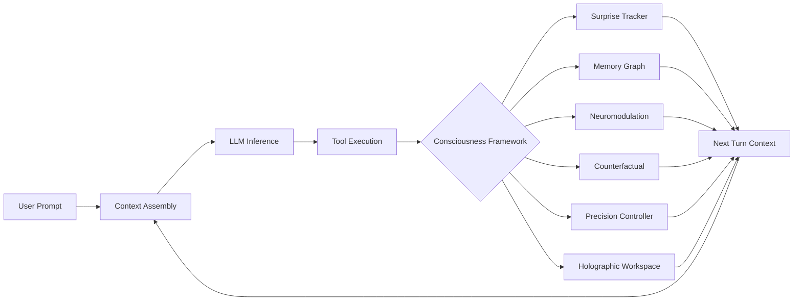

# Consciousness Framework: An A/B Study of Synthetic Cognitive Architecture in Autonomous Agents

> **Status:** TEMPLATE — sections marked [AUTO] are populated by `scripts/generate-research-draft.sh`; sections marked [HUMAN] require authoring.

---

## Abstract [HUMAN]

> TODO: Write 150-word abstract summarizing:
> - The problem (measuring whether synthetic consciousness subsystems improve agent behavior)
> - The method (controlled A/B study with identical prompt batteries)
> - Key results (populated after study runs)
> - Significance (first empirical measurement of cognitive architecture in a production agent system)

---

## 1. Introduction [HUMAN]

### 1.1 The Agent Self-Improvement Landscape

> TODO: Survey the 2026 agent ecosystem — GEPA evolutionary loops, Hermes skills, AutoEvolve Bradley-Terry.
> Reference: `docs/NEXT_GEN_COMPETITIVE_INTEL.md` for competitive context.

### 1.2 Consciousness as Engineering

> TODO: Distinguish Chump's approach (engineering proxy metrics inspired by cognitive science) from philosophical consciousness claims.
> Key framing: "We do not claim machine consciousness. We implement measurable cognitive proxies — surprisal tracking, neuromodulation, precision control — and test whether they improve agent behavior."
> Reference: `book/src/dissertation.md` (rendered: https://repairman29.github.io/chump/dissertation.html), `docs/CHUMP_TO_COMPLEX.md`

### 1.3 Research Questions

1. Does enabling the consciousness framework produce measurably different agent behavior compared to a baseline agent with the same LLM?
2. What is the latency overhead of the consciousness subsystems?
3. Which cognitive proxy metrics (surprisal, causal lessons, memory graph density) show the strongest signal?

---

## 2. Architecture [HUMAN + diagrams]

### 2.1 System Overview

> TODO: Brief description of Chump as a Rust-native autonomous agent with 6 consciousness subsystems.

### 2.2 The Six Subsystems

| # | Subsystem | Module | Cognitive Proxy | Measurement |
|---|-----------|--------|-----------------|-------------|
| 1 | Surprise Tracker | `surprise_tracker.rs` | Prediction error (surprisal) | Mean surprisal, high-surprise % |
| 2 | Associative Memory Graph | `memory_graph.rs` | Long-term relational memory | Triple count, entity count |
| 3 | Neuromodulation | `neuromodulation.rs` | DA/NA/5HT affective state | Modulator levels per turn |
| 4 | Counterfactual Reasoning | `counterfactual.rs` | Causal lesson extraction | Lesson count, confidence |
| 5 | Precision Controller | `precision_controller.rs` | Thermodynamic exploration/exploitation | Epsilon, dissipation |
| 6 | Holographic Workspace | `holographic_workspace.rs` | Global Workspace Theory broadcast | Workspace activations |

### 2.3 Architecture Diagram

> TODO: Mermaid diagram showing data flow between subsystems and the agent loop.



---

## 3. Methodology [HUMAN + AUTO]

### 3.1 Study Design [HUMAN]

> TODO: Describe the controlled A/B design:
> - Independent variable: `CHUMP_CONSCIOUSNESS_ENABLED` (1 vs 0)
> - Dependent variables: prediction count, surprisal, memory graph density, causal lessons, latency
> - Control: fresh SQLite database for each condition, same prompt battery, same model, same hardware

### 3.2 Hardware & Model [AUTO]

> Populated from study data: `logs/study-analysis.json`

### 3.3 Prompt Battery [AUTO]

> 28 prompts across 7 categories. Full list in `scripts/run-consciousness-study.sh`.

### 3.4 Measurement Protocol [HUMAN]

> TODO: Describe how baselines are captured (`consciousness-baseline.sh`), what each metric means, and how deltas are computed (`analyze-ab-results.sh`).

---

## 4. Results [AUTO]

> Populated by `scripts/generate-research-draft.sh` → `docs/CONSCIOUSNESS_AB_RESULTS.md`

See [CONSCIOUSNESS_AB_RESULTS.md](CONSCIOUSNESS_AB_RESULTS.md) for full data tables.

---

## 5. Discussion [HUMAN]

### 5.1 Interpretation

> TODO: What do the results mean? Does the consciousness framework produce meaningfully different behavior?

### 5.2 Prediction Quality

> TODO: Does the surprise tracker actually reduce prediction errors over the course of a session? Look at per-prompt surprisal trends.

### 5.3 Latency vs. Capability Tradeoff

> TODO: Is the overhead acceptable? For what use cases?

### 5.4 Comparison to Alternative Approaches

> TODO: How does this compare to GEPA evolutionary loops (between-session optimization) vs consciousness (within-session adaptation)?

---

## 6. Limitations [HUMAN]

1. **Single model, single hardware** — results are from one run on one machine.
2. **Synthetic prompt battery** — does not represent natural user interaction.
3. **Cold start only** — fresh DB per condition; doesn't measure accumulated memory benefits.
4. **No semantic quality scoring** — measures structural metrics, not response quality.
5. **Small N** — 28 prompts is a smoke test, not a statistically powered study.

---

## 7. Future Work [HUMAN]

1. **Multi-model study** — run across 3+ models (7B, 9B, 14B) to test scaling effects.
2. **LLM-as-judge evaluation** — score response quality, not just structural metrics.
3. **Longitudinal study** — measure accumulated memory benefits over 100+ sessions.
4. **Multi-agent study** — test consciousness framework in fleet/mesh configurations.
5. **User study** — real users, real tasks, satisfaction ratings.

---

## 8. Conclusion [HUMAN]

> TODO: 2-3 paragraphs summarizing findings and positioning Chump's consciousness framework as a research contribution.

---

## 9. References

1. Chump Project Brief — `docs/CHUMP_PROJECT_BRIEF.md`
2. Chump Dissertation — `book/src/dissertation.md` (rendered: https://repairman29.github.io/chump/dissertation.html)
3. Chump-to-Complex Vision — `docs/CHUMP_TO_COMPLEX.md`
4. Consciousness Metrics — `docs/METRICS.md`
5. Competitive Intelligence — `docs/NEXT_GEN_COMPETITIVE_INTEL.md`
6. Hermes Competitive Roadmap — `docs/HERMES_COMPETITIVE_ROADMAP.md`
7. GEPA: Genetic-Pareto Optimization — [citation needed]
8. Active Inference — Friston, K. (2010). The free-energy principle: a unified brain theory?

---

## Appendix A: Reproduction

```bash
# Full study (builds, runs A/B, analyzes, generates report)
./scripts/run-consciousness-study.sh

# Quick smoke test (4 prompts, ~5 min)
./scripts/consciousness-ab-mini.sh

# Report from existing data
./scripts/consciousness-report.sh
./scripts/analyze-ab-results.sh
./scripts/generate-research-draft.sh
```

## Appendix B: Raw Data

> Links to JSON baselines, timings, and analysis files populated after study run.

---

*Template created for the Chump consciousness framework A/B study. Combine with auto-generated results from `docs/CONSCIOUSNESS_AB_RESULTS.md` for the complete publication.*
