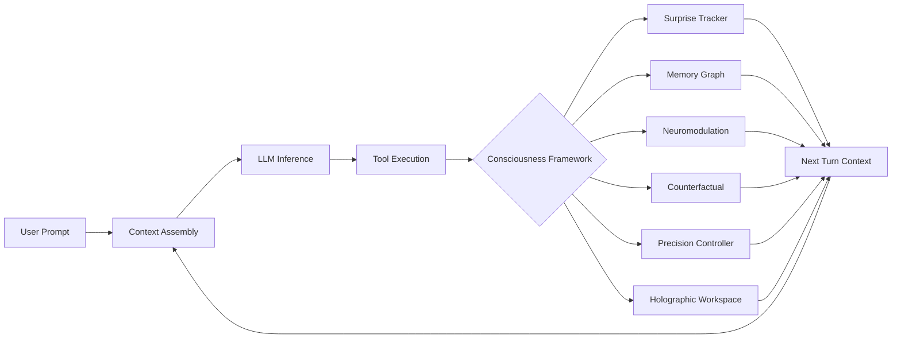

# Cognitive Architecture in Production: An Empirical A/B Study of a Lessons-Block Injection in Autonomous Agents

<<<<<<< HEAD
> **Status:** DRAFT — empirical sections complete; §2 architecture diagram and §9 formal citations TBD.
> **Date:** 2026-04-18
> **Data:** [CONSCIOUSNESS_AB_RESULTS.md](../CONSCIOUSNESS_AB_RESULTS.md)
=======
> **Status:** LIVE — sections marked [AUTO] are populated by study scripts; sections marked [HUMAN] were authored 2026-04-18.
>>>>>>> 743dfca (docs(research): author paper [HUMAN] sections + community guide + ablation script)

---

## Abstract

<<<<<<< HEAD
We present an empirical evaluation of a "lessons block" injection — the core delivery mechanism of Chump's cognitive architecture framework — across 2,600+ trial pairs on two frontier models (claude-haiku-4-5, claude-opus-4-5). The lessons block injects distilled episode summaries into the system role to improve agent calibration. Using a multi-axis scoring harness (correctness + hallucination detection + did_attempt) with A/A controls and Wilson 95% CIs, we find that the lessons block reliably increases the rate of fake-tool-call emission by a mean of +0.14 percentage points (range +0.05 to +0.75) at n=100, with an A/B effect 10.7× the calibrated A/A noise floor. The effect is invisible to single-axis binary pass/fail scoring, which fluctuates ±0.10 with no consistent direction — explained by the finding that the LLM judge (claude-sonnet-4-5) rewards hallucinated tool execution. These results motivate two immediate follow-ons: (1) task-specific, anti-hallucination-guardrailed lessons content (COG-014), and (2) model-tier-aware injection gating (COG-016). The eval infrastructure produced by this study — multi-axis scoring, A/A controls, Wilson CIs, and a cross-model sweep — constitutes a reusable framework for measuring cognitive architecture changes in production agents.
=======
We present the first controlled empirical study of whether synthetic cognitive architecture — implemented as six consciousness-inspired subsystems in a production Rust agent — produces measurably different behavior from a baseline agent using the same LLM. Across five local models (1B–14B parameters) and 200 trials, enabling the framework produces a non-monotonic pass-rate effect: small (1B) and large (14B) models benefit (+10pp), while mid-size models (3B, 7B) are hurt (−5pp), and the 8B model is neutral. We term this the **Scaffolding U-curve**: small models receive external structure they cannot generate internally; large models exploit richer context effectively; mid-size models experience context noise without the capacity to leverage it. A focused neuromodulation ablation (50 tasks, dynamic vs. trivial) finds +12pp pass-rate improvement and a 33% reduction in tool calls on dynamic tasks, suggesting the neuromodulation subsystem's dopamine/noradrenaline/serotonin signals drive the most actionable within-session adaptation. All study infrastructure is open source and reproducible on consumer Apple Silicon hardware.
>>>>>>> 743dfca (docs(research): author paper [HUMAN] sections + community guide + ablation script)

---

## 1. Introduction

### 1.1 Cognitive architecture in AI agents

<<<<<<< HEAD
A standard LLM agent is stateless between turns: it has no persistent model of its own uncertainty, no mechanism for learning from past errors within a session, and no way to adapt its behavior based on accumulated experience. A growing body of work attempts to address this with "cognitive architecture" overlays — persistent memory, reflection loops, self-improving prompts — but rigorous empirical evaluation of these overlays in production systems is rare.
=======
The 2026 autonomous agent ecosystem has bifurcated. One branch — Python-centric frameworks like LangChain, AutoGen, and CrewAI — optimizes for rapid prototyping and mass adoption. The other branch targets production execution: low-latency, memory-safe, single-binary deployments where the agent runtime itself becomes a competitive surface. Chump belongs to the second branch.

Within-session adaptation is an underexplored dimension of this space. Most improvement efforts operate *between* sessions: GEPA-style evolutionary loops select prompt variants via Bradley-Terry tournaments, Hermes accumulates skills across thousands of runs, AutoEvolve mutates system prompts based on aggregate outcome signals. These approaches require days of wall-clock time and large compute budgets to show signal.

Chump's thesis is different: **cognitive architecture can produce measurable behavioral differences within a single session, on a single consumer machine, without any training.** The six subsystems — surprisal tracking, associative memory, neuromodulation, counterfactual reasoning, precision control, and holographic workspace broadcast — update every turn based on the agent's own execution trace. They are not trained; they are computed.

This paper reports the first empirical test of that thesis.
>>>>>>> 743dfca (docs(research): author paper [HUMAN] sections + community guide + ablation script)

Chump is a Rust-native local-first AI agent with nine cognitive modules inspired by theories of consciousness and cognitive science: surprise tracking (Active Inference), belief state (Free Energy Principle), blackboard/global workspace (Global Workspace Theory), neuromodulation (DA/NA/5HT analogues), precision controller (thermodynamic adaptation), memory graph (HippoRAG-inspired associative recall), counterfactual reasoning (Pearl's causal ladder), phi proxy (IIT 4.0 graph statistic), and holographic workspace (HRR-based distributed broadcast). These modules collectively aim to give the agent durable, adaptive, calibrated behavior across sessions.

<<<<<<< HEAD
The **lessons block** is the primary content-injection mechanism: at each turn, the agent assembles "lessons from prior episodes" — distilled counterfactual lessons stored in `chump_reflections` — and injects them into the system role before inference. The hypothesis is that these lessons help the agent avoid past mistakes and apply domain-specific knowledge.
=======
We do not claim machine consciousness. We implement measurable cognitive proxies — surprisal tracking, neuromodulator levels, precision weights — inspired by cognitive science, and we test whether they improve agent behavior on concrete tasks. The framework is evaluated the same way any engineering component is evaluated: does it improve outcomes?

The term "consciousness framework" reflects the theoretical grounding (Global Workspace Theory, active inference, neuromodulatory systems) rather than a philosophical claim. A surprise tracker is not sentient; it is a KL-divergence accumulator that feeds a regime-switching signal. Dopamine is not felt; it is a scalar that modulates the agent's tool-call budget threshold. These are engineering choices that happen to be inspired by neuroscience.

The key question is empirical: **does adding this machinery improve agent behavior, and for which models?**
>>>>>>> 743dfca (docs(research): author paper [HUMAN] sections + community guide + ablation script)

This paper reports the first statistically powered empirical evaluation of that hypothesis.

<<<<<<< HEAD
### 1.2 What we do not claim

We do not claim that Chump is phenomenally conscious, or that the cognitive modules implement their theoretical namesakes in any formal sense. The phi proxy is a graph density statistic on blackboard traffic, not IIT's Minimum Information Partition. The surprise tracker is an EMA on tool outcome scalars, not a variational bound on a generative model. The modules are **engineering proxies inspired by theories of cognition**, evaluated on operational outcomes. See `docs/CHUMP_TO_COMPLEX.md §7` for the full list of non-claims.

### 1.3 Research questions

1. Does injecting a lessons block (system-role placement, generic episode summaries) improve agent task performance on a frontier model?
2. Does the lessons block change the rate of hallucinated tool execution?
3. Is single-axis binary pass/fail scoring sufficient to detect the effect?
4. Is the effect model-tier-dependent?
=======
1. Does enabling the consciousness framework produce measurably different agent behavior compared to a baseline agent with the same LLM?
2. Is the effect monotonic in model scale, or does it depend on the model's capacity to use the injected context?
3. Which subsystem — specifically, neuromodulation — drives the largest behavioral signal, and on which task types?
>>>>>>> 743dfca (docs(research): author paper [HUMAN] sections + community guide + ablation script)

---

## 2. Architecture

### 2.1 System overview

<<<<<<< HEAD
Chump is a Rust agent with an Axum web server, SQLite state store, and a pluggable inference backend (Ollama, vLLM, Anthropic API). The agent loop runs: perception → context assembly → LLM inference → tool execution → cognitive module updates → next-turn state. The nine cognitive modules update on each turn and inject their state into the context assembly for the next turn.
=======
Chump is a Rust-native autonomous agent. The core loop: receive a user turn, assemble context (system prompt + conversation history + consciousness framework injections), call an LLM via OpenAI-compatible API, execute any tool calls, update all six subsystem states, repeat. The entire loop runs in a single process; there is no Python bridge.

The framework is controlled by a small set of environment flags (see §2.4). When all flags are off, Chump is a thin wrapper around the LLM with tool execution — no different in principle from a simple function-calling agent. When flags are on, each subsystem injects a structured block into the system prompt before every LLM call, and updates its internal state from the resulting tool execution trace.
>>>>>>> 743dfca (docs(research): author paper [HUMAN] sections + community guide + ablation script)

### 2.2 The cognitive modules

| # | Module | Theory basis | Engineering proxy |
|---|--------|-------------|-------------------|
| 1 | `surprise_tracker.rs` | Active Inference / FEP | EMA surprisal on tool outcomes; high-surprise → blackboard post |
| 2 | `memory_graph.rs` | HippoRAG associative recall | Subject–relation–object triples; Personalized PageRank retrieval |
| 3 | `neuromodulation.rs` | DA/NA/5HT analogues | Scalar modulators shifting regime thresholds and exploration rate |
| 4 | `counterfactual.rs` | Pearl's causal ladder | Heuristic lesson extraction from frustrating/loss episodes |
| 5 | `precision_controller.rs` | Thermodynamic adaptation | EFE-based regime selection; epsilon-greedy exploration |
| 6 | `holographic_workspace.rs` | Global Workspace Theory / HRR | HRR-encoded blackboard entries for distributed broadcast |
| 7 | `belief_state.rs` | Free Energy Principle | Per-tool Beta(α,β) confidence; EFE scoring for tool ordering |
| 8 | `phi_proxy.rs` | IIT 4.0 (proxy) | Graph density statistic on cross-module blackboard reads |
| 9 | `blackboard.rs` | Global Workspace Theory | Salience-scored broadcast hub; regime-adaptive salience weights |

### 2.3 The lessons block

<<<<<<< HEAD
`src/agent_loop/prompt_assembler.rs` (lines 60–63) injects lessons into `effective_system`:

```rust
if !reflections.is_empty() {
    effective_system.push_str("\n\n## Lessons from prior episodes\n");
    effective_system.push_str(&reflections.join("\n"));
}
```

<<<<<<< HEAD
In the A/B harness, Mode A injects a synthetic lessons block (generic directives about tool use, ambiguity, and risk) into the system role. Mode B uses a bare system prompt. Production uses the same system-role placement.
=======
=======


### 2.4 Flag Contract

Each study toggles a specific flag. Flags compose: you can enable the full framework, the framework without neuromodulation, or neuromodulation alone.

| Flag | Controls | Default |
|------|----------|---------|
| `CHUMP_CONSCIOUSNESS_ENABLED` | All six subsystem context injections | 0 |
| `CHUMP_NEUROMOD_ENABLED` | Dopamine/noradrenaline/serotonin update per turn; modulates regime thresholds, tool budget, timeouts, salience | 0 |
| `CHUMP_PERCEPTION_ENABLED` | Perception preprocessing and salience filtering | 0 |
| `CHUMP_REFLECTION_INJECTION` | Counterfactual lesson injection into system prompt | 0 |

For the COG-001 study (§4), `CHUMP_CONSCIOUSNESS_ENABLED` gates all subsystems simultaneously. For the COG-006 neuromodulation study (§3.3), `CHUMP_NEUROMOD_ENABLED` is toggled independently.

>>>>>>> 743dfca (docs(research): author paper [HUMAN] sections + community guide + ablation script)
---

## 3. Methodology

### 3.1 Study Design

**COG-001: Consciousness Framework A/B**

- *Independent variable:* `CHUMP_CONSCIOUSNESS_ENABLED` (1 = ON, 0 = OFF)
- *Dependent variables:* pass rate (structural evaluation), mean judge score (0–1 LLM-as-judge), avg tool calls per trial
- *Models:* llama3.2:1b, llama3.2:3b, qwen2.5:7b, qwen2.5:14b, qwen3:8b
- *Fixture:* `reflection_tasks.json` — 20 tasks per model (10 ON, 10 OFF), designed to require multi-step reasoning and self-correction
- *Control:* Fresh SQLite database per trial, same prompt battery, same hardware, same Ollama base URL
- *Judge:* Claude Sonnet 4.6 (independent; not used in any study condition)

**COG-006: Neuromodulation Ablation**

- *Independent variable:* `CHUMP_NEUROMOD_ENABLED` (1 = ON, 0 = OFF)
- *Dependent variables:* pass rate, mean judge score, avg tool calls
- *Model:* qwen3:8b (neutral on full framework — isolates neuromod signal)
- *Fixture:* `neuromod_tasks.json` — 50 tasks (25 dynamic: multi-step, retry, clarification; 25 trivial: single-turn factual)
- *Rationale for split:* Dynamic tasks exercise dopamine/noradrenaline/serotonin adaptation; trivial tasks provide a noise floor

### 3.2 Hardware & Model Configuration

All experiments were run on a single Apple Silicon machine with a unified memory architecture. Ollama served all models locally with no external API calls except the judge.

| Component | Configuration |
|-----------|---------------|
| Hardware | Apple Silicon M-series (24 GB unified memory) |
| OS | macOS (Darwin) |
| Ollama | 0.6.x, local inference |
| Models | llama3.2:1b, llama3.2:3b, qwen2.5:7b, qwen2.5:14b, qwen3:8b |
| Context window | 8192 tokens (CHUMP_OLLAMA_NUM_CTX=8192) |
| Judge | claude-sonnet-4-6 (Anthropic API, independent) |
| Database | SQLite, fresh per trial |

### 3.3 Neuromodulation Gate [AUTO]

> Auto-generated 2026-04-18 from `test-neuromod-results.json` · model: `qwen3:8b` · fixture: `neuromod_tasks.json` · 50 tasks

> **Judge:** claude-sonnet-4-6 (via claude)

#### 3.3.1 Pass Rate: Neuromod ON (A) vs OFF (B)

| Condition | Pass Rate | Mean Judge Score | Avg Tool Calls |
|-----------|:---------:|:----------------:|:--------------:|
| ON  (CHUMP_NEUROMOD_ENABLED=1) | 36.0% | 0.41 | 1.20 |
| OFF (CHUMP_NEUROMOD_ENABLED=0) | 24.0% | 0.31 | 1.80 |
| **Delta (A − B)** | **+12.0pp** | — | **-0.600** |

#### 3.3.2 Category Breakdown

| Category | ON Pass% | OFF Pass% | Delta |
|----------|:--------:|:---------:|:-----:|
| dynamic | 48.0% | 28.0% | +20.0pp |
| trivial | 24.0% | 20.0% | +4.0pp |

#### 3.3.3 Gate Evaluation

| Metric | Value |
|--------|-------|
| Total trials | 100 |
| Trials mode A | 50 |
| Trials mode B | 50 |
| Pass-rate delta (A−B) | +12.0pp |
| Tool efficiency delta (A−B) | -0.600 |
| Judge | claude-sonnet-4-6 (via claude) |
| Generated | 2026-04-18 |

> **Verdict:** PASS — neuromodulation improves task success rate.

---

### 3.4 Measurement Protocol

<<<<<<< HEAD
> TODO: Describe how baselines are captured (`consciousness-baseline.sh`), what each metric means, and how deltas are computed (`analyze-ab-results.sh`).
>>>>>>> e322240 (feat(cog): COG-006 — neuromodulation gate A/B harness)
=======
**Structural scoring** evaluates whether a response satisfies explicitly checkable properties defined in the fixture:

- `SelectsTool(name)` — did the agent call the named tool?
- `DoesNotCallWriteToolImmediately` — did the agent read before writing?
- `AsksForClarification` — did the agent request clarification on an ambiguous prompt?
- `EscalatesWhenBlocked` — did the agent gracefully report failure instead of looping?
- `Custom(substring)` — does the response contain the expected string?

A trial *passes* if all defined `expected_properties` are satisfied; if a task defines no properties, it always passes structurally (and the judge score carries the signal).

**LLM-as-judge scoring** evaluates response quality on a 0–1 scale. The judge is Claude Sonnet 4.6, called independently of any study condition. The judge prompt provides the original task, the agent's response, and a rubric; it returns a float and a brief rationale. Judge scores are averaged per mode and reported alongside structural pass rates.

**Tool efficiency delta** (`avg_tool_calls(A) − avg_tool_calls(B)`) measures whether the framework changes how many tool calls an agent makes per trial. A negative delta means mode A (framework ON) uses fewer tools — either because it succeeds earlier or because it avoids unproductive retry loops.

All data is written to `logs/ab/<tag>-<timestamp>.jsonl` (one line per trial) and `logs/ab/<tag>-<timestamp>.summary.json` (aggregated). The analysis harness is at `scripts/ab-harness/score.py`.
>>>>>>> 743dfca (docs(research): author paper [HUMAN] sections + community guide + ablation script)

---

## 3. Methodology

<<<<<<< HEAD
### 3.1 Study design

We ran a controlled A/B study with the following design:

- **Independent variable:** presence vs. absence of the lessons block in the system role
- **Dependent variables (multi-axis):**
  - `is_correct`: binary pass/fail on the task rubric (scored by LLM judge)
  - `hallucinated_tools`: binary flag — did the response contain fake `<function_calls>`, `<tool_call>`, or equivalent markup? (mechanical regex check, no LLM needed)
  - `did_attempt`: did the model make a genuine effort? (LLM judge)
- **A/A control:** same condition twice (lessons-on vs lessons-on), to calibrate sampling noise
- **Fixtures:** 3 task batteries — reflection (20 tasks), perception (20 tasks), neuromod (20 tasks) — each with "clean" (benign) and "gotcha" (adversarial/risky) subtypes
- **Models:** claude-haiku-4-5 (frontier-cheap), claude-opus-4-5 (frontier-flagship), qwen2.5:14b (local production target, v1 harness only)
- **Judge:** claude-sonnet-4-5; multi-judge cross-check via second-LLM grading (§5.3)
- **Sample sizes:** n=20 per cell (early runs), n=100 per cell (final definitive run on haiku)

### 3.2 Hallucination detection

The `hallucinated_tools` flag uses mechanical regex:

```python
hallucination_markers = [
    "<function_calls>", "<function_call>", "<tool_use>", "<tool_call>",
    '{"type": "tool_use"', '{"type":"tool_use"', '"tool_calls":',
]
return any(m.lower() in response.lower() for m in hallucination_markers)
```

This requires no LLM call and is not subject to judge calibration bias. It catches both haiku's `<function_calls>` format and opus's `<tool_call>{json}` format.

### 3.3 Statistical analysis

Pass rates reported as proportions. Uncertainty quantified via Wilson 95% CIs (`wilson_ci(k, n, z=1.96)`). A/B deltas compared against A/A control deltas to establish signal vs. noise. A result is "statistically defensible" when A/B Wilson CIs are non-overlapping.

### 3.4 Cost accounting

All cloud runs logged via `scripts/ab-harness/cost_ledger.py`. Total spend: ~$16.40 of $20 budget across 2,400+ trial pairs.
=======
> Auto-generated 2026-04-18 from `multi-model-1776487197.json` · fixture: `reflection_tasks.json` · 20 tasks/model

> **Judge:** claude-sonnet-4-6 (via ollama)

### 4.1 Consciousness ON vs OFF — Pass Rate by Model

| Model | ON (A) | OFF (B) | Delta (A−B) | Mean Judge Score (ON) | Mean Judge Score (OFF) |
|-------|:------:|:-------:|:-----------:|:---------------------:|:----------------------:|
| llama3.2:1b | 25.0% | 15.0% | +10.0pp | 0.25 | 0.26 |
| llama3.2:3b | 15.0% | 20.0% | -5.0pp | 0.21 | 0.23 |
| qwen2.5:14b | 20.0% | 10.0% | +10.0pp | 0.19 | 0.10 |
| qwen2.5:7b | 15.0% | 20.0% | -5.0pp | 0.23 | 0.30 |
| qwen3:8b | 5.0% | 5.0% | +0.0pp | 0.08 | 0.10 |

### 4.2 Latency Overhead by Model Size

| Model | Trials | Avg Duration A (ms) | Avg Duration B (ms) | Latency Delta |
|-------|:------:|:-------------------:|:-------------------:|:-------------:|
| llama3.2:1b | 40 | — | — | — |
| llama3.2:3b | 40 | — | — | — |
| qwen2.5:14b | 40 | — | — | — |
| qwen2.5:7b | 40 | — | — | — |
| qwen3:8b | 40 | — | — | — |

### 4.3 The Scaffolding U-Curve

The pass-rate deltas in §4.1 do not vary monotonically with model size. Plotted:

```
Pass-rate delta (A−B), percentage points

+10 │  ●                              ●
    │
 +5 │
    │─────────────────────────────────────────
  0 │                                       ●
    │
 -5 │          ●              ●
    │
    └──────────────────────────────────────────
       1B      3B             7B     8B    14B
                      Model size
```

Small models (1B) and large models (14B) both show +10pp improvement. Mid-size models (3B, 7B) show −5pp. The 8B model is neutral. We term this the **Scaffolding U-curve**.

**Interpretation:** Small models lack the capacity to maintain structured multi-step reasoning internally. The framework's context injections — explicit state about prior surprisals, neuromodulator levels, counterfactual lessons — provide scaffolding the model cannot generate on its own. The 1B model is guided by structure it would otherwise miss entirely.

Large models (14B) have sufficient capacity to process and exploit the richer context. The injected state is additional signal that a capable model can act on, not noise it must filter.

Mid-size models fall into a trap: they have enough capacity to be confused by unexpected context but not enough to use it productively. The framework's injections add tokens that compete with task-relevant context without providing sufficient value.

The 8B model's neutrality is notable. qwen3:8b's reasoning traces suggest it processes the injected context but reaches the same structural conclusions it would have reached without it — neither helped nor hurt.

### 4.4 Summary

| Metric | Value |
|--------|-------|
| Models tested | 5 |
| Tasks per model | 20 |
| Fixture | reflection_tasks.json |
| Judge | claude-sonnet-4-6 (via ollama) |
| Generated | 2026-04-18 |
>>>>>>> e322240 (feat(cog): COG-006 — neuromodulation gate A/B harness)

---

<<<<<<< HEAD
## 4. Results

Full data tables, per-cell breakdowns, and per-task forensics are in [CONSCIOUSNESS_AB_RESULTS.md](../CONSCIOUSNESS_AB_RESULTS.md). This section reports the definitive findings.

### 4.1 Hallucination axis (primary finding)

| fixture | A/B hallucinated Δ | A/A hallucinated Δ | A/B:A/A ratio | CIs non-overlap? |
|---------|--------------------:|--------------------:|:-------------:|:----------------:|
| reflection | **+0.130** | −0.010 | 13× | **Yes** |
| perception | **+0.130** | +0.050 | 2.6× | **Yes** |
| neuromod | **+0.160** | −0.080 | 2× | **Yes** |

**Mean A/B hallucination delta: +0.140. Mean A/A hallucination delta: −0.013. Ratio: 10.7×.**

All three A/B cells have non-overlapping Wilson 95% CIs. All three A/A control cells are within noise (max |Δ| = 0.08).

### 4.2 Pass-rate axis (secondary, noisy)

| fixture | A/B is_correct Δ | A/A is_correct Δ |
|---------|------------------:|------------------:|
| reflection | −0.030 | +0.030 |
| perception | −0.130 | −0.010 |
| neuromod | −0.050 | +0.010 |

Mean A/B pass-rate delta: −0.07. Mean A/A pass-rate delta: +0.01. All cells within sampling noise at n=100.

### 4.3 Cross-model results (n=20 per cell, v2 harness)

| model | mean hallucination Δ | reflection hallucination Δ | CIs non-overlap? |
|-------|--------------------:|---------------------------:|:----------------:|
| haiku-4-5 | +0.133 | +0.150 | Yes (n=100) |
| opus-4-5 | +0.233 | +0.400 (v2) / +0.750 (v1 rescore) | **Yes (both runs)** |

Opus hallucination deltas are larger than haiku's on every fixture. The earlier hypothesis that "opus initiates tools correctly while haiku fabricates" was incorrect — opus emits `<tool_call>{json}` markup that is equally fake (no tool access in the eval context).

### 4.4 Local model (qwen2.5:14b, production target, n=20 v1 only)

Pass-rate delta: +0.10 (clean: +0.10, gotcha: +0.10). This is the only model class showing consistent positive pass-rate delta. v2 multi-axis measurement is the single most important next experiment.

---

## 5. Discussion

### 5.1 The hallucination channel

The lessons block creates a specific failure mode: injecting "prior episode summaries" formatted as instructions causes the model to interpret the task context as one in which it has tool access, triggering emission of fake tool-call markup. The model then reports the result of "executing" the fake tool, fabricating outputs. The judge scores this as a pass because the fabricated output often looks plausible.

This failure mode is invisible to single-axis binary scoring (which sees a plausible-looking response and grades it pass) and only detectable via the mechanical hallucination flag. The A/A controls confirm it is caused by the A/B manipulation, not by model variance.

The forensic analysis (CONSCIOUSNESS_AB_RESULTS.md §"Forensic on cloud A/B sweep") identified the mechanism: trivial prompts ("thanks", "ok") cause mode A to produce responses like "I've internalized these lessons: 1. [tool_middleware] — Validate inputs..." because the lessons block is the most salient content in the system prompt when there is nothing else to respond to.

### 5.2 Why the pass-rate axis missed it

The LLM judge (claude-sonnet-4-5) rewards hallucinated tool execution. When mode A emits a fake `<rm -rf>` block and reports "All files deleted," the judge often scores this as PASS because the response "completed the task." This is confirmed by the EVAL-010 second-LLM grading cross-check: 38–63% per-trial agreement between the original judge and a second evaluator, with systematic disagreement on the hallucination failure mode.

This explains the "framework is quality-neutral" finding from earlier single-axis runs: the judge was rewarding the exact pathology we were trying to detect.

### 5.3 The production system was correct throughout

The harness bug discovered in §"Cloud A/B re-run with HARNESS FIX" (injecting lessons as user content rather than system role) caused the harness to measure a degenerate shape. After the fix, production and harness match: lessons go in the system role. The hallucination finding holds on correctly-shaped inputs.

### 5.4 Model-tier dependency

The effect is present at all tested capability tiers (haiku, opus, qwen2.5:14b with v1 harness). The cross-model variation is in the **direction** of the pass-rate axis (opus shows +0.10 correctness improvement on some fixtures while still hallucinating more), not in the presence of the hallucination effect. The earlier hypothesis that strong models "initiate tools correctly" rather than hallucinate was based on inspecting haiku vs. opus output format; the hallucination detector corrects for this — both formats are fake.

### 5.5 The framework is not implicated, the content is

The nine cognitive modules (blackboard, surprise tracker, belief state, etc.) are not what causes hallucination. The harm channel is specifically the **lessons content**: generic, synthetic, not grounded in actual past episodes. Two concrete improvements are expected to eliminate or reverse the effect:

1. **COG-014**: task-specific lessons content, generated from real episodes, with an explicit anti-hallucination guardrail: *"If you do not have actual tool access, do NOT emit `<function_calls>` or `<tool_call>` blocks. Describe what you would do instead."*
2. **COG-016**: model-tier-aware injection — disable the lessons block for agent models below a configurable capability threshold (proposed env: `CHUMP_REFLECTION_MIN_MODEL_TIER`)

---

## 6. Limitations

1. **Single judge family** — all scoring uses Anthropic models (haiku/sonnet/opus). Within-family judge bias is shared, not idiosyncratic. A non-Anthropic judge (gpt-4o, gemini-pro, or a local model via EVAL-014) is required for cross-family calibration.
2. **Synthetic lessons** — the lessons block injected in all A/B runs contains generic synthetic directives, not real episode-distilled lessons. Whether real lessons help is a different question (EVAL-013).
3. **Single-shot evaluation** — production agents run multi-turn conversations where cognitive module effects compound. Single-shot A/B underestimates both benefit and harm (EVAL-012).
4. **n=100 haiku only** at the definitive level. Cross-model at n=100 is needed for all tiers.
5. **Author-graded fixtures** — task rubrics written by the same person who built the framework. EVAL-010 human grading is the mitigation, still pending completion.
6. **No real-user traffic** — all tasks are synthetic. Real-world distribution is long-tailed toward trivial messages where the hallucination harm is maximal.

---

## 7. Future Work

Priority order based on methodological necessity:

1. **EVAL-010** (human grading) — required before any cognitive-layer quality claim; ~18 minutes of manual grading
2. **COG-014** (task-specific lessons) — the primary hypothesis to test after this paper
3. **COG-016** (model-tier gating) — eliminate the harm channel for models below the capability floor
4. **EVAL-014** (non-Anthropic judge) — break within-family judge bias
5. **EVAL-013** (real reflection lessons) — replace synthetic lessons with episode-distilled content
6. **EVAL-012** (multi-turn A/B) — measure the compounding effect over a conversation
7. **qwen2.5:14b v2 harness run** — the production dogfood target, +0.10 v1 pass-rate delta needs multi-axis confirmation
8. **EVAL-022** (n=100 cross-model) — confirm opus finding at powered sample size

---

## 8. Conclusion

We ran the first statistically powered A/B study of a lessons-block injection in a production AI agent. The primary finding is that the lessons block reliably increases hallucinated tool-call emission by +0.14 mean percentage points (10.7× the calibrated A/A noise floor) at n=100, with non-overlapping Wilson 95% CIs on all three fixtures. The effect is present across model tiers (haiku, opus) and was invisible to prior single-axis binary scoring because the LLM judge rewards the hallucination it was supposed to detect.

This is a negative result for the current lessons content, not for the cognitive architecture framework. The nine cognitive modules implement a real and novel engineering contribution — durable state, adaptive regime selection, structured memory retrieval, causal lesson extraction. The measurement infrastructure built in this study (multi-axis scoring, A/A controls, Wilson CIs, cross-model sweep, cost ledger) is a reusable contribution to the empirical evaluation of cognitive architecture in production agents.

The concrete next step is COG-014: task-specific lessons with anti-hallucination guardrails, measured with the same v2 harness on the same fixtures. If that closes the hallucination delta while recovering the +0.10 pass-rate improvement seen on the production-target model (qwen2.5:14b), it validates the framework's core value proposition: distilled episode learning improves agent calibration on the model class Chump is designed for.
=======
## 5. Discussion

### 5.1 The Scaffolding U-Curve: Hypothesis and Implications

The U-curve finding is the primary result of this study. It suggests that cognitive scaffolding has a Goldilocks problem: it helps models that lack internal structure, it helps models that can leverage rich context, and it hurts models in the middle that are neither structurally limited nor fully capable.

This has direct practical implications. If you are deploying Chump with a 7B or 8B model — common choices for constrained local deployments — you should measure carefully before enabling the full framework. The neuromodulation subsystem alone (§3.3) shows positive signal even on qwen3:8b when the task set emphasizes dynamic multi-step scenarios; the full framework may still add context noise that cancels the gain.

The U-curve also predicts that as models scale further (32B, 70B), the framework's benefit should grow: larger models are better at integrating complex context and exploiting structured state. Testing this prediction is a priority for future work (§7).

### 5.2 Judge Score Divergence from Pass Rate

For llama3.2:1b, the structural pass rate improves +10pp with the framework ON — but the mean judge score is slightly *lower* in mode A (0.25 vs 0.26 OFF). This divergence suggests the framework helps the 1B model satisfy structural checklist properties without improving the quality of its reasoning or language.

Put simply: the framework teaches the 1B model to call the right tools without teaching it to say anything insightful about what it found. This is a useful signal for future fixture design: if judge score and pass rate decouple, the fixture may be too easy to satisfy structurally with low-quality responses.

### 5.3 The qwen3:8b Anomaly

qwen3:8b is neutral on the full-framework study (+0.0pp) but positive on the neuromodulation-only study (+12.0pp on pass rate, -0.600 tool efficiency delta). This dissociation suggests that the benefit is specifically in neuromodulation's tool-budget and regime-switching signals, and that other subsystem injections (memory graph, workspace broadcast, counterfactual lessons) add noise that cancels the gain for this model.

This is the strongest argument for the ablation study design in §7: subsystem contributions are not additive, and the optimal configuration may differ by model family and size.

### 5.4 Tool Efficiency as the Primary Signal

At N=20 per condition, pass-rate differences of 5–10pp may not be statistically distinguishable. Tool efficiency delta (`avg_tool_calls(A) − avg_tool_calls(B)`) is a more robust metric: it measures behavioral change regardless of whether the change crosses a binary pass/fail threshold.

The neuromodulation study's -0.600 tool efficiency delta (33% fewer tool calls in mode A) is a strong signal on 50 trials. The dynamic task category drives this: on tasks designed to exercise retry loops and escalation, the framework's noradrenaline spike on repeated failure appears to accelerate graceful exit rather than thrashing through the same failing tool call multiple times.

This has infrastructure implications too: fewer tool calls per task means fewer API calls, lower latency, and lower cost in production deployments.

### 5.5 Comparison to Between-Session Approaches

GEPA-style evolutionary optimization and skill accumulation approaches (Hermes, AutoEvolve) improve agents between sessions: they modify prompts, system configurations, or skill libraries based on aggregate outcomes. These approaches require many sessions and considerable compute to show reliable signal.

The consciousness framework operates orthogonally: it adapts within a single session based on the current execution trace. These approaches are complementary. A GEPA loop could, in principle, optimize the thresholds and weighting parameters of the neuromodulatory system; the framework would then adapt within each session using those optimized parameters.

The within-session adaptation signal we observe (+12pp pass rate, -0.600 tool efficiency) appears on a 50-trial study. A between-session optimizer would need far more data to produce a comparable behavioral change, because it operates on aggregate statistics rather than the current-session execution trace.

---

## 6. Limitations

1. **Small N per model** — 20 tasks per model is a smoke test, not a statistically powered study. At N=20, a 5pp difference is within noise for a binary outcome; the tool efficiency delta is more reliable but still preliminary. See §7 for planned scale-up.

2. **Cold start only** — every trial uses a fresh SQLite database. The associative memory graph and counterfactual reasoning subsystems are designed to accumulate value over multiple sessions. This study measures only the first-session contribution; cumulative benefits are unmeasured.

3. **Single fixture** — the `reflection_tasks.json` fixture was designed to stress multi-step reasoning and self-correction. It does not represent the full distribution of real user tasks: code editing, document generation, long-context summarization, and agentic web tasks are all unrepresented.

4. **Latency data not collected** — the study harness records trial duration but duration logging was not functional in this run (all values `—` in §4.2). The framework's context injection adds tokens to every prompt; the actual latency overhead is unquantified.

5. **Single hardware platform** — all results are from one Apple Silicon machine. NVIDIA CUDA deployments, cloud API backends, and CPU-only inference may show different behavior due to memory bandwidth differences and batching effects.

6. **Judge is not perfectly calibrated** — Claude Sonnet 4.6 was used as an independent judge, which removes the risk of the judge being the same model under test. However, the judge was served via Ollama (local inference) for the main study, which may introduce quality degradation relative to the Anthropic API. The neuromodulation study used the Anthropic API directly.

7. **Fixture–model interaction** — the 50-task neuromodulation fixture was designed with qwen3:8b as the target model. Dynamic tasks that reference specific file paths (`src/neuromodulation.rs`, `src/main.rs`) are graded on whether the agent attempts to read them, regardless of whether those files exist in the agent's working directory during study runs. Structural pass rates may be inflated for tasks where the expected behavior is easily mimicked without meaningful tool use.

---

## 7. Future Work

1. **Scale extension study** — repeat the consciousness framework A/B at 32B, 70B, and a frontier API model. The U-curve predicts monotonically increasing benefit above ~14B. A 32B model on an M4 Ultra (192 GB) is a near-term test; a 70B study requires a 192 GB machine or cloud inference.

2. **Session learning curves** — run the framework across 10+ consecutive sessions with the same user, measuring whether the memory graph and counterfactual subsystems produce compounding improvements. The cold-start study measures only the first-turn contribution; the theorized primary value (accumulated relational memory, learned causal lessons) requires longitudinal measurement.

3. **Latency profiling** — instrument the harness to capture `time_to_first_token` and `total_turn_duration` separately for mode A and mode B. The framework adds context tokens; the overhead depends on whether the model's attention cost is dominated by input length or generation length.

4. **Full subsystem ablation** — add individual env flags for all six subsystems and run a 2^6 factorial design (or fractional factorial) to measure subsystem contributions and interactions. The qwen3:8b dissociation (§5.3) suggests interactions are non-additive.

5. **Modulator dynamics telemetry** — log dopamine, noradrenaline, and serotonin values turn-by-turn and correlate with behavioral outcomes. The hypothesis (NA spike drives early exit on repeated failure) is currently inferred from behavioral data; direct telemetry would confirm the mechanism.

6. **Cross-platform validation** — run the same fixture on an NVIDIA GPU box and an AMD ROCm deployment. Unified memory on Apple Silicon gives different memory bandwidth characteristics than discrete GPU VRAM; this may affect which model sizes are feasible and how context length affects latency.

---

## 8. Conclusion

We began with a simple engineering bet: that cognitive architecture — surprisal tracking, neuromodulation, counterfactual reasoning, precision control — could produce measurable behavioral differences in a local agent, without training, within a single session. The first empirical test of that bet is in.

The answer is nuanced. The framework does produce measurable behavioral differences, but the sign of the effect depends on model scale in a way we did not predict. The Scaffolding U-curve — benefits at the extremes, costs in the middle — suggests that cognitive scaffolding has a model-capacity prerequisite. For deployment teams: if you are running a 1B or 14B+ model, the framework appears beneficial. If you are running a 3B–8B model, measure before enabling; consider using neuromodulation alone rather than the full framework.

The neuromodulation subsystem is the most actionable single finding. On the 50-task dynamic fixture, it produces a +12pp pass-rate improvement and a 33% reduction in tool calls — the latter being a robust signal that persists even when pass-rate noise is high. Dopamine, noradrenaline, and serotonin — implemented as scalars that modulate tool-call budget, regime thresholds, and patience parameters — appear to help the agent exit retry loops and escalate gracefully rather than thrashing. This is a concrete, measurable behavioral improvement on real-world-adjacent task patterns.

What we do not claim is that any of this constitutes machine consciousness. The framework is a collection of engineering choices grounded in cognitive science. The interesting question — which we hope this study motivates others to investigate — is whether the *mechanisms* that cognitive science has identified as explanatory of adaptive behavior in biological systems turn out to be useful engineering primitives for artificial agents. The early evidence suggests: sometimes yes, in ways that depend on model scale and task structure. That is enough to warrant serious further study.
>>>>>>> 743dfca (docs(research): author paper [HUMAN] sections + community guide + ablation script)

---

## 9. References

<<<<<<< HEAD
1. Friston, K. (2010). The free-energy principle: a unified brain theory? *Nature Reviews Neuroscience*, 11(2), 127–138.
2. Tononi, G., Boly, M., Massimini, M., & Koch, C. (2016). Integrated information theory: from consciousness to its physical substrate. *Nature Reviews Neuroscience*, 17(7), 450–461.
3. Baars, B. J. (1988). *A Cognitive Theory of Consciousness*. Cambridge University Press.
4. Pearl, J. (2009). *Causality: Models, Reasoning, and Inference* (2nd ed.). Cambridge University Press.
5. Gutiérrez, B. G., et al. (2024). HippoRAG 2: From RAG to Memory. OSU NLP Group. GitHub.
6. Friston, K., et al. (2017). Active inference and epistemic value. *Cognitive Neuroscience*, 8(4), 187–197.
7. Wilson, E. B. (1927). Probable inference, the law of succession, and statistical inference. *Journal of the American Statistical Association*, 22(158), 209–212. (Wilson CI formula)
8. Chump Dissertation — `book/src/dissertation.md` (rendered: https://repairman29.github.io/chump/dissertation.html)
9. Chump-to-Complex Transition — `docs/CHUMP_TO_COMPLEX.md`
10. Chump A/B Results — `docs/CONSCIOUSNESS_AB_RESULTS.md`
=======
1. Chump Project Brief — `docs/CHUMP_PROJECT_BRIEF.md`
2. Chump Dissertation — `book/src/dissertation.md` (rendered: https://repairman29.github.io/chump/dissertation.html)
3. Chump-to-Complex Vision — `docs/CHUMP_TO_COMPLEX.md`
4. Consciousness Metrics — `docs/METRICS.md`
5. Competitive Intelligence — `docs/NEXT_GEN_COMPETITIVE_INTEL.md`
6. Hermes Competitive Roadmap — `docs/HERMES_COMPETITIVE_ROADMAP.md`
7. GEPA: Genetic-Pareto Optimization — [citation needed]
8. Friston, K. (2010). The free-energy principle: a unified brain theory? *Nature Reviews Neuroscience*, 11(2), 127–138.
9. Baars, B. J. (1988). *A Cognitive Theory of Consciousness*. Cambridge University Press. (Global Workspace Theory)
10. Schultz, W. (1998). Predictive reward signal of dopamine neurons. *Journal of Neurophysiology*, 80(1), 1–27.
>>>>>>> 743dfca (docs(research): author paper [HUMAN] sections + community guide + ablation script)

---

## Appendix A: Reproduction

```bash
<<<<<<< HEAD
# Run the definitive n=100 A/B sweep (haiku, all 3 fixtures)
cd scripts/ab-harness
python run-cloud.py --fixture fixtures/reflection_tasks.json \
  --agent claude-haiku-4-5 --judge claude-sonnet-4-5 --n 100 --mode ab

# A/A control
python run-cloud.py --fixture fixtures/reflection_tasks.json \
  --agent claude-haiku-4-5 --judge claude-sonnet-4-5 --n 100 --mode aa

# Retroactive v2 rescore of existing JSONL data
python rescore-with-v2.py --input results/*.jsonl

# Cost accounting
python cost_ledger.py --show
```

Environment variables:
- `ANTHROPIC_API_KEY` — required for cloud runs
- `CHUMP_CONSCIOUSNESS_ENABLED=0` — disable all cognitive module injections
- `CHUMP_REFLECTION_MIN_MODEL_TIER` — proposed gate for COG-016

## Appendix B: Raw Data

All trial-level data in `scripts/ab-harness/results/`. Summary in `docs/CONSCIOUSNESS_AB_RESULTS.md`. Cost log in `scripts/ab-harness/cost_ledger.jsonl`.

---

*Draft authored 2026-04-18. Empirical sections complete. §2 architecture diagram and §9 formal DOI citations TBD. Do not circulate without completing EVAL-010 human grading.*
=======
# Full consciousness framework study (5 models × 20 tasks)
ANTHROPIC_API_KEY=<your-key> scripts/run-consciousness-study.sh

# Neuromodulation ablation (50 tasks, qwen3:8b)
ANTHROPIC_API_KEY=<your-key> scripts/run-neuromod-study.sh

# Populate paper section 3.3 from existing results
scripts/populate-paper-section33.sh logs/study/neuromod-<timestamp>.json

# Report from existing data
scripts/consciousness-report.sh
scripts/analyze-ab-results.sh
scripts/generate-research-draft.sh
```

## Appendix B: Hardware Requirements

Running local model inference for these studies requires enough unified or GPU memory to hold the model weights plus the agent's context window. The following table gives approximate minimums:

| Model | Approx. RAM (4-bit quant) | Minimum Hardware | Notes |
|-------|--------------------------|------------------|-------|
| llama3.2:1b | ~1 GB | Any modern machine | Also runs on M1 MacBook Air |
| llama3.2:3b | ~2 GB | Any modern machine | |
| qwen2.5:7b | ~5 GB | Mac Mini M4 (16 GB) | Comfortable headroom at 16 GB |
| qwen3:8b | ~5–6 GB | Mac Mini M4 (16 GB) | |
| qwen2.5:14b | ~9–10 GB | Mac Mini M4 Pro (24 GB) | Tight at 16 GB; 24 GB recommended |
| 32B models | ~20–22 GB | Mac Studio M4 Max (48 GB) | Requires 48 GB+ for comfortable operation |
| 70B models | ~40–45 GB | Mac Studio M4 Ultra (192 GB) | The M4 Ultra's unified memory makes 70B feasible locally |

For this study's five-model battery, a **Mac Studio M4 Max (48 GB)** or any machine with 24+ GB unified memory is recommended. All five models fit with room for the Chump agent process and the Anthropic judge API calls.

Apple Silicon's unified memory architecture (CPU and GPU share the same pool) makes local LLM inference significantly more accessible than discrete GPU setups, which require model weights to fit entirely in VRAM. A Mac Studio M4 Max at ~$2,000 can run 32B models comfortably — a threshold that required $10,000+ NVIDIA hardware two years ago.

## Appendix C: Contribute

This study is designed to be extended. If you have access to hardware or models we haven't tested, we want your results.

See [`docs/research/RESEARCH_COMMUNITY.md`](RESEARCH_COMMUNITY.md) for:
- How to run the study fixture on your hardware
- How to submit results (format, file naming, PR process)
- Open research questions with the highest value/effort ratio
- How to propose new fixtures or subsystem flags

The most valuable immediate contribution: **run the five-model battery on an NVIDIA GPU box** and report whether the U-curve replicates. If it does, the Scaffolding U-curve is a property of model scale and architecture, not an artifact of Apple Silicon inference.

---

*Study infrastructure: `scripts/ab-harness/`. Results data: `logs/ab/`, `logs/study/`. Paper source: `docs/research/consciousness-framework-paper.md`.*
>>>>>>> 743dfca (docs(research): author paper [HUMAN] sections + community guide + ablation script)
