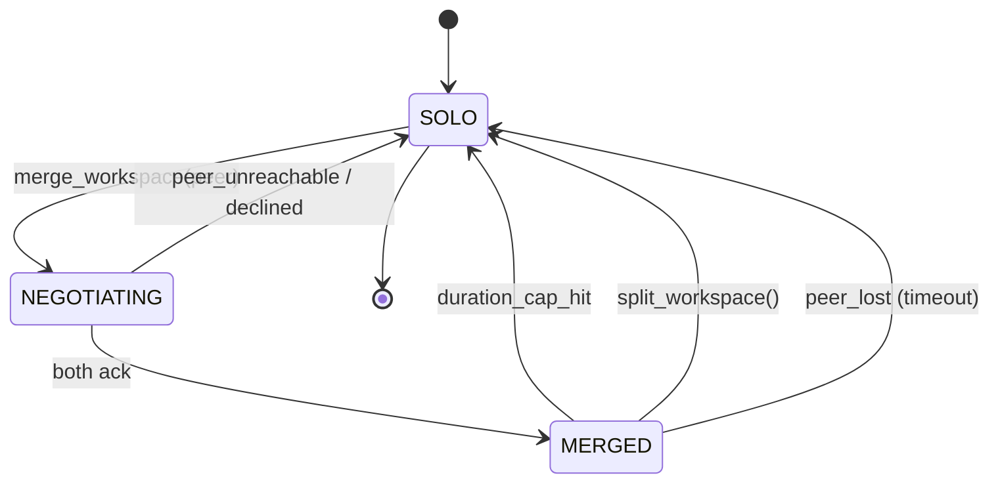

# RFC: Fleet Workspace Merge Protocol (FLEET-003a)

**Status:** Accepted (FLEET-003b shipped 2026-04-18)
**Date:** 2026-04-17
**Work package:** FLEET-003 (decomposes into FLEET-003a/b/c)
**Related:** FLEET-001 (mutual supervision; done), FLEET-002 (single fleet report; done), [src/fleet.rs](../../src/fleet.rs), [docs/CHUMP_TO_COMPLEX.md](../CHUMP_TO_COMPLEX.md) §3.6

## Problem

Two Chump instances (typically Mac-Pixel pair) sometimes need to share
blackboard context for a bounded window — to converge on a hard problem,
to ride one peer's higher-quality model, or to merge belief states after
diverging during async work. Today peer_sync is item-level
(heartbeats, single posts); there's no atomic state exchange and no
defined attribution after the merge ends.

## Goals

1. **Bounded merge window** — never permanently entangle two peers;
   all merges have a hard duration cap.
2. **Atomic exchange** — the two peers agree on a "snapshot" of the
   merged blackboard; no partial syncs that leave one peer with half
   the merged context.
3. **Attribution after split** — every memory/lesson/episode created
   during the merge window carries the merged-with peer ID so
   downstream curation can decide whether to keep / dedupe / discard.
4. **Failure-safe** — if one peer disappears mid-merge, the other
   reverts cleanly to solo state without orphaned blackboard items.

## State diagram



## Wire envelope

Sent over the existing peer_sync channel. New message types:

```json
{
  "kind": "merge_request",
  "from": "mac-chump",
  "to":   "pixel-chump",
  "duration_turns": 3,
  "blackboard_snapshot_sha256": "ab12...",
  "blackboard_count": 47
}

{
  "kind": "merge_ack",
  "from": "pixel-chump",
  "to":   "mac-chump",
  "accepted": true,
  "peer_blackboard_snapshot_sha256": "cd34...",
  "peer_blackboard_count": 38
}

{
  "kind": "blackboard_batch",
  "from": "mac-chump",
  "to":   "pixel-chump",
  "merge_session_id": "abc-123",
  "items": [ /* full BlackboardItem array */ ],
  "sequence": 1,
  "total_sequences": 1,
  "checksum": "ab12..."
}

{
  "kind": "merge_split",
  "from": "mac-chump",
  "to":   "pixel-chump",
  "merge_session_id": "abc-123",
  "reason": "duration_cap | manual | error"
}
```

## Initiation conditions

The agent opts into a merge via the new `merge_workspace` tool
(FLEET-003c). Recommended automatic triggers — tunable via
`CHUMP_FLEET_AUTO_MERGE`:

- **High surprisal sustained** for >5 turns AND a peer with lower
  recent surprisal is reachable.
- **Stuck** (`consecutive_failed_batches` ≥ 2) AND peer reachable.
- **Explicit user request** ("ask Mabel about this").

Default: NO auto-merge. Tool-driven only until we have empirical data
on whether merges help or hurt.

## Duration cap

Hard cap: `CHUMP_FLEET_MAX_MERGE_TURNS` (default 3). At turn 3 + 1,
the agent forces a `split_workspace`. No way to extend without
explicit user override (`--extend-merge`).

## Attribution after split

Every blackboard item, episode, lesson, or skill created during a
merge window gets a `merged_with: <peer_id>` field. After split:

- **Lessons**: kept; the `merged_with` field flows into the lesson
  table so prompt assembler can de-prioritize lessons authored "with"
  a peer that's known to be unreliable.
- **Episodes**: kept; queryable by peer.
- **Skills**: NOT installed automatically. The merge surfaces them as
  a recommendation that the user must accept.
- **Memory facts**: kept but with confidence multiplied by 0.85 (peer
  attribution adds uncertainty until confirmed).

## Failure modes

| failure | behavior |
|---|---|
| peer doesn't ack within 30s | revert to SOLO; no blackboard exchanged |
| ack received but `blackboard_batch` never arrives | timeout 60s; revert; no items integrated |
| partial batch (sequence < total) | wait until total_sequences received OR 60s timeout; if timeout, discard EVERYTHING from that session |
| our process crashes mid-merge | on restart, peer_sync sees no active merge_session_id from us; auto-issues `merge_split` with reason=error |
| network split | both peers timeout independently; both revert |

## Decisions

### D1: Snapshot exchange or live mirror?

**Decided: snapshot exchange.** Live mirror (every blackboard post
streamed to peer) doubles the network volume and breaks attribution.
Snapshot-then-update keeps the boundary clean.

### D2: Blackboard or full state (memory + skills + lessons)?

**Decided: blackboard only.** Merging long-term memory adds a
de-duplication problem we don't want during the bounded window.
Skills and memory facts go through their existing curation pipelines
post-split.

### D3: Symmetric or asymmetric?

**Decided: symmetric.** Both peers share their snapshots. Asymmetric
(one peer reads the other's blackboard but not vice versa) sounds
useful but creates an attribution mess — what's the diff source for
items that originated on the read-only side?

### D4: Speculative or committed?

**Decided: committed for the duration; rollbackable on failure only.**
Speculative merges (try a merge, see if it improves outcomes, undo if
not) are a tempting V2 but add complexity that competes with
INFRA-001's transactional speculation work.

## Out of scope

- 3+ way merges. Pairs only.
- Cross-version peers. Both peers must run identical wire-version
  (checked in merge_request payload; declined otherwise).
- Persistent merges. The duration cap is a hard requirement — no
  "permanent" or "indefinite" merges supported.

## Implementation plan

1. **FLEET-003a (this RFC)** — accepted ✓ when merged
2. **FLEET-003b** — implement `peer_sync::exchange_workspace()` and
   the wire-envelope handlers
3. **FLEET-003c** — surface as `merge_workspace` and `split_workspace`
   agent tools

## Open questions

- Should the split's downgrade-confidence multiplier (0.85) be
  user-tunable? Default looks fine for a first pass; revisit after
  6 weeks of merge data.
- What happens to in-progress speculation when a merge starts?
  **Proposal:** speculative branches are isolated-per-peer; merge does
  not propagate them. Easier to reason about. Document in INFRA-001
  decision table when both ship.
