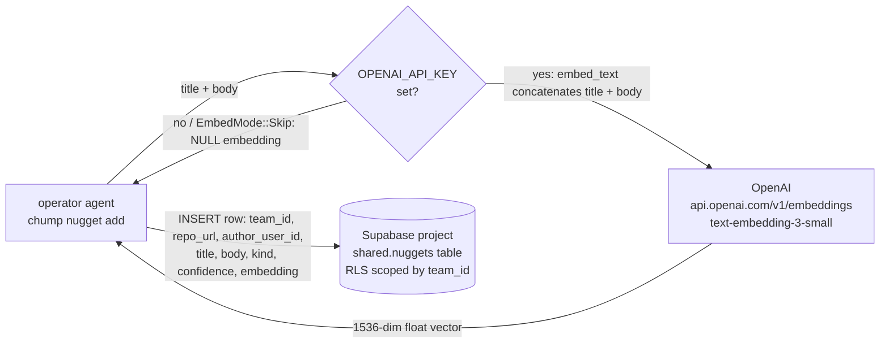

# Nugget data flow — what crosses the wire

> Closes INFRA-1473 AC #10. Pairs with INFRA-1691, INFRA-1692, INFRA-1694.
> SOC 2 posture: see [META-065](../../docs/gaps/META-065.yaml) (gap registry).
> GDPR export of all team data: see [INFRA-1695](../../docs/gaps/INFRA-1695.yaml).

This document describes exactly which fields leave the operator's machine
when they run `chump nugget add` (or any code path through
`crates/chump-team/src/nuggets.rs::create_nugget`). It exists so an operator
can answer, in one read, the two questions security review always asks:

1. *What did this command send, and where?*
2. *What can I do to suppress that?*

Source of truth in code:

- `crates/chump-team/src/nuggets.rs` (`Nugget` struct, `embed_text`, `EmbedMode`)
- `supabase/migrations/0003_nuggets.sql` (table schema, RLS policies)
- `supabase/migrations/0004_nugget_search_rpc.sql` (similarity-search RPC)

## Data-flow diagram

Read paths (`search_nuggets`, `list_nuggets`, `log_nugget_read`,
`delete_nugget`) all hit the same Supabase project over PostgREST and are
gated by the RLS policies in `0003_nuggets.sql` (team_members of the
nugget's team only).

## Fields leaving the machine

### → OpenAI (only when `OPENAI_API_KEY` is set and `EmbedMode::AutoEmbed`)

Sent as a single concatenated input string `"{title}\n\n{body}"` to
`https://api.openai.com/v1/embeddings` (or `OPENAI_EMBED_ENDPOINT` if
overridden) with the model `text-embedding-3-small`:

| Field    | Source           | Why it goes |
|----------|------------------|-------------|
| `title`  | operator-typed   | Concatenated into embed input — maximizes semantic recall |
| `body`   | operator-typed   | Concatenated into embed input — the actual nugget content |
| *(implicit)* `kind` | `NuggetKind` enum | Not in the embed payload, but visible in code paths that decide *whether* to embed |

OpenAI never receives `team_id`, `repo_url`, `author_user_id`,
`author_session_id`, `author_machine`, or any other row metadata.

### → Supabase (always, on every `create_nugget`)

PostgREST `INSERT` into `shared.nuggets`; RLS scopes the row to
`team_id` (see `0003_nuggets.sql` policies `team_members_*`):

| Field                  | Source           | Notes |
|------------------------|------------------|-------|
| `team_id`              | caller (config)  | UUID of the team this nugget belongs to |
| `repo_url`             | caller           | Repo this nugget describes (multi-repo scoping) |
| `author_user_id`       | session auth     | RLS `INSERT WITH CHECK` requires this matches `auth.uid()` |
| `title`                | operator-typed   | Plain text |
| `body`                 | operator-typed   | Plain text — the discovery |
| `kind`                 | enum             | One of: gotcha, pattern, dead_end, failure_mode, convention, other |
| `confidence`           | enum             | low / medium / high |
| `embedding`            | OpenAI (or NULL) | 1536-dim float vector; NULL when `EmbedMode::Skip` or no API key |
| `expires_at`           | computed         | `NOW() + 30 days` for non-keepers |
| `gap_id` *(optional)*  | caller           | Gap that surfaced this nugget |

Additional metadata that the table schema declares as nullable and that
`create_nugget` does **not** populate today:

- `repo_path_glob`, `author_session_id`, `author_machine` — schema-reserved
  for future use; not sent on the current `create_nugget` path.

`search_nuggets` additionally sends the **query text** to OpenAI (same
embed endpoint) and the resulting embedding to Supabase via the
`search_nuggets` RPC. The query text itself never lands in the database.

## Fields staying local

In the default `EmbedMode::AutoEmbed` flow with `OPENAI_API_KEY` set,
**nothing in the nugget itself stays local** — the title and body go to
OpenAI for embedding, and all stored fields go to Supabase. The only
operator-machine-only artifacts are:

- The `OPENAI_API_KEY` value itself (never echoed back).
- Wall-clock timestamps before they're sent (Supabase records its own
  `created_at` via `DEFAULT NOW()`).
- Network metadata (your IP, TLS fingerprint) seen by OpenAI and Supabase
  at the transport layer — outside the scope of this document.

### Offline mode (`EmbedMode::Skip`)

When the operator passes `EmbedMode::Skip` or `OPENAI_API_KEY` is unset:

- **No OpenAI call is made.** `embed_text` short-circuits with `Ok(None)`.
- The Supabase `INSERT` still happens, with `embedding = NULL`.
- The nugget is invisible to similarity search until a reindex pass fills
  in the embedding (manual operator action or a future batch job).

So in offline mode the data leaving the machine is the same Supabase row
as above *minus* the `embedding` column. The title and body still go to
Supabase — only the OpenAI hop is skipped.

## Operator actions

| Goal                                    | How                                                                                          |
|-----------------------------------------|----------------------------------------------------------------------------------------------|
| Disable embedding (skip OpenAI call)    | `unset OPENAI_API_KEY` before running `chump nugget add`, or call with `EmbedMode::Skip`     |
| Point embedding at a different endpoint | `export OPENAI_EMBED_ENDPOINT=https://your-proxy.example/v1/embeddings` (must return 1536-d) |
| Delete a single nugget                  | `chump nugget delete <nugget-id>` — soft-delete, RLS-gated to author + team admins           |
| Export all team data (GDPR)             | See [INFRA-1695](../../docs/gaps/INFRA-1695.yaml) — full team export tool (pending)           |
| Hard-delete (purge soft-deleted rows)   | Supabase admin SQL only; not exposed via `chump`. See SOC 2 posture in META-065.             |
| Audit who read a nugget                 | `SELECT * FROM nugget_reads WHERE nugget_id = ...` via Supabase (team-scoped by RLS)         |

## Related

- [META-065](../../docs/gaps/META-065.yaml) — SOC 2 posture for the Supabase
  substrate (encryption at rest, access controls, retention).
- [INFRA-1695](../../docs/gaps/INFRA-1695.yaml) — GDPR-style export of all
  team data (`chump team export`).
- [INFRA-1473](../../docs/gaps/INFRA-1473.yaml) — Phase 2 nugget API
  (parent gap; this doc closes its AC #10).
- [INFRA-1691](../../docs/gaps/INFRA-1691.yaml), [INFRA-1692](../../docs/gaps/INFRA-1692.yaml),
  [INFRA-1694](../../docs/gaps/INFRA-1694.yaml) — sibling follow-ups to INFRA-1473.
