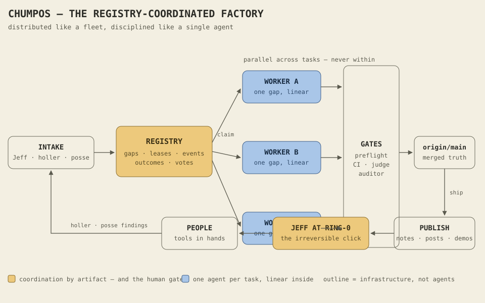

# The Artifact Organization — the fleet already contains the full software company

> **What this is.** Sibling to [`SOFTWARE_FACTORY_MATRIX_2026-08-05.md`](./SOFTWARE_FACTORY_MATRIX_2026-08-05.md)
> (DOC-079). That doc measured Chump against the 8-layer factory model. This one
> records the operator's second thesis — *if the mission is "turn ideas into
> successful software," code is 25–35% of the work* — and an almanac fleet survey
> (2026-08-05) testing it against everything the operator has ever built. Filed as
> **DOC-083** (outcome: CHUMPOS). Implementing gaps: **EFFECTIVE-363/364/365**.
>
> **The thesis in one abstraction.** Model the factory around artifact
> production, and every job — React component, migration, release note,
> help-center article, launch email — becomes the same shape:
> **Inputs → Process → Outputs → Quality Gates → Publication → Feedback.**
> Adding a capability means teaching the factory a new artifact type, not
> reinventing the system.

## 0. Honesty rule

Everything cited from a dormant repo below is **claimed capability** — code that
exists, not value that's verified (REALITY_MAP §0, applied fleet-wide). The
sanctioned route for any of it is **mine before archive** (`extractions/`),
gated by revoke-before-publish and the release-auditor before anything goes
public. Survey method: `almanac_search_fleet` keyword battery, one query per
department; keyword mode is noisy (one query returned minified generated JS) —
absence of evidence here is weak evidence of absence.

## 1. The survey — department × fleet reality

| Department | What exists | Where (receipts) |
|---|---|---|
| Product & Business | `ProductToMarketPipeline`, product-CPO dashboards (competitive analysis, research frameworks, market), user-story audits | `beast-mode:website/lib/ai/productToMarket.ts:42`, `website/app/dashboard/product-cpo/*` — plus LIVE: Chump outcomes/AC, opportunity-library (89 dossiers), six NO-GO go/no-gos |
| Design | `ExpertDesigner`, `DesignActions`, design-chat, design training corpus; a design system; WCAG contrast auditor | `beast-mode:website/lib/mlops/expertDesigner.js:112`; `echeo-web:lib/design-system.ts:16`; `slidemate:frontend/lib/accessibility/contrast-audit.ts:37` |
| Engineering | The live factory — verified zero-touch ships this week | `chump` (scoreboard ① YES) |
| Quality | Chump gate gauntlet + eval/adversary harness (live); accessibility audit | `chump`; `slidemate` |
| Documentation | 579-file docs corpus, docs-site, DEPTH.md fleet discipline | `chump` |
| Customer Communication | `ReleaseNotesGenerator`, email templates, support chatbot, `SupportResponseCenter` | `beast-mode:lib/release/releaseNotesGenerator.js:10`; `slidemate:frontend/lib/email-templates.ts:207`; `echeo-web:app/components/SupportChatbot.tsx:34`; `smugglers` |
| Marketing | Launch-marketing checklist, **HN + Product Hunt launch generators**, content-marketing strategy, `GhostWriterService`, growth corpus | `beast-mode:scripts/growth/launch/hackernews-launch.js:184`, `product-hunt-launch.js:121`, `website/lib/services/ghostWriter.ts:31` — plus LIVE human layer: content/STYLE.md + Substack |
| Sales | An entire deck product: sales templates, standards, `OutlinerAgent`; pricing page | `slidemate:frontend/lib/templates/sales-template-*.ts`; `beast-mode:website/components/pricing/PricingPageSlick.tsx:217` |
| Customer Success | Knowledge-base engines ×2, support pages | `slidemate:frontend/lib/knowledge-base/knowledge-base-engine.ts:20`; `echeo-web:app/components/KnowledgeBaseSearch.tsx:15` |
| Operations | Rollback machinery ×3; Chump ops-for-itself live (wedge taxonomy, reality-check, syntheses) | `smugglers:scripts/deployment/deploy-rollback.js:12`; `slidemate`; `beast-mode`; `chump` |
| Analytics | `RevenueAnalyticsService` + `DashboardManager`, dedicated `analytics-platform-service` repo, `UnifiedAnalyticsService`, `CommercialAnalytics` | `smugglers:R&D/services/revenue-analytics-service/src/index.js:43`; `analytics-platform-service:openapi.yaml`; `postsub:src/services/unifiedAnalyticsService.ts:188`; `commercial-platform:server.js:291` |
| Continuous Improvement | Repo-quality recommendation generator; Chump L8 (live — strong enough it needed MISSION-045 governing) | `beast-mode:website/app/api/repos/quality/route.ts:593`; `chump` |
| **Publishing** | **Nothing built.** A complete design exists: `~/Projects/PUBLISHER.md` (2026-07-19) — draft → approve → drive → track, own surfaces automated, foreign surfaces draft-and-hand-off, the irreversible click stays human | design only → **EFFECTIVE-365** |

## 2. Three conclusions

**BEAST-MODE was the first attempt at this exact organization — and it made the
super-agent mistake in org form.** Role dashboards, role training corpora
(CTO/growth/design), bot registries: the org chart as UI, with no gates and no
verified output. Dormant. Chump modeled pipeline *stages with gates* and just
produced verified zero-touch ships — into BEAST-MODE, its own predecessor. The
artifact abstraction is the synthesis both missed: not job titles, not
code-stages — **typed artifacts flowing through one gated pipeline.**

*Figure (added 2026-08-06, DOC-088): the coordination model — registry at the center instead of a hub agent, one worker per gap (linear inside, parallel across), gates as infrastructure, the human at ring-0, and the PEOPLE → holler/posse → intake feedback loop closing the six stages.*

**Chump already implements 4 of the 6 stages.** Inputs → Process → Outputs →
Quality Gates map onto gap(AC) → claim/worktree → diff → preflight/CI/judge.
Missing: **Publication** (the pipeline ends at merge — the mechanical cause of
built ≠ shipped ≠ told, of L7 reading empty in DOC-079, of GIVEAWAY Phase E
staying human-only) and **Feedback** (holler is half of it — inbound only, with
no where-published receipt to trace adoption back to). The pipeline is
artifact-agnostic in principle, code-typed in practice: its gates are
cargo-shaped, so only code flows.

**The expansion is registration, not construction.** Because the buried engines
exist and the pipeline exists, "expand into a full software organization" means:
teach the pipeline artifact types, add the two missing stages, and mine the
dormant repos for per-type machinery instead of rebuilding it.

## 3. The implementing gaps

| Gap | What | Depends |
|---|---|---|
| **EFFECTIVE-363** (CHUMPOS) | `artifact_type` on gaps/outcomes + per-type quality-gate registry (voice-lint for copy, contrast-audit class for design, DEPTH for tests); preflight dispatches by type; release-note proves the first non-code type end-to-end (pairs with EFFECTIVE-356) | — |
| **EFFECTIVE-364** (COTG) | Publication stage: ship event + publish-target registry → publication work reserved as gaps, linked to source; external targets route to the approval queue, never auto-post; where-published receipts close the feedback loop | 363 |
| **EFFECTIVE-365** (COTG) | Publisher co-pilot built to PUBLISHER.md spec — draft/approve/drive/track; own surfaces on explicit go, foreign surfaces stop at the button, LinkedIn never automated; mines beast-mode launch scripts as prior art | consumes 364 |

Already in flight from DOC-079: **EFFECTIVE-356** (release notes — the first
non-code artifact), **EFFECTIVE-357** (objective intake — the front door),
**EFFECTIVE-358** (design pass). Fleet workers claimed all three within a day of
filing.

## 4. What this doc does NOT authorize

No dormant repo goes public, no buried engine gets wired in, without its own
mine-before-archive extraction, security review, and release-auditor GO — the
survey above is a map of *where to dig*, not a claim that the engines run.

_Filed 2026-08-05 under DOC-083. Sibling: DOC-079. Sequence: 363 → 364 → 365,
with 356/357/358 proving the first artifact types._
