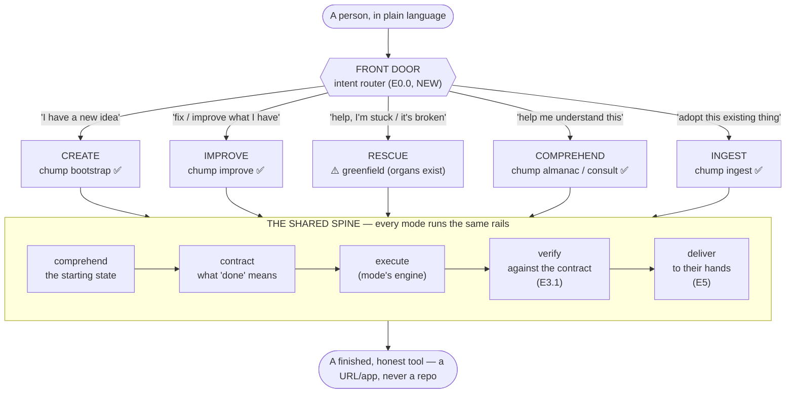

# Chump Front Door — the entry architecture (DOC-071)

> **Status:** spec of record for how ChumpOS *meets* a person and their work.
> **Parent:** [COTG_READINESS_BACKLOG.md](./COTG_READINESS_BACKLOG.md) (the outcome this serves).
> **Filed:** 2026-07-29. **Author:** Chump (opus-4.8), at Jeff's direction.

## 0. Why this doc exists

The goal is *"a ChumpOS that powers the next generation of dreamers"* — a person brings a
real problem in plain language and ChumpOS returns a finished, honest, in-their-hands tool
with zero human software-interventions (the COTG outcome).

We have spent this arc **tuning the engine** — the reliability floor (typed FSM, deterministic
ceremony, edit-verify, durable resume), self-healing (intervention watchdog, gate self-heal),
and honest verification. What we do **not** have is a **track** to run the engine on: no way
for a person's work to *enter* ChumpOS, and no finish line that puts a tool *in their hands*.

And the track is not a single lap. People show up in fundamentally different states:

> *"I have a new idea"* vs *"fix what I have"* vs *"help, I'm stuck"* — and more.

So the front door is not a "vision intake form." It is an **intent router** that meets a person
wherever they are and routes them onto the right engine — all of which converge on **one shared
spine** to a delivered outcome. This doc specifies that router, the modes, the spine, what we
already have to reuse, and the genuinely-greenfield pieces left to build.

## 1. The core shape

**The one idea:** the modes differ only in the *starting state* and *which engine drives
execution*. The rails after the router — comprehend → contract → verify → deliver — are the
**same for every mode**. Build the router and the shared rails once; wrap the engines we
already have.

## 2. The entry modes (how someone shows up → the engine)

| Someone arrives saying… | Mode | Engine today | Status (receipt) |
|---|---|---|---|
| "I have a new idea" | **CREATE** | `chump bootstrap` | ✅ built (INFRA-2265: empty dir → scaffold → first commit → umbrella gap) |
| "Fix / improve what I have" | **IMPROVE** | `chump improve` | ✅ built + dogfooded 2026-07-29 (real zero-touch BEAST PR; the reliability floor lives here) |
| "Help, I'm stuck / it's broken" | **RESCUE** | comprehension organs + `consult` | ⚠️ **greenfield for users.** `paramedic` is *internal PR-rescue* (INFRA-1375), NOT a user-facing "unstick my project" flow. Diagnosis organs exist; the user flow does not. |
| "Help me understand this" | **COMPREHEND** | `chump almanac` / `consult` | ✅ built (grounded index + comprehension organs) |
| "Adopt this existing thing" | **INGEST** | `chump ingest` | ✅ built (INFRA-1746) |

Future modes plug into the same router without changing the spine: **FINISH** ("I started X,
complete it" → comprehend partial state, close the gap), **SHIP** ("get this live" → jump
straight to deliver), **REVIEW** ("is this any good?" → audit). The taxonomy is open; the spine
is fixed.

## 3. The shared spine — and how it maps onto COTG gaps already filed

Most of the spine is **already specced** in the COTG backlog (written CREATE-mode-first; this
doc generalizes each across all modes):

| Spine stage | What it does | COTG gap | Status |
|---|---|---|---|
| **comprehend** | read the starting state (empty for CREATE; the repo for IMPROVE; the broken state for RESCUE) | COMPREHEND organs / almanac | ✅ exists |
| **contract** | pin what "done" means, in the person's words, before building | COTG-0.1 intake, 0.2 go/no-go, 0.3 MVP-scope | filed, **0 merged** |
| **execute** | the mode's engine builds/fixes/unsticks | bootstrap / improve / … | ✅ engines exist; reliability floor merged |
| **verify** | does the result actually *solve the stated problem* (not just "CI green") | **COTG-3.1** outcome-verification | filed, **unbuilt** |
| **deliver** | put a usable tool in the person's hands; translate fleet-state to their language; tell them honestly | COTG-5.1 deploy-to-surface, 5.2 user-language, 5.3 honest-handoff | filed, **0 merged** |

**The gap between "engine" and "track" in one line:** the spine's *middle* (execute) is built and
reliable; both *ends* (contract-in, deliver-out) and the *scorekeeper* (verify) are specced but
unbuilt — and there was **no router at all**.

## 4. What's genuinely greenfield (the build list)

Five pieces stand between "engine in a garage" and "a lap you can run and measure." Each gets
crisp AC so it's buildable and tracked.

### 4.1 The front-door router — **NEW gap (E0.0)**
- **AC1:** a single entry (`chump start` / a conversational surface) takes plain language and
  classifies intent into a mode (CREATE / IMPROVE / RESCUE / COMPREHEND / INGEST), with a
  confidence + a one-line "here's what I think you want, yes?" confirmation.
- **AC2:** ambiguous or mixed intent is *asked about in the person's words*, never guessed
  silently; misclassification is recoverable (they can say "no, I meant fix").
- **AC3:** routes to the mode engine with the comprehended starting state attached.
- **AC4:** test — a fixture set of plain-language asks maps to the right mode; adversarial
  ("I have an app but it's broken and I also want a new feature") resolves without a wrong lap.

### 4.2 The cross-mode outcome contract (generalizes COTG-0.1/0.2/0.3)
- One honest definition of "done" that works whether the result is a new app or a one-line fix:
  what the person will be able to *do* that they couldn't before, plus the go/no-go
  (evidence-before-build) and the smallest-honest-first-scope. Same artifact for every mode.

### 4.3 The scorekeeper — outcome verification (COTG-3.1)
- Grades the produced thing against the contract (*does it solve the stated problem?*), and
  **counts human touches** during the lap. This is the number that answers "can it run sustained
  hands-off" — instrumented by the intervention-watchdog (INFRA-3489, shipped) plus a
  contract-satisfaction check.

### 4.4 The finish line — delivery to hands (COTG-5.1/5.2/5.3)
- Deploys to a **usable surface** (a URL/app), never hands back a repo or a PR; translates
  fleet-state into the person's language (they never see CI/PRs); and hands off *honestly*
  (told, and true — no over-claim).

### 4.5 The plain-language layer (spans the router + delivery)
- Two-way translation so a non-technical person can drive: their words in (4.1/4.2), fleet
  reality out (4.4). This is the difference between "an OS a developer can use" and "an OS a
  dreamer can use."

## 5. Reuse map — what we do NOT rebuild

| Already built (reuse) | Where |
|---|---|
| CREATE engine | `chump bootstrap` (INFRA-2265) |
| IMPROVE engine + reliability floor | `chump improve` (`src/improve.rs`); COTG-1.x merged 2026-07-29 |
| COMPREHEND engine | `chump almanac`, `consult`, comprehension organs |
| INGEST engine | `chump ingest` (INFRA-1746) |
| Self-heal + intervention metric | intervention-watchdog (INFRA-3489, capability done but not invoked by any coordination loop), gate self-heal (INFRA-3490, 3 of 5 fix classes wired) — **correction 2026-07-29: "guarded ceremony (INFRA-3516)" was listed here as shipped reuse; verified against current main, `docs/gaps/INFRA-3516.yaml` is still `status: open` (P1) — the edit-verify gate (COTG-1.3) is wired on the initial ship path but not on the remediation path (`fix_pr`/`remediate_held`), which is exactly what INFRA-3516 tracks. Do not treat this as reuse until it ships.** |
| Internal PR-rescue (informs RESCUE) | `chump paramedic` (INFRA-1375) — *internal only; not the user flow* |

The release is **mostly wrapping, not inventing**: five modes already have engines. The new
build is the router + the two spine ends + the scorekeeper + the plain-language layer.

## 6. Build sequence (proposed)

The order is chosen so each step produces a *runnable, measurable* lap as early as possible:

1. **First real rail = IMPROVE** (its engine is the most proven, dogfooded to a real zero-touch
   PR). Wrap it in the minimal spine: contract-in (what "better" means) → verify (COTG-3.1) →
   deliver (COTG-5.1). This gives us the **first complete lap** on the mode we trust most, and
   the first honest hands-off measurement.
2. **The router (4.1)** — once one rail is a full lap, add the front door so a person can *arrive*
   and be routed to it.
3. **RESCUE** — highest human value ("I'm stuck"), and the diagnosis organs already exist; build
   the user-facing flow on top.
4. **CREATE** — the greenfield-heaviest lap (vision → new tool), last, because it exercises the
   most of the spine end-to-end.
5. Generalize COMPREHEND / INGEST / future modes through the same router + spine.

Each rail is "done" only when a lap runs end-to-end and the human-touch count is recorded — that
count, driven toward zero, **is** readiness. Not "CI green"; not "a merged PR." A tool in a
person's hands, and how many times we had to reach in to get it there.

## 7. What this changes in the COTG backlog

- **Adds** the front-door router as a new gap in E0 (call it COTG-0.0), *before* the existing
  0.1 vision-intake (which becomes the CREATE-mode contract, not the universal on-ramp).
- **Reframes** E0 and E5 from CREATE-only to cross-mode (the AC above supersede the CREATE-first
  phrasing in the existing gaps).
- **Elevates** COTG-3.1 (outcome-verify) to the scorekeeper for *every* lap, wired to the
  already-shipped intervention metric.
- Sequencing: this doc's §6 replaces "E1→E2→…" wave-order for the *delivery* half — build the
  first full lap (IMPROVE) before breadth.
